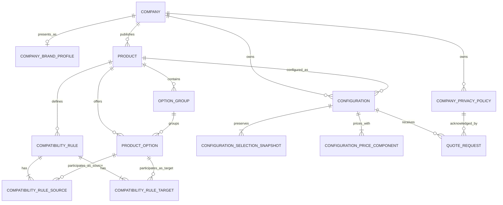

# Logical Data Model

Document version: 1.8  
Status: Approved for MVP implementation  
Last updated: 2026-07-28  
Initial product: Escritorio gaming modular (`DESK-001`)

## 1. Purpose

This document defines the technology-independent logical data model for NainConfigurator.

Its primary scalability test is:

> A second, fundamentally different configurable product must be addable through catalog data without adding product-specific entities, columns, request fields or validation branches.

The model translates the approved product definition, business rules and public API contracts into entities, ownership, relationships, persistence requirements and integrity boundaries. It does not define SQL Server column types, Entity Framework mappings, migrations, repository interfaces or deployment architecture.

## 2. Source boundaries

| Document | Authority |
|---|---|
| `00.2-CommercialStrategy.md` | Approved tenancy and separation between public company context and future commercial-account concerns |
| `01-ProductDefinition.md` | Approved values for the initial `DESK-001` catalog |
| `02-BusinessRules.md` | Business behavior, validation, lifecycle and acceptance scenarios |
| `03-DataModel.md` | Logical entities, ownership, relationships and persistence requirements |
| `03.2-UXRequirements.md` | Approved default-locale, branding and historical presentation requirements |
| `04.1-ApiContracts.md` | Public HTTP routes, payload fields, response fields and error representation |
| `04.2-NonFunctionalRequirements.md` | Approved scale envelope and logical content-length limits |
| `04.3-SecurityAndPrivacy.md` | Approved company-isolation, privacy evidence, retention, erasure and access boundaries |
| `05-DatabaseDesign.md` | Approved physical SQL Server implementation of this model |

This model must represent the business rules without redefining them. If a persistence design cannot enforce or support an approved rule, the persistence design must change.

## 3. Goals and non-goals

### Goals

- Support multiple companies and products in the logical model, while the MVP publishes one product.
- Represent option groups, options, defaults, selection limits and compatibility through data.
- Preserve configurations independently from later catalog changes.
- Support deterministic validation, pricing and response reconstruction.
- Make configuration and quote creation idempotent and concurrency-safe.
- Preserve the privacy-notice acknowledgment evidence and retention deadline required by a quote request.
- Separate public stable codes from internal persistence identifiers.
- Isolate personal data from publicly retrievable configuration data.
- Apply company locale and accessible branding without changing product-specific schema or commercial truth.

### Non-goals

- Physical table, index and SQL data-type selection
- Public customer accounts and customer self-service authorization
- Product administration or draft-editing workflows
- Inventory, discounts, payments, tax calculation, shipping or installation
- Quote workflow states beyond `New`
- Data warehouse, analytics or billing models
- Subscription accounts, invoices, customer memberships and administration permissions

## 4. Modeling principles

1. **Generic catalog:** products are composed from option groups, options and compatibility rules.
2. **Company ownership:** every product belongs to one company; downstream ownership is derived from persisted relationships.
3. **Stable codes:** published business codes are immutable and scoped as defined by BR-022.
4. **Internal keys stay internal:** public clients never receive database identifiers.
5. **Published-state versioning:** each product exposes one current positive `catalogVersion` for its published catalog.
6. **Immutable snapshots:** a saved configuration does not depend on current option names, prices, status or visual assets.
7. **Explicit idempotency:** successful create requests retain the client request ID and the normalized request identity.
8. **Commercial and visual separation:** visual state can restore presentation but never defines a selection or price.
9. **Soft lifecycle for published catalog data:** deactivation is preferred to destructive deletion when historical or referenced data exists.
10. **UTC and decimal authority:** server timestamps use UTC and authoritative money uses decimal arithmetic with two decimal places in the MVP.
11. **Commercial-account separation:** `Company` owns public catalogs and quote context; it is not implicitly a subscription, invoice, user-membership or administration aggregate.
12. **Presentation separation:** company branding has its own version, while human-readable configuration snapshots preserve their content locale; neither changes price authority.

## 5. Domain areas and aggregate boundaries

| Domain area | Aggregate root | Owned or related data | Responsibility |
|---|---|---|---|
| Company context | `Company` | `CompanyBrandProfile`, `CompanyPrivacyPolicy` | Company identity, default locale, presentation profile and active privacy policy designation |
| Product catalog | `Product` | `OptionGroup`, `ProductOption`, `CompatibilityRule`, rule sources and targets | Current published configurable catalog and its version |
| Configuration | `Configuration` | `ConfigurationSelectionSnapshot`, `ConfigurationPriceComponent`, optional visual state | Immutable commercial result of one accepted selection |
| Quote intake | `QuoteRequest` | Contact, privacy-notice acknowledgment and retention evidence | Idempotent commercial contact request linked to a saved configuration |

`Product`, `Configuration` and `QuoteRequest` are independent transaction boundaries. Configuration creation persists its complete aggregate atomically. Quote creation persists its complete aggregate atomically and never modifies the configuration.

## 6. Logical relationship diagram

The `Company` designates one of its policy records as the active privacy policy. That self-scoped designation is an invariant even though the reference is not shown as a second Mermaid relationship.

## 7. Entity definitions

Logical field types describe intent only. Exact storage types and lengths belong in `05-DatabaseDesign.md` unless a limit is already part of an approved public contract or business rule.

### 7.1 Company

Represents the business that owns product catalogs and receives quote requests.

For the MVP, one paying customer is onboarded operationally as one `Company`. A future customer account may own multiple companies or brands, so billing, membership and administrative access must be modeled separately when those capabilities are approved.

| Field | Required | Meaning |
|---|---:|---|
| `CompanyId` | Yes | Internal identifier; never public |
| `Slug` | Yes | Global stable public company identifier; public requests allow a maximum of 100 characters |
| `DisplayName` | Yes | Name returned in catalogs and copied into configuration snapshots; maximum 150 Unicode scalar values |
| `DefaultLocale` | Yes | BCP 47 language tag for the company's single public MVP content locale |
| `ActivePrivacyPolicyId` | For a public quote-enabled company | References one policy version owned by the same company |

Invariants:

- `Slug` is globally unique and uses lowercase letters, numbers and hyphens.
- A company cannot designate another company's privacy policy.
- A public catalog that supports quote requests must expose one active policy version and resource.
- Changing `DisplayName` increments every current published product version whose snapshots include that name.
- A public company's `DefaultLocale` must be supported by the client release; the initial MVP value is `es-ES`.
- Changing `DefaultLocale` is published with aligned company/product text and increments every affected current product version because new snapshots preserve that locale.

### 7.2 CompanyBrandProfile

Represents the company's current non-commercial presentation configuration.

| Field | Required | Meaning |
|---|---:|---|
| `CompanyBrandProfileId` | Yes | Internal identifier |
| `CompanyId` | Yes | Owning company; one current profile per company |
| `Version` | Yes | Positive independent branding version |
| `Mode` | Yes | `CoBranded` in the MVP; `WhiteLabel` is reserved for future approval |
| `LogoAssetKey` | No | Managed presentation-asset reference; not executable content; maximum 200 Unicode scalar values |
| `PrimaryColor` | Yes | Validated semantic surface color in `#RRGGBB` form |
| `OnPrimaryColor` | Yes | Validated foreground color in `#RRGGBB` form |

Invariants:

- `CompanyId` is unique in this aggregate, so one company has at most one current brand profile.
- `Version` is positive and increments whenever a public branding field changes.
- `PrimaryColor` and `OnPrimaryColor` are valid sRGB hex colors and meet at least 4.5:1 contrast when used for normal text.
- The MVP permits only `CoBranded`; an unsupported mode cannot activate arbitrary styling or executable assets.
- Branding is presentation data. It never changes selections, validation, price, saved commercial snapshots or `Product.CatalogVersion`.
- Missing or invalid runtime branding falls back to the accessible platform theme and company display name without making the product unavailable.

### 7.3 CompanyPrivacyPolicy

Represents one immutable version of a company's privacy policy presentation resource.

| Field | Required | Meaning |
|---|---:|---|
| `CompanyPrivacyPolicyId` | Yes | Internal identifier |
| `CompanyId` | Yes | Owning company |
| `Version` | Yes | Stable version value submitted by the client and stored as acknowledgment evidence; maximum 100 Unicode scalar values |
| `ResourceUrl` | Yes | HTTPS resource that presents the immutable approved notice before acknowledgment; maximum 2,048 Unicode scalar values |
| `ContentAssetKey` | Yes | Managed immutable privacy-content asset reference; maximum 200 Unicode scalar values |
| `ContentHashSha256` | Yes | Lowercase 64-hexadecimal SHA-256 identity of the exact published content |
| `PublishedAtUtc` | Yes | Server UTC publication timestamp |
| `QuoteRetentionDays` | Yes | Quote aggregate retention period; 30 to 1,825 days, default 365 |

Invariants:

- `(CompanyId, Version)` is unique.
- A policy version and its content asset/hash are immutable after publication.
- `Version` contains 1 to 100 Unicode scalar values and `ResourceUrl` contains an absolute HTTPS resource of at most 2,048 Unicode scalar values.
- `ResourceUrl` cannot resolve to mutable content under the same policy version.
- A value above 365 retention days requires documented controller justification before activation.
- Older versions are retained while acknowledgment evidence, the additional 400-day evidence window or an approved legal obligation requires them.
- Activating a new version changes `Company.ActivePrivacyPolicyId`; it does not rewrite previous quote evidence.

### 7.4 Product

Represents one configurable commercial product owned by a company.

| Field | Required | Meaning |
|---|---:|---|
| `ProductId` | Yes | Internal identifier |
| `CompanyId` | Yes | Owning company |
| `Code` | Yes | Stable public code, unique inside the company; public requests allow a maximum of 50 characters |
| `Name` | Yes | Current catalog name; maximum 150 Unicode scalar values |
| `Description` | Yes | Current catalog description; maximum 2,000 Unicode scalar values |
| `CatalogVersion` | Yes | Positive integer for the current published catalog state |
| `BasePrice` | Yes | Current catalog base amount |
| `CurrencyCode` | Yes | ISO 4217 currency code |
| `PriceDisclaimer` | Yes | Message displayed with the estimate; maximum 500 Unicode scalar values |
| `VisualAssetKey` | No | Client-agnostic product visual mapping key; maximum 200 Unicode scalar values |
| `IsActive` | Yes | Whether new catalog load, validation and configuration are allowed |
| `IsPublished` | Yes | Whether the catalog is publicly available |

Invariants:

- `(CompanyId, Code)` is unique.
- `CatalogVersion` is greater than zero for a published product.
- Money is non-negative in the current MVP catalog and uses two decimal places.
- A product is publicly configurable only when active, published and internally valid.
- Publishing or changing a covered catalog field increments `CatalogVersion` atomically with that change.
- The MVP stores the current catalog state, not a complete temporal copy of every catalog version. Historical commercial truth is preserved by configuration snapshots.

### 7.5 OptionGroup

Defines a data-driven selection boundary inside one product.

| Field | Required | Meaning |
|---|---:|---|
| `OptionGroupId` | Yes | Internal identifier |
| `ProductId` | Yes | Owning product |
| `Code` | Yes | Stable code, unique inside the product |
| `Name` | Yes | Current display name; maximum 150 Unicode scalar values |
| `MinSelections` | Yes | Minimum number of distinct selected options |
| `MaxSelections` | No | Maximum selections; null means no configured maximum |
| `IsActive` | Yes | Whether the group is published and selectable |
| `SortOrder` | Yes | Primary deterministic catalog order |

Invariants:

- `(ProductId, Code)` is unique.
- `MinSelections >= 0`.
- `MaxSelections` is null or `>= 1`.
- When present, `MinSelections <= MaxSelections`.
- A group cannot require more defaults or selections than its active catalog can satisfy.

### 7.6 ProductOption

Represents a selectable catalog value belonging to exactly one product and one option group.

| Field | Required | Meaning |
|---|---:|---|
| `ProductOptionId` | Yes | Internal identifier |
| `ProductId` | Yes | Owning product and uniqueness scope |
| `OptionGroupId` | Yes | Persisted group used for validation |
| `Code` | Yes | Stable code, unique inside the product |
| `Name` | Yes | Current display name; maximum 150 Unicode scalar values |
| `PriceAdjustment` | Yes | Amount added when selected |
| `VisualAssetKey` | No | Client-agnostic option visual mapping key; maximum 200 Unicode scalar values |
| `IsDefault` | Yes | Whether the option participates in the product default selection |
| `IsActive` | Yes | Whether new configurations may select it |
| `SortOrder` | Yes | Deterministic order inside its group |

Invariants:

- `(ProductId, Code)` is unique, including across different groups of the same product.
- `OptionGroupId` belongs to the same `ProductId`.
- `PriceAdjustment` uses the product currency and two decimal places.
- In the current MVP catalog, price adjustments are non-negative.
- Published codes are not renamed or reused for a different meaning.
- Deactivation does not change historical snapshots.

### 7.7 CompatibilityRule

Defines a product-scoped, data-driven compatibility constraint.

| Field | Required | Meaning |
|---|---:|---|
| `CompatibilityRuleId` | Yes | Internal identifier |
| `ProductId` | Yes | Owning product |
| `Code` | Yes | Stable code, unique inside the product |
| `Type` | Yes | Rule evaluator discriminator |
| `Message` | Yes | Public validation explanation; maximum 500 Unicode scalar values |
| `IsActive` | Yes | Whether the rule is evaluated and published |

`CompatibilityRuleSource` contains `(CompatibilityRuleId, ProductOptionId)` pairs.  
`CompatibilityRuleTarget` contains `(CompatibilityRuleId, ProductOptionId)` pairs.

Invariants:

- `(ProductId, Code)` is unique.
- A rule has at least one distinct source and one distinct target.
- Every source and target option belongs to the same product as the rule.
- Duplicate source or target pairs are prohibited.
- The MVP executes only `RequiresAny`.
- An unknown or unsupported active type makes the product unavailable; it is never ignored.

The separate source and target relations support multiple options without desk-specific columns and without encoding comma-separated codes.

### 7.8 Configuration

Represents one immutable saved configuration and its commercial snapshot header.

| Field | Required | Meaning |
|---|---:|---|
| `ConfigurationId` | Yes | Internal identifier |
| `ConfigurationCode` | Yes | Global public code in `NCF-{24 uppercase hexadecimal}` format |
| `ClientRequestId` | Yes | Client GUID for configuration-create idempotency |
| `IdempotencyFingerprint` | Yes | Identity of the canonical normalized create payload |
| `CompanyId` | Yes | Company inherited from the product |
| `ProductId` | Yes | Product selected at creation |
| `CatalogVersionAtCreation` | Yes | Accepted current product version |
| `CompanySlugSnapshot` | Yes | Historical company slug |
| `CompanyNameSnapshot` | Yes | Historical company display name |
| `ProductCodeSnapshot` | Yes | Historical product code |
| `ProductNameSnapshot` | Yes | Historical product name |
| `ProductBasePriceSnapshot` | Yes | Historical base price |
| `ContentLocale` | Yes | BCP 47 locale of the persisted human-readable snapshot values |
| `CurrencyCode` | Yes | Single currency for the complete configuration |
| `EstimatedPrice` | Yes | Authoritative total persisted by the API |
| `VisualStateSchemaVersion` | No | Supported schema version when visual state exists |
| `VisualStateJson` | No | Canonical optional presentation-only JSON |
| `CreatedAtUtc` | Yes | Server creation timestamp |

Invariants:

- `ConfigurationCode` is globally unique, immutable and never reused.
- `ClientRequestId` is unique in the configuration-create idempotency scope.
- `ProductId` belongs to `CompanyId`.
- Snapshot values never change after creation.
- `ContentLocale` equals the resolved company default locale for the accepted catalog version and never changes afterward.
- `EstimatedPrice` equals the sum of persisted price components.
- Visual state is either absent or has both schema version and canonical JSON.
- Visual state is at most 16 KB serialized as UTF-8 and supports schema version `1` in the MVP.
- Configuration creation writes the header, selections, price components, visual state and idempotency data in one transaction.

`IdempotencyFingerprint` is derived from canonical company, product, catalog version, normalized distinct option codes and canonical visual state. Exact comparison may also use the persisted normalized data; a fingerprint must not allow a different payload to be accepted as an exact replay.

### 7.9 ConfigurationSelectionSnapshot

Preserves one normalized selected option independently from the current catalog.

| Field | Required | Meaning |
|---|---:|---|
| `ConfigurationSelectionSnapshotId` | Yes | Internal identifier |
| `ConfigurationId` | Yes | Owning configuration |
| `NormalizedPosition` | Yes | Stable position in the saved normalized result |
| `OptionGroupCodeSnapshot` | Yes | Historical group code |
| `OptionGroupNameSnapshot` | Yes | Historical group name |
| `OptionCodeSnapshot` | Yes | Historical option code |
| `OptionNameSnapshot` | Yes | Historical option name |
| `PriceAdjustmentSnapshot` | Yes | Historical selected adjustment |
| `VisualAssetKeySnapshot` | No | Historical client-agnostic visual key |

Invariants:

- `(ConfigurationId, OptionCodeSnapshot)` is unique.
- `(ConfigurationId, NormalizedPosition)` is unique.
- Position follows group `SortOrder` and code, then option `SortOrder` and code at creation time.
- Snapshot rows do not require current option data to reconstruct a saved configuration.
- Future catalog changes never update snapshot rows.

### 7.10 ConfigurationPriceComponent

Preserves the authoritative price breakdown returned by validation and retrieval.

| Field | Required | Meaning |
|---|---:|---|
| `ConfigurationPriceComponentId` | Yes | Internal identifier |
| `ConfigurationId` | Yes | Owning configuration |
| `Position` | Yes | Stable price breakdown position |
| `Type` | Yes | `BasePrice` or `OptionAdjustment` in the MVP |
| `CodeSnapshot` | Yes | Product or option code represented by the component |
| `NameSnapshot` | Yes | Product or option name represented by the component |
| `Amount` | Yes | Historical component amount |

Invariants:

- `(ConfigurationId, Position)` is unique.
- Exactly one `BasePrice` component exists and is first.
- One `OptionAdjustment` component exists for every selection snapshot.
- Component ordering matches the normalized selection result.
- The sum of `Amount` equals `Configuration.EstimatedPrice`.
- New component types require an explicit business-rule and API-contract change before use.

### 7.11 QuoteRequest

Represents an idempotent commercial contact request linked to one saved configuration.

| Field | Required | Meaning |
|---|---:|---|
| `QuoteRequestId` | Yes | Internal identifier |
| `QuoteRequestCode` | Yes | Global public code in `NQR-{24 uppercase hexadecimal}` format |
| `ClientRequestId` | Yes | Client GUID in the separate quote-create idempotency scope |
| `IdempotencyFingerprint` | Yes | Identity of the canonical normalized quote payload |
| `ConfigurationId` | Yes | Existing immutable configuration |
| `Status` | Yes | `New` in the MVP |
| `ContactName` | Yes | Normalized contact name, maximum 150 characters |
| `ContactEmail` | Yes | Normalized syntactically valid email, maximum 254 characters |
| `ContactPhone` | No | Normalized phone, maximum 30 characters |
| `Message` | No | Normalized free text, maximum 1000 characters |
| `CompanyPrivacyPolicyId` | Yes | Policy version active for the configuration's company at first creation |
| `PrivacyNoticeAcknowledged` | Yes | Presentation evidence; always `true` for a persisted quote request |
| `AcknowledgedPrivacyPolicyVersion` | Yes | Immutable copy of the submitted and validated version |
| `AcknowledgedPrivacyContentHash` | Yes | Immutable copy of the active policy content hash |
| `PrivacyNoticeAcknowledgedAtUtc` | Yes | Server acknowledgment timestamp |
| `RetentionUntilUtc` | Yes | Server deadline calculated from creation and the policy's approved retention days |
| `LegalHoldUntilUtc` | No | Audited time-bounded hold when an approved controller/legal instruction suspends deletion |
| `CreatedAtUtc` | Yes | Server creation timestamp |

Invariants:

- `QuoteRequestCode` is globally unique, immutable and never reused.
- `ClientRequestId` is unique in the quote-create idempotency scope, independently from configuration request IDs.
- The configuration must exist before the quote is created.
- Company and product ownership are derived from the configuration; the client cannot override them.
- For a new quote request, the current referenced product must be active and published.
- The referenced policy belongs to the configuration's company and was active for the first successful request.
- The submitted version equals that policy's version.
- A persisted quote always records explicit notice acknowledgment, content identity and a server UTC timestamp; this is not marketing consent or a declaration of lawful basis.
- `RetentionUntilUtc` equals the server creation time plus the active policy's approved retention period.
- A legal hold has an authorized owner, scope, reason and review evidence outside the public contract.
- The complete quote aggregate is deleted within 24 hours after the effective retention/hold deadline.
- Contact data is never returned by the public configuration endpoint or echoed by the quote-create response.

The quote fingerprint covers configuration code, normalized contact values, normalized message, privacy version and acknowledgment. An exact replay resolves the existing quote before current product availability and policy validation, so deactivating the product or activating a later policy does not create a duplicate or invalidate the historical replay.

## 8. Ownership and cardinality rules

| Relationship | Cardinality | Rule |
|---|---|---|
| Company to Product | 1 to many | Every product belongs to exactly one company |
| Company to Brand Profile | 1 to zero or one | Branding is optional at runtime because accessible platform fallback is required |
| Company to Privacy Policy | 1 to many | Versions are company-specific; one is designated active for public quote intake |
| Product to Option Group | 1 to many | A group cannot be shared between products |
| Product to Product Option | 1 to many | Option-code uniqueness is product-scoped |
| Option Group to Product Option | 1 to many | Every option belongs to exactly one persisted group |
| Product to Compatibility Rule | 1 to many | Rules cannot span products |
| Compatibility Rule to Sources | 1 to many | At least one distinct source is required |
| Compatibility Rule to Targets | 1 to many | At least one distinct target is required |
| Company and Product to Configuration | 1 to many | Both references are persisted and must agree |
| Configuration to Selection Snapshot | 1 to many | At least one row; complete normalized selection |
| Configuration to Price Component | 1 to many | At least one base component |
| Configuration to Quote Request | 1 to many | Multiple independent requests are not prohibited; idempotency prevents replay duplicates |
| Privacy Policy to Quote Request | 1 to many | Historical acknowledgment points to the exact version and content hash presented |

## 9. Catalog publication and versioning

The logical MVP stores the current catalog state on `Product`, its groups, options and rules. It does not require a temporal copy of each previous catalog version because saved configurations preserve their own commercial snapshots.

A catalog mutation that affects the selectable interface, 3D representation, validation, price or saved snapshot must:

1. Validate the complete resulting catalog, including its default configuration.
2. Increment `Product.CatalogVersion`.
3. Persist the mutation and version increment atomically.
4. Make the new state visible as one published unit.

Covered changes include product commercial fields and availability; group name, state, order and limits; option name, group, state, order, default, price and visual key; and rule type, source, targets, state or message.

A company default-locale change is published only with aligned company, product, option and rule text and increments affected product versions. A brand-profile change increments only `CompanyBrandProfile.Version` because branding is not part of commercial snapshot or selection identity.

The following are publication-time invariants rather than isolated row checks:

- All required groups can be satisfied by active options.
- Defaults satisfy group limits and all active compatibility rules.
- All active rule source and target options are active and belong to the product.
- Only supported rule types are active.
- Prices and currency are internally consistent.

Draft catalogs, scheduled publication, rollback to a previous catalog version and complete catalog-version history belong to a future administration design.

## 10. Snapshot and historical behavior

Configuration retrieval reads only the configuration aggregate and its snapshots. It must not rebuild names, prices, selection membership or visual keys from the current catalog.

Current catalog references are retained for ownership and internal traceability, but copied snapshot fields are the historical authority. Therefore:

- Deactivating a company product, group or option does not invalidate a saved configuration.
- Renaming or repricing catalog items does not change historical responses.
- A quote uses its linked configuration snapshot rather than the current product catalog.
- Catalog changes do not trigger updates to configurations, selection snapshots or price components.
- Historical human-readable values are interpreted using `Configuration.ContentLocale`, not the company's current default locale.
- Current branding may decorate historical retrieval when available, but is never copied into or treated as authority for the configuration snapshot.

## 11. Idempotency and concurrency

Configuration and quote request creation use separate idempotency scopes.

For each scope:

- `ClientRequestId` has a unique persistence constraint.
- The first valid request creates the complete aggregate atomically.
- An exact normalized replay returns the existing resource.
- Reusing the ID with different normalized data returns `CLIENT_REQUEST_ID_REUSED`.
- Concurrent requests with the same ID cannot commit two resources.
- A successful existing resource is resolved before validating mutable current catalog or policy state.

Public code uniqueness is a separate constraint. Code generation collision retries occur inside the same operation and never expose or reuse an internal key.

## 12. Privacy and personal-data boundary

`Configuration` contains no quote contact data. Personal data is isolated in `QuoteRequest`.

| Data | Classification | Public behavior |
|---|---|---|
| Configuration and quote public codes | Public identifiers | May appear in API responses and logs |
| Product and option snapshots | Commercial data | Returned only through the configuration contract |
| Visual state | Presentation data | Returned with its configuration; never commercial truth |
| Contact name, email and phone | Personal data | Accepted on quote creation; not echoed publicly or logged in full |
| Quote message | Potential personal/free-text data | Not echoed publicly or logged in full |
| Policy version, content hash and acknowledgment timestamp | Compliance evidence | Persisted with the quote; not treated as consent or lawful-basis selection |

Security, retention, access, encryption and deletion behavior are approved in `04.3-SecurityAndPrivacy.md`. Real personal data remains prohibited until the customer-specific legal notice, lawful basis, data-processing agreement, contacts and operational evidence are approved.

## 13. Lifecycle and deletion behavior

| Entity | MVP lifecycle |
|---|---|
| Company | Created and referenced; administration lifecycle not yet public |
| Company brand profile | Current versioned presentation configuration; missing or invalid runtime presentation uses the accessible default theme |
| Privacy policy version | Immutable after publication; old referenced versions remain through quote references plus the approved evidence window |
| Product | Active/inactive and published/unpublished; published codes remain stable; unavailability blocks new quote requests but not historical configuration reads or successful quote replays |
| Option group and option | Active/inactive; deactivation replaces destructive deletion for referenced catalog data |
| Compatibility rule | Active/inactive; unsupported active types are invalid catalog state |
| Configuration | Create and read only; immutable |
| Configuration snapshots and components | Created and deleted only with their owning configuration according to a future retention rule |
| Quote request | Created as `New`; complete aggregate is hard-deleted after its retention deadline unless an approved legal hold applies; later status workflow is outside the MVP |

Hard deletion of companies, published catalog elements and configurations remains unauthorized. Quote aggregate deletion is required by BR-045 and must be company-scoped, idempotent and auditable. Physical foreign-key actions remain restrictive unless `05-DatabaseDesign.md` proves the deletion is confined to the owning quote aggregate.

## 14. Integrity enforcement matrix

Some invariants fit a single relational constraint; others require application or publication validation across multiple records.

| Invariant | Primary enforcement boundary |
|---|---|
| Global company slug uniqueness | Database unique constraint |
| One current brand profile per company | Database unique relationship |
| Valid supported company locale and branding mode | Application publication validation |
| Brand color syntax and contrast | Application publication validation |
| Product, group, option and rule code scopes | Database composite unique constraints |
| Public configuration and quote code uniqueness | Database unique constraints |
| Client request ID uniqueness per create scope | Database unique constraints |
| Option group belongs to option product | Composite relationship constraint or equivalent physical design |
| Rule sources and targets belong to rule product | Relationship constraint plus publication validation |
| Non-negative selection limits and `min <= max` | Database checks where supported |
| Complete valid defaults | Application publication validation |
| Active rule type support | Application publication and load validation |
| Catalog version increment with covered changes | Application transaction boundary |
| Selection ownership, limits and compatibility | Shared application validation service |
| Authoritative price and normalized order | Shared application calculation service |
| Snapshot completeness and total consistency | Application transaction plus database required relationships |
| Configuration immutability | Application command boundary and restricted persistence operations |
| Visual-state schema and 16 KB size | Request/application validation |
| Active privacy policy belongs to company | Relationship constraint and application validation |
| Quote policy matches current active version on first creation | Application validation inside quote transaction |
| UTC timestamps | Server application generation |

## 15. API-to-model traceability

| Public operation | Reads | Writes | Historical authority |
|---|---|---|---|
| Get configurable product | Company, current brand profile, active privacy policy, Product, active groups, active options, active rules | None | Current published catalog plus current presentation profile |
| Validate configuration | Company, Product, groups, options, rules | None | Current catalog matching requested version |
| Create configuration | Same catalog data and resolved company locale; existing Configuration by client request ID | Complete Configuration aggregate | New immutable snapshot including content locale |
| Get saved configuration | Configuration, selection snapshots, price components; optional current company branding | None | Saved commercial snapshot; branding remains current optional presentation |
| Create quote request | Existing QuoteRequest by client request ID, Configuration, current Product availability, active company policy | Complete QuoteRequest aggregate | Saved configuration plus acknowledged policy version/hash and retention deadline |

Validation-only requests create no configuration, quote or idempotency record.

The standard response envelope (`success`, `errors` and `traceId`), validation-only normalized results, `isValid`, `wasExisting`, and catalog-conflict version details are transient application outputs. They are not domain entities and do not require independent persistence. Persisted configuration snapshots and price components remain the source for reconstructing saved-configuration responses.

## 16. Business-rule traceability

| Rule area | Model support |
|---|---|
| BR-001 to BR-006 | Product, group and option ownership and active state |
| BR-007 to BR-016 | Product money, snapshots, price components, public codes and compatibility data |
| BR-017 to BR-026 | Company scope, generic limits, versioning, stable code scopes, rules and deterministic positions |
| BR-027 to BR-032 | Aggregate transaction boundaries, immutability, visual state and idempotency fields |
| BR-033 to BR-037 | Quote contact constraints, policy acknowledgment, ownership, status, UTC and PII isolation |
| BR-045 | Quote retention deadline, legal hold and aggregate deletion |
| BR-038 to BR-044 | Catalog-driven entities, supported rule discriminator, validation ordering, current product availability, content locale, company branding and supported publication envelope |

The 34 acceptance scenarios in `02-BusinessRules.md` must be reused later as application and persistence integration-test inputs.

## 17. Second-product scalability test

The model passes the required extensibility test when a new company product can be introduced by inserting or publishing only:

- One `Product`
- Its `OptionGroup` records with selection limits
- Its `ProductOption` records with prices, defaults and visual keys
- Any supported `CompatibilityRule` records and source/target relationships

No new product-specific table, column, endpoint property, price formula branch or validator class is permitted merely because the product has different commercial dimensions.

For example, a product may use groups such as material, capacity, mounting method or optional modules instead of desk size, finish, legs and drawers. The same relationships, validation pipeline, snapshot entities and quote flow still apply.

Adding a genuinely new rule behavior is different from adding a product. A new rule type may require new generic evaluator behavior, but it must still be represented through the existing rule model and requires explicit business-rule, API and client approval before publication.

## 18. Approved logical decisions

| ID | Decision | Rationale |
|---|---|---|
| DM-001 | Privacy policies are versioned immutable company records, with one designated active record | Preserves historical acknowledgment evidence and exact content identity while allowing policy changes |
| DM-002 | Catalog compatibility uses separate source and target relationships | Supports multiple options and avoids encoded lists or product-specific columns |
| DM-003 | The MVP retains current catalog state plus immutable configuration snapshots | Meets historical requirements without prematurely designing an admin version-history system |
| DM-004 | Price breakdown is persisted as ordered snapshot components | Reproduces the authoritative response without consulting current catalog data |
| DM-005 | Idempotency data is stored with the created resource in separate configuration and quote scopes | Supports exact replay lookup and concurrency uniqueness without a polymorphic resource table |
| DM-006 | Configuration selections are normalized snapshot rows | Preserves generic multi-group selections and deterministic retrieval |
| DM-007 | Published referenced catalog records use deactivation rather than destructive deletion | Protects stable codes and historical relationships |
| DM-008 | One configuration may receive multiple quote requests with different client request IDs | Current rules prohibit replay duplicates but do not define one quote per configuration; this avoids adding an unapproved uniqueness restriction |
| DM-009 | Each public company has one independently versioned constrained brand profile with accessible fallback | Keeps branding data-driven and prevents visual changes from creating catalog conflicts or customer forks |
| DM-010 | Each company has one default BCP 47 locale in the MVP and configurations snapshot their content locale | Supports locale-correct history without language-specific columns or dependence on later company settings |

## 19. Deferred physical and operational decisions

These decisions do not block approval of the logical model but must be resolved in the named later document or before the stated milestone.

| Decision | Owner document or milestone |
|---|---|
| Internal identifier types | `05-DatabaseDesign.md` |
| Exact SQL storage lengths and Unicode-unit mapping outside approved public and NFR logical limits | `05-DatabaseDesign.md` |
| Decimal SQL precision while preserving scale two | `05-DatabaseDesign.md` |
| JSON storage strategy and canonicalization | Fingerprint canonicalization is resolved by `06-Architecture.md`; physical visual-state storage remains in `05-DatabaseDesign.md` |
| Idempotency fingerprint algorithm | Resolved by `06-Architecture.md`: SHA-256 over a typed canonical UTF-8 projection plus exact persisted-field comparison |
| Index shapes and query-performance strategy | `05-DatabaseDesign.md` |
| Transaction isolation and code-generation retry policy | Transaction/retry boundary is resolved by `06-Architecture.md`; exact SQL isolation and constraints remain in `05-DatabaseDesign.md` |
| Catalog administration, drafts and full version history | Future administration design |
| Customer-specific legal notice, lawful basis, DPA, contacts and operational control evidence | Before real customer data; technical requirements are approved in `04.3-SecurityAndPrivacy.md` |
| Quote notification recipient and commercial workflow | Before real customer launch |
| Subscription-account, billing, membership and administrative-access model | Future authenticated control-plane and billing design; it must remain separate from the public `Company` catalog domain |

## 20. Approval checklist

The logical model is ready to approve when all statements below are accepted:

- [x] Every public create and response field has a logical owner or is explicitly transient.
- [x] Every persistence-dependent business rule maps to an entity, relationship or enforcement boundary.
- [x] Configuration retrieval can be completed without current catalog values.
- [x] Company and product ownership cannot be overridden by public requests.
- [x] Configuration and quote idempotency use separate unique scopes.
- [x] Quote personal data is isolated from public configuration retrieval.
- [x] No entity or field is specific to desks.
- [x] Company branding is versioned independently and cannot alter commercial truth.
- [x] Historical snapshot language remains interpretable after a company locale change.
- [x] Generic catalog count and human-readable content limits are explicit before physical string and index design.
- [x] A second fundamentally different product can be published through data only.
- [x] Physical SQL decisions are approved in `05-DatabaseDesign.md`.
- [x] Quote retention and deletion are explicit, while customer-specific legal and operational launch artifacts remain visible.
- [x] The logical decisions in section 18 were accepted by the product owner on 2026-07-19.

This logical model remains approved after flow, UX, quality, security and architecture alignment. It does not authorize backend, database migration or renderer implementation before the remaining implementation-readiness documents are approved.
