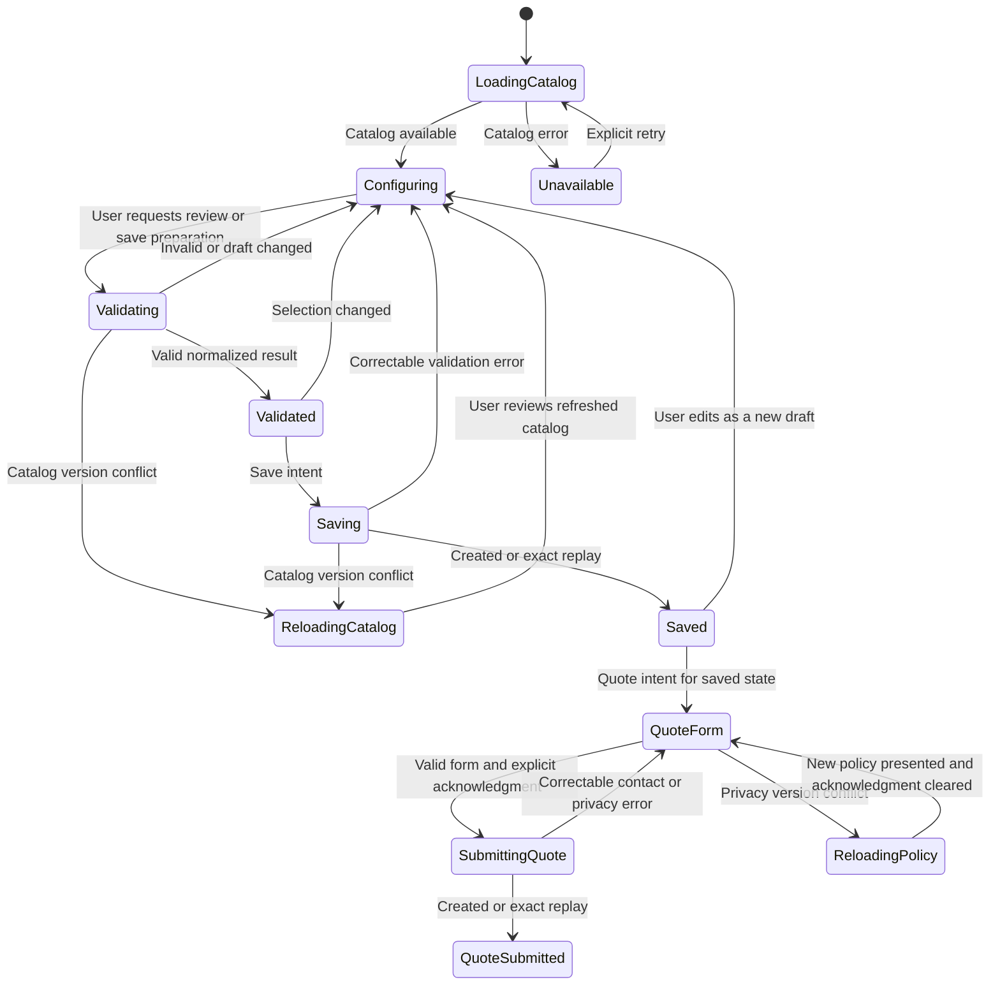
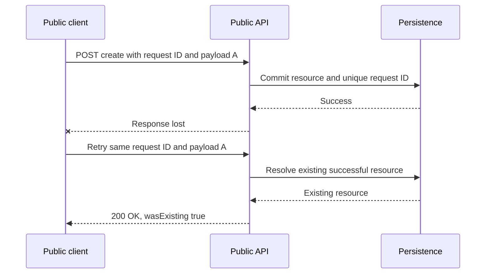

# User Flows

Document version: 1.5  
Status: Approved for MVP implementation  
Last updated: 2026-07-28  
Initial product: Escritorio gaming modular (`DESK-001`)

## 1. Purpose

This document defines the public-user, public-client, optional 3D-renderer and API interaction flows for the NainConfigurator MVP.

Its scalability test is:

> The same flows must support a second, fundamentally different configurable product by loading different catalog data, without introducing product-specific screens, request fields or validation branches.

These flows describe user intent, client state, API calls, success behavior, error recovery and idempotent retry behavior. They do not define visual styling, exact screen layouts, Babylon.js scene structure, Blender asset composition, database tables or implementation classes.

## 2. Source boundaries

| Document | Authority |
|---|---|
| `00-ProjectOverview.md` | Product vision, commercial direction and MVP boundary |
| `01-ProductDefinition.md` | Initial catalog values and examples |
| `02-BusinessRules.md` | Validation, lifecycle and acceptance behavior |
| `03-DataModel.md` | Approved logical ownership and persistence requirements |
| `03.1-UserFlows.md` | User intent, client state transitions and interaction recovery |
| `03.2-UXRequirements.md` | Responsive, accessible, degraded-rendering, branding and localization behavior |
| `04.1-ApiContracts.md` | Public routes, payloads, responses and error codes |
| `04.3-SecurityAndPrivacy.md` | Privacy-notice acknowledgment, browser-data, abuse, access and retention requirements |

When a flow conflicts with a business rule or public contract, this document must be corrected. A client convenience never overrides API authority.

## 3. Scope and actors

### Actors

| Actor | Responsibility | Trust level |
|---|---|---|
| Public user | Chooses a product configuration and optionally submits contact details | Untrusted public input |
| Public client | Renders accessible catalog-driven controls, coordinates the optional 3D renderer, maintains transient session state and calls the API | Helpful but non-authoritative |
| Public API | Resolves ownership, validates, prices, persists and returns canonical results | Authoritative application boundary |
| Product catalog | Current published product, groups, options and compatibility rules | Authoritative current commercial data |
| Configuration snapshot | Immutable saved commercial result | Authoritative historical data |
| Company privacy policy | Active immutable version and resource presented before quote acknowledgment | Authoritative compliance input |

The MVP has no authenticated customer account. `06-Architecture.md` resolves public routes and keeps unsaved configuration state in memory only; it stores no quote contact data or commercial authority in browser persistence.

### Included public outcomes

- Load an available product catalog.
- Configure a product through generic option groups.
- Show a responsive local estimate.
- Validate and receive an authoritative normalized price.
- Save an immutable configuration.
- Retrieve a saved configuration by public code.
- Submit an idempotent quote request with privacy-notice acknowledgment.

### Excluded outcomes

- Customer login or account history
- Online payment or checkout
- Product administration
- Quote administration or status updates beyond `New`
- Email, SMS or CRM notification
- Inventory or delivery reservation
- Marketing-consent collection
- Analytics and conversion tracking

## 4. Client-state model

The following state exists only in the client unless the flow explicitly creates a server resource.

| Client state | Source | Authority and behavior |
|---|---|---|
| Company and product identity | Route or launch context, confirmed by catalog response | API relationship wins |
| Company locale and branding | Product response | Presentation context only; never commercial truth |
| Loaded catalog version | Product response | Required for validation and creation |
| Option groups, options and rules | Product response | Never hardcoded as commercial truth |
| Current selected option codes | User interaction, initialized from catalog defaults | Transient until validated or saved |
| Local estimated price | Loaded catalog plus current distinct selections | Informative only |
| API normalized selections and price | Validation or creation result | Authoritative for the matching catalog version and payload |
| Visual state | Public client and optional renderer | Optional and non-commercial |
| Renderer state | Local capability and runtime result | Independent `NotStarted`, `Loading`, `Ready`, `Reduced`, `Unavailable` or `Failed` presentation state |
| Validation status | Most recent API result | Invalidated by any selection or catalog change |
| Saved configuration code | Configuration-create response | Identifies one immutable server snapshot |
| Dirty-since-save flag | Comparison of current draft with saved selection | Determines whether a new configuration is required |
| Configuration create request ID | Generated for one create intent | Reused only for an exact uncertain retry |
| Quote form | User input | Transient personal data until a successful quote request |
| Privacy acknowledgment | Explicit user action for one presented version | Cleared when the active version changes |
| Quote create request ID | Generated for one quote intent | Separate from configuration idempotency |

Selection arrays are treated as sets for commercial equivalence, but the client displays the API's deterministic normalized order.

## 5. Cross-flow principles

1. The client renders groups generically from `minSelections`, `maxSelections`, defaults and `sortOrder`.
2. Product and option codes are data, not program branches.
3. The client may guide compatibility, but the API validates independently.
4. The client may calculate an immediate price, but replaces it with the API result after validation or creation.
5. A catalog or selection change invalidates the previous validation result.
6. A saved configuration is immutable; editing creates a new draft and later a new saved configuration.
7. Network retries reuse a client request ID only when the canonical payload is unchanged.
8. Error codes drive recovery behavior; unknown errors never expose technical details.
9. Personal quote data is not included in configuration retrieval or general logs.
10. A visual failure never invents or changes a commercial selection.
11. Catalog controls, validation, saving and quote submission remain operable without the renderer.
12. Company branding is optional presentation data and falls back safely without changing catalog state.
13. Human-readable content and money use the resolved company locale; API decimal values and codes remain authoritative.
14. Responsive layout may reorder visual regions but preserves logical reading, focus and commercial state.

## 6. Primary conversion journey

The primary commercial journey ends when a quote request is safely persisted as `New`. Notification and sales follow-up happen outside the current public MVP.

```mermaid
sequenceDiagram
    actor User as Public user
    participant Client as Public client
    participant API as Public API
    participant Catalog as Current catalog
    participant Snapshot as Configuration snapshot
    participant Quote as Quote request

    User->>Client: Open configurator
    Client->>API: GET company product
    API->>Catalog: Resolve active published catalog
    Catalog-->>API: Product, groups, options, rules, policy
    API-->>Client: Catalog version and defaults
    Client-->>User: Render generic controls; progressively start 3D when supported
    User->>Client: Change selections
    Client-->>User: Update visuals and local estimate
    Client->>API: POST validate selections
    API-->>Client: Normalized selections and authoritative price
    Client-->>User: Show confirmed estimate
    User->>Client: Save configuration
    Client->>API: POST configuration with request ID
    API->>Snapshot: Persist immutable aggregate atomically
    Snapshot-->>API: Configuration code
    API-->>Client: Created or exact replay result
    Client-->>User: Show saved configuration reference
    User->>Client: Complete quote form and accept policy
    Client->>API: POST quote request with separate request ID
    API->>Quote: Persist contact, acknowledgment and retention evidence
    Quote-->>API: Quote request code and status New
    API-->>Client: Created or exact replay result
    Client-->>User: Confirm request reference
```

## 7. Client state transitions



This diagram represents transient client behavior. Only `Saved` and `QuoteSubmitted` correspond to persisted server resources.

## 8. Detailed flows

### UF-001 - Load configurable product

**Trigger:** The user opens a configurator with a `companySlug` and `productCode` context.

**Preconditions:** None. The client must not assume the company, product or catalog exists.

**Main flow:**

1. The client calls `GET /api/v1/companies/{companySlug}/products/{productCode}`.
2. The API resolves the company and product relationship.
3. The API returns only an active, published and internally valid product with company locale and branding, active groups, active options, supported active rules and the active company privacy policy.
4. The client stores the returned `catalogVersion` as the version for the current draft and applies `company.locale` to human-readable presentation.
5. The client sorts groups and options using `sortOrder`, then stable code as a tie-breaker.
6. The client constructs controls from selection limits:
   - `maxSelections = 1` produces a single-selection interaction.
   - `maxSelections > 1` or null permits multiple selections up to the configured limit.
   - `minSelections` determines the minimum required selection count.
7. The client initializes the draft from active `isDefault` options.
8. The client evaluates supported compatibility rules for immediate guidance.
9. The client calculates the informative local default price from base price and distinct default option adjustments.
10. The client renders accessible generic controls independently from renderer readiness, applies valid branding or the accessible default fallback, and makes the privacy-policy resource accessible before quote acknowledgment.
11. The client progressively starts the visual region using `visualAssetKey` mappings when supported; renderer loading or failure does not block the commercial flow.

**Success state:** `Configuring`, with an unvalidated current draft tied to one catalog version.

**Alternative outcomes:**

- `COMPANY_NOT_FOUND` or `PRODUCT_NOT_FOUND`: show a non-technical not-found state; do not fabricate a fallback product.
- `PRODUCT_NOT_AVAILABLE`: show an unavailable state and allow an explicit retry later.
- Active unknown compatibility type or invalid defaults: treat the product as unavailable; do not ignore the defect.
- Missing local visual asset or renderer failure: preserve the commercial catalog and selection, move the visual region to a degraded or failed state, and show a localized presentation fallback. The client must not replace the associated option.
- Missing or invalid company branding: use the accessible platform theme and company display name without making the product unavailable.

### UF-002 - Configure product locally

**Trigger:** The user selects or clears an option through a catalog-generated control.

**Main flow:**

1. The client derives the option's group from loaded catalog data.
2. The client applies the group's selection behavior without desk-specific code.
3. The client keeps option codes distinct.
4. For a single-selection group, the new choice replaces the previous choice.
5. For a multiple-selection group, the choice is added or removed within `minSelections` and `maxSelections` guidance.
6. An explicit no-feature option such as `DRAWER_NONE` remains a normal selected option when defined by catalog data.
7. The client reevaluates supported compatibility guidance.
8. The client requests an update of mapped 3D visuals when the renderer is ready; failure leaves the selection unchanged and exposes the textual selected-state summary.
9. The client recalculates the local informative estimate.
10. The client marks the draft unvalidated and, when applicable, dirty since the last save.

**Rules:**

- The client should prevent obviously invalid choices when it can explain why, but it must never assume prevention replaces API validation.
- If the client and API later disagree, the API result wins.
- Business values are never read from `visualState`.

### UF-003 - Validate current draft

**Trigger:** The user requests a review, proceeds toward saving, or the client chooses to obtain an authoritative result.

**Preconditions:** A catalog and draft exist.

**Main flow:**

1. The client sends company slug, product code, loaded catalog version and distinct selected option codes to `POST /api/v1/configurations/validate`.
2. The client sends no price, group ownership or commercial data inside visual state.
3. The API validates in the approved deterministic order.
4. If valid, the API returns normalized selections, authoritative price breakdown, estimated price and currency.
5. The client replaces its displayed selection order and price with the API result.
6. The client records the draft as validated for exactly that catalog version and canonical option set.

**Success state:** `Validated`.

**Invalid result:**

- Keep the user's draft available for correction.
- Clear any previous authoritative price state for that invalid payload.
- Associate errors with their stable `target` when supplied.
- Use error codes for behavior and a human-readable message for explanation.
- Do not create any server resource or idempotency record.

**Important:** Pre-save validation improves feedback but is not a security boundary. Configuration creation always repeats authoritative validation and pricing.

### UF-004 - Save configuration

**Trigger:** The user confirms that the current valid-looking draft should be saved.

**Preconditions:** A catalog and current draft exist. A previous validation result is recommended but not authoritative for creation.

**Main flow:**

1. The client freezes the intended create payload: company, product, catalog version, selected option codes and optional canonical visual state. When the renderer is unavailable, optional visual state may be omitted without changing selections.
2. The client generates one new configuration `clientRequestId` for that exact create intent.
3. The client calls `POST /api/v1/configurations`.
4. The API resolves any existing successful idempotency record before mutable catalog validation.
5. For a new request, the API validates, recalculates and persists the complete configuration aggregate atomically.
6. On `201 Created`, the client stores the configuration code and marks `wasExisting = false`.
7. On an exact replay with `200 OK`, the client stores the same configuration code and marks `wasExisting = true`.
8. The client marks the current draft as corresponding to that immutable configuration.
9. The client displays the configuration reference to the user and enables the quote flow for that saved state.

**Recovery:**

- Network timeout or lost response: retry the exact payload with the same request ID.
- Any payload change before a retry: abandon that create intent and generate a new request ID.
- `CLIENT_REQUEST_ID_REUSED`: stop automatic retry; the same ID identifies different data and indicates corrupted client state or an invalid reuse.
- `CATALOG_VERSION_OUTDATED`: execute UF-007. Do not silently save against the new catalog.
- Selection or compatibility errors: return to `Configuring`, preserve the draft for correction and use a new request ID for the corrected create intent.
- Visual-state errors: correct or omit only the presentation state, keep the commercial selection unchanged, and use a new request ID for the changed payload.
- Transaction failure or unexpected server error: no partial configuration is considered saved. If the response is uncertain, the client may retry the exact payload and ID.

### UF-005 - Retrieve saved configuration

**Trigger:** The user opens or enters a saved `configurationCode`.

**Main flow:**

1. The client calls `GET /api/v1/configurations/{configurationCode}`.
2. The API reads the immutable configuration snapshot, not the current catalog.
3. The client displays snapshotted company, product, selections, price breakdown, total and currency using the persisted `contentLocale`.
4. If a supported visual state exists, the client restores it.
5. If visual state is absent or cannot be rendered locally, the client uses its presentation fallback without changing commercial data; current valid company branding may decorate the view but is not historical authority.
6. The client does not expect quote contact details in the response.

**Success state:** A historical read-only configuration view.

**Alternative outcomes:**

- `CONFIGURATION_NOT_FOUND`: show a not-found state and do not offer quote submission for that code.
- The current product, group or option is inactive or changed: continue showing the saved snapshot without current revalidation.

**Approved availability boundary:** Submitting a new quote from a historical configuration still requires the current company privacy policy and an active, published current product. When that product is unavailable, UF-012 keeps the historical configuration viewable but blocks new quote creation under FD-009.

### UF-006 - Submit quote request

**Trigger:** The user asks the business to contact them about the currently saved configuration.

**Preconditions:**

- A saved configuration code identifies the intended immutable configuration.
- The client has presented the active policy resource for the configuration's company.
- The current draft has not diverged from the saved configuration, or UF-011 has created a new saved configuration first.

**Main flow:**

1. The client shows required name and email fields, optional phone and message fields, and an unselected privacy checkbox.
2. The immutable policy resource and active version remain accessible before acknowledgment.
3. The user explicitly accepts the presented version.
4. The client performs helpful shape validation but does not treat it as authoritative.
5. The client freezes the quote intent: configuration code, normalized contact values, message, acknowledged flag and privacy version.
6. The client generates one new quote `clientRequestId`, separate from configuration request IDs.
7. The client calls `POST /api/v1/quote-requests`.
8. The API resolves any successful idempotent replay first.
9. For a new request, the API verifies the configuration, contact fields and current active policy version.
10. The API stores the quote as `New`, with server UTC creation, acknowledgment and retention timestamps.
11. The client displays the quote request code and confirms that the request was recorded.

**Recovery:**

- Field errors: preserve the local form for correction and focus the relevant field.
- Privacy notice not acknowledged or missing version: require explicit acknowledgment; never preselect it.
- `PRIVACY_POLICY_VERSION_OUTDATED`: execute UF-008.
- Network timeout or lost response: retry the exact payload with the same quote request ID.
- `CLIENT_REQUEST_ID_REUSED`: stop automatic retry; generate a new ID only for a deliberately new or corrected quote intent.
- `CONFIGURATION_NOT_FOUND`: stop submission and show that the saved reference is unavailable.
- `PRODUCT_NOT_AVAILABLE`: keep the historical configuration view, stop new quote submission and execute the view-only behavior in UF-012.

**Success boundary:** A `New` quote request exists. The client must not promise that an email, CRM event or employee notification occurred because those workflows are not part of the MVP contract.

### UF-007 - Recover from catalog version conflict

**Trigger:** Validation or configuration creation returns `CATALOG_VERSION_OUTDATED`.

**Main flow:**

1. The client invalidates its prior validation and authoritative price display.
2. The client retains the user's old option codes only as a temporary comparison candidate.
3. The client reloads the product with UF-001.
4. The client compares previous codes with the new active catalog:
   - An unchanged active code may remain selected as a draft choice.
   - A missing, inactive or moved option is removed from the candidate draft and explained.
   - New defaults are not silently substituted for removed user choices.
5. The client reevaluates selection limits, defaults and compatibility using only the new catalog.
6. The client clearly marks every automatically retained or removed choice for user review.
7. The user reviews and confirms the refreshed draft.
8. The client validates again using the new version.
9. Any later create intent uses a new request ID because the catalog version and possibly payload changed.

**Principle:** Catalog migration is never a silent save operation. The user sees changes before a new immutable configuration is created.

### UF-008 - Recover from privacy policy version conflict

**Trigger:** Quote creation returns `PRIVACY_POLICY_VERSION_OUTDATED`.

**Main flow:**

1. The client clears the previous privacy acknowledgment immediately.
2. The client retains other form fields only in transient client state.
3. The client reloads the current company product catalog to obtain the active policy version and `resourceUrl`.
4. The client presents the new policy resource.
5. The checkbox remains unselected until the user explicitly accepts the new version.
6. The corrected quote intent receives a new quote request ID because its privacy version and acknowledgment event differ from the previous payload.
7. The client submits again only after explicit acknowledgment.

The client never transfers acknowledgment from an old version to a new version.

### UF-009 - Handle uncertain network results and idempotent retries

**Trigger:** The client cannot determine whether a configuration or quote create request completed.



Rules:

- Do not generate a new request ID merely because a response timed out; that can create a duplicate resource.
- Do not reuse the same ID after changing any canonical payload field.
- Store the request ID with the frozen payload in client state until a definitive response is obtained or the intent is abandoned.
- Validation requests have no request ID and no persisted idempotency record.
- Configuration and quote request IDs may have the same GUID value because their persistence scopes are separate, but clients should generate a fresh GUID for every new intent.

### UF-010 - Handle visual state

**Trigger:** The client saves or retrieves optional presentation state.

Rules:

- Commercial selection always comes from `selectedOptionCodes` or saved selection snapshots.
- Visual state schema version `1` may include only the documented camera position and rotation data.
- Values must be finite JSON numbers and serialized data must not exceed 16 KB.
- A client may omit visual state without preventing configuration creation.
- `VISUAL_STATE_TOO_LARGE`, `VISUAL_STATE_INVALID` or `VISUAL_STATE_SCHEMA_UNSUPPORTED` can be corrected by fixing or omitting presentation data; the client must not change commercial selections as a workaround.
- A future renderer may ignore a visual mapping it cannot display while preserving the saved commercial snapshot.

### UF-011 - Modify after saving

**Trigger:** The user changes a selection after a configuration has been saved.

**Main flow:**

1. The client keeps the saved configuration code associated with the immutable historical state.
2. The changed selection becomes a new unsaved draft and is marked dirty since save.
3. The previous saved configuration is never updated.
4. Validation of the new draft follows UF-003.
5. Saving the changed draft follows UF-004 with a new request ID and produces a new configuration code.
6. A quote for the changed selection must reference the new saved configuration.
7. If the user deliberately wants a quote for the older saved configuration, the client must clearly identify that older snapshot before opening the quote form.

This prevents a quote from silently referring to a different selection than the one shown to the user.

### UF-012 - Historical configuration with unavailable current product

**Trigger:** A saved configuration is retrieved successfully, but its current product catalog cannot be loaded because the product is inactive or unavailable.

**Approved behavior:**

- Continue to display the historical configuration snapshot.
- Do not revalidate it against current catalog data.
- Do not invent or reuse a stale privacy policy version.
- Disable creation of a new quote request while the current product is inactive or unpublished.
- If a new quote is attempted, the API returns `PRODUCT_NOT_AVAILABLE` and creates no quote request.
- Continue to return an existing successfully created quote for an exact idempotent replay, because replay resolution occurs before current availability validation.

The historical configuration is therefore view-only for new commercial requests. A future independent company-contact flow would require a new approved business rule and public contract; it is not inferred from the saved configuration.

## 9. Error-to-client behavior matrix

| Error code or category | Client behavior | Automatic retry |
|---|---|---:|
| `COMPANY_NOT_FOUND` | Show invalid or unavailable company context | No |
| `PRODUCT_NOT_FOUND` | Show product not found | No |
| `PRODUCT_NOT_AVAILABLE` | For catalog load, show unavailable; for a historical configuration, keep the view but disable new quote creation | Only explicit later retry after reactivation |
| `CATALOG_VERSION_OUTDATED` | Run UF-007 and require review | No blind retry |
| `SELECTED_OPTIONS_REQUIRED` | Return to selection and show missing draft | No |
| `DUPLICATE_OPTION_CODE` | Treat as client-state defect and remove duplicate state | No |
| `OPTION_NOT_FOUND` | Invalidate draft and reload current catalog | No blind retry |
| `OPTION_NOT_AVAILABLE` | Remove unavailable candidate after reload and require review | No blind retry |
| `OPTION_DOES_NOT_BELONG_TO_PRODUCT` | Reset invalid cross-product state and reload | No |
| `MIN_SELECTIONS_NOT_REACHED` | Highlight affected group and require more selections | No |
| `MAX_SELECTIONS_EXCEEDED` | Highlight affected group and require fewer selections | No |
| `INVALID_OPTION_COMBINATION` | Explain rule conflict and preserve draft for correction | No |
| `CONFIGURATION_NOT_FOUND` | Stop retrieval or quote flow for that code | No |
| `CLIENT_REQUEST_ID_REUSED` | Stop automatic retry and treat as request-state conflict | No |
| `VISUAL_STATE_TOO_LARGE` | Reduce or omit visual state without changing selections | Changed payload uses new ID |
| `VISUAL_STATE_INVALID` | Correct or omit visual state | Changed payload uses new ID |
| `VISUAL_STATE_SCHEMA_UNSUPPORTED` | Convert to supported schema or omit | Changed payload uses new ID |
| `NAME_REQUIRED` | Focus contact name | No |
| `EMAIL_REQUIRED` | Focus contact email | No |
| `EMAIL_INVALID` | Explain expected email format | No |
| `PRIVACY_POLICY_NOT_ACKNOWLEDGED` | Keep checkbox unselected and require explicit action | No |
| `PRIVACY_POLICY_VERSION_REQUIRED` | Reload and present active policy | No blind retry |
| `PRIVACY_POLICY_VERSION_OUTDATED` | Run UF-008 | No blind retry |
| Network timeout with unknown create result | Retry exact payload and request ID | Yes |
| Unexpected server error | Show generic message and retain `traceId` for support | Exact uncertain create may retry |
| Unknown error code | Fail safely with generic message; do not guess business behavior | No blind retry |

Client-visible wording may be localized later. Stable error codes and recovery semantics must not depend on the displayed language.

## 10. Generic UI behavior

The user experience may use different visual widgets, but commercial behavior is inferred from data:

| Catalog data | Generic behavior |
|---|---|
| `minSelections = 1`, `maxSelections = 1` | Exactly one selected value required |
| `minSelections = 0`, `maxSelections = 1` | Zero or one selected value |
| `maxSelections > 1` | Multiple values up to the configured maximum |
| `maxSelections = null` | Multiple values with no explicit configured maximum |
| `isDefault = true` | Candidate for the initial complete default selection |
| `sortOrder` | Primary display and normalized order |
| `visualAssetKey` | Renderer mapping only |
| Active `RequiresAny` rule | Source selection requires at least one target selection |

Product-specific labels and visual mappings may change without changing the flow engine. A client may choose radio buttons, cards, selectors or checkboxes based on UX design, but those widgets do not redefine selection limits.

## 11. Privacy, security and support behavior

- Privacy acknowledgment is never preselected.
- The policy resource is accessible before acknowledgment.
- A version change clears acknowledgment.
- Contact details and free text are not included in configuration URLs, public configuration responses or routine logs.
- Quote responses do not echo contact details.
- Public errors show generic technical failure wording and may expose a `traceId`, not stack traces or internal identifiers.
- Public configuration codes contain sufficient non-sequential entropy and are not replaced with internal IDs.
- The client must not place authoritative prices, selected options or compatibility data inside visual state.
- Rate limiting, bot protection, administrative access and abuse monitoring remain required before real launch.

## 12. Second-product flow test

The flow design passes the scalability requirement when another product can use the same journey with only different catalog data.

The new product may have completely different groups, names, selection limits, defaults, prices and `RequiresAny` rules. The client still:

1. Loads one company product catalog.
2. Generates controls from generic selection metadata.
3. Maps visual asset keys without interpreting them commercially.
4. Validates option codes through the same endpoint.
5. Saves the same configuration payload shape.
6. Retrieves the same snapshot shape.
7. Submits the same quote payload shape.

No flow step may refer to desk size, finish, legs, drawers or accessories except as current catalog labels displayed to the user.

## 13. API traceability

| Flow | Endpoint | Persistence effect |
|---|---|---|
| UF-001 | `GET /api/v1/companies/{companySlug}/products/{productCode}` | None |
| UF-003 | `POST /api/v1/configurations/validate` | None |
| UF-004 and UF-009 | `POST /api/v1/configurations` | One immutable configuration for a new valid intent |
| UF-005 | `GET /api/v1/configurations/{configurationCode}` | None |
| UF-006, UF-008 and UF-009 | `POST /api/v1/quote-requests` | One `New` quote request for a new valid intent |
| UF-007 | Product GET followed by validation | None until a later explicit save |

## 14. Acceptance-scenario traceability

| Business scenarios | Primary flow coverage |
|---|---|
| SC-001 to SC-006 | Catalog defaults, group behavior, compatibility and local configuration |
| SC-007 to SC-011 | Ownership, active state and duplicate/error recovery |
| SC-012 | UF-007 catalog reload and user review |
| SC-013 and SC-014 | Generic explicit no-feature and minimum-selection behavior |
| SC-015 | UF-003 validation has no persistence effect |
| SC-016 and SC-017 | UF-004 and UF-009 configuration idempotency |
| SC-018 | UF-005 snapshot-only historical retrieval |
| SC-019 | UF-010 commercial and visual separation |
| SC-020 and SC-021 | UF-006 and UF-008 privacy behavior |
| SC-022 | UF-006 and UF-009 quote idempotency |
| SC-023 | UF-001 fail-safe invalid catalog behavior |
| SC-024 | UF-003 deterministic normalization |
| SC-025 | UF-004 atomic save and uncertain-result recovery |
| SC-026 and SC-027 | UF-012 blocks new quotes for unavailable products while preserving exact successful quote replays |

## 15. Approved flow decisions

| ID | Decision | Rationale |
|---|---|---|
| FD-001 | The client UI is generated from generic catalog metadata and never from product-specific commercial branches | Required for a reusable multi-product platform |
| FD-002 | The client normally validates before save for feedback, while create always revalidates and can remain correct without a prior validation call | Separates user experience from the security boundary |
| FD-003 | A catalog version conflict reloads data, compares old codes and requires explicit user review before another save | Prevents silent changes to customer intent |
| FD-004 | Exact uncertain retries reuse the same request ID; any canonical payload change creates a new intent and ID | Prevents both duplicates and idempotency conflicts |
| FD-005 | Editing after save creates a dirty draft and a later new configuration; a quote must clearly reference the intended saved snapshot | Preserves configuration immutability and commercial clarity |
| FD-006 | A privacy version conflict clears acknowledgment and requires presentation and explicit acknowledgment of the new resource | Preserves evidence of the exact notice presented without misrepresenting legal consent |
| FD-007 | Quote success means a `New` request was persisted; the public client does not claim an email, CRM event or staff notification occurred | Keeps the MVP honest and separates future integrations |
| FD-008 | Missing visual assets or unsupported local presentation do not modify commercial selections | Keeps renderers replaceable and visual state non-authoritative |
| FD-009 | Historical configurations remain viewable, but an unavailable current product blocks new quote requests while exact successful quote replays still resolve | Avoids selling unavailable products without damaging historical access or idempotency |

## 16. Decisions and context still required

UX/localization, analytics policy, abuse controls, browser routes and session-resume behavior are resolved by `03.2-UXRequirements.md`, `04.3-SecurityAndPrivacy.md` and `06-Architecture.md`. The remaining item blocks a complete real-customer launch flow, not physical database design.

| ID | Decision needed | Why it matters | Target milestone |
|---|---|---|---|
| UF-OD-006 | Define quote notification, ownership and response workflow | Persisting a lead does not ensure a business acts on it | Before onboarding a paying client |

## 17. Approval checklist

- [x] Every MVP public endpoint is used by at least one flow.
- [x] Main success, validation failure, stale catalog, stale privacy, visual error and uncertain network paths are defined.
- [x] Configuration and quote idempotency use separate client states and retry rules.
- [x] Saved configurations remain immutable and independent from the current catalog.
- [x] Personal data is isolated from configuration retrieval.
- [x] The client never becomes authoritative for price, ownership or validation.
- [x] No flow engine behavior is specific to desks.
- [x] A second fundamentally different product uses the same flow and payload shapes.
- [x] Real-launch dependencies are visible and not silently assumed.
- [x] The product owner approved FD-001 through FD-009 on 2026-07-19.

This flow remains approved after Gate E architecture alignment. It does not authorize code implementation until physical database design, testing and operational readiness documents are also approved.
