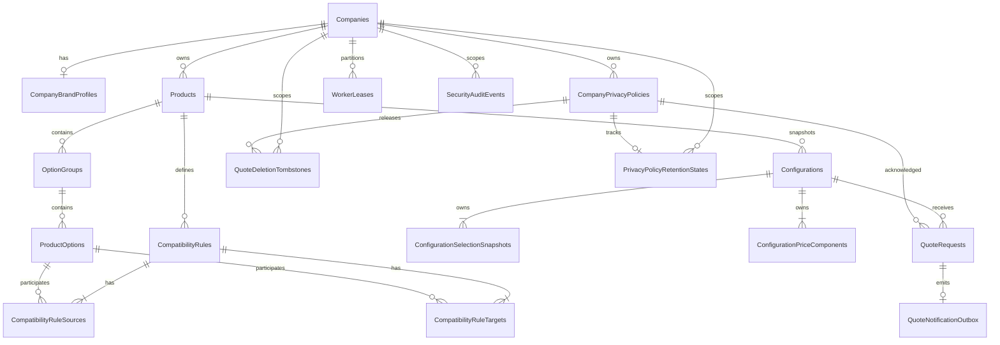

# Database Design

Document version: 1.2  
Status: Approved for implementation planning; SL-000 completed; database-domain implementation remains unauthorized  
Last updated: 2026-07-28  
Target: Azure SQL Database and SQL Server 2025, compatibility level `170`

## 1. Purpose and authority

This document translates the approved logical model and architecture into one physical relational design for NainConfigurator. It defines environment profiles, schemas, tables, columns, keys, constraints, indexes, company Row-Level Security (RLS), transactions, concurrency, idempotency, outbox processing, retention hooks and migration rules.

It implements, and does not redefine:

- `02-BusinessRules.md` for business invariants and lifecycle behavior.
- `03-DataModel.md` for logical entities, ownership and historical authority.
- `04.1-ApiContracts.md` for public fields and stable error behavior.
- `04.2-NonFunctionalRequirements.md` for capacity and measurable performance.
- `04.3-SecurityAndPrivacy.md` for isolation, retention, erasure and audit requirements.
- `06-Architecture.md` for Azure SQL authority, transaction ownership and deployment boundaries.

This document contains no executable SQL or Entity Framework migration. It does not authorize application code, a cloud deployment, a billable resource or real personal data.

## 2. Direct outcome

The recommendation is one shared-schema relational design for every environment. The prototype uses the same SQL behavior as production and changes only hosting, durability and operational guarantees.

- Local prototype: zero recurring database cost on the owner's computer.
- Optional public demo: Azure SQL Database free offer with synthetic data and deliberate suspension on quota exhaustion.
- Paying pilot and production: the approved paid Azure SQL profile when reliability, recovery and personal-data obligations apply.
- No SQLite, in-memory provider, PostgreSQL fork or desk-specific schema is introduced.

This avoids the false economy of proving the prototype against a database that cannot exercise SQL Server RLS, filtered indexes, rowversion, locking and migration behavior.

## 3. Design drivers

1. A second fundamentally different product must require data and assets only when it uses approved rule types.
2. SQL constraints must prevent cross-company relationships even if an application query is defective.
3. Configuration and quote creation must remain atomic and idempotent under concurrent requests and multiple hosts.
4. Historical configurations must be reconstructable without current catalog rows.
5. Quote personal data must have no public read path and must be deletable as one bounded aggregate.
6. Prototype cost must remain zero by default without creating a later database rewrite.
7. Indexes must serve approved query shapes, not hypothetical reporting.
8. Physical design must stay understandable enough for one owner to operate and evolve safely.

## 4. Environment and cost profiles

| Phase | Database profile | Data | Cost and guarantees |
|---|---|---|---|
| Local prototype | SQL Server 2025 Developer Edition on local Windows or a local container; compatibility `170` | Synthetic only | No recurring database charge. Developer Edition is non-production only. No availability, managed backup or recovery promise. |
| Local integration | Disposable SQL Server 2025 Developer database created from migrations | Deterministic synthetic fixtures | No persistent environment required. It validates real SQL constraints, RLS and concurrency. |
| Optional public demo | Azure SQL Database General Purpose free offer; automatic pause until the next month when the free allowance is exhausted | Synthetic or deliberately non-personal demo data only | Free allowance is currently 100,000 vCore seconds, 32 GB data and 32 GB backup per database each month. It has seven-day PITR and LRS backup under the no-charge stop option; it does not satisfy production NFRs. |
| Paying pilot/production | Approved Azure SQL Database General Purpose serverless, `0.5-4` vCores, auto-pause disabled, zone redundant, GZRS backup, 35-day PITR | Approved customer data only after launch gates | Billable. Required when the product must meet security, recovery and continuity obligations. |

Rules:

- No Azure resource is required to begin implementation or local demonstrations.
- The free Azure offer is optional, requires an Azure subscription and must use the stop-until-next-month behavior. Enabling automatic overage billing requires separate explicit authorization.
- A free/demo database may stop without notice after quota exhaustion; therefore it cannot support a paid customer, real personal data, the 99.5-percent internal SLO or the approved production RPO.
- SQL Server Developer Edition must never serve production traffic. SQL Server Express is not selected because Developer Edition exercises the fuller target feature set without cost in a non-production environment.
- Schema migrations must pass on local SQL Server 2025 and an Azure SQL compatibility test before a production release.
- TDE, GZRS, managed identity, zone redundancy and provider backups are environment capabilities, not schema differences.

## 5. Database-wide conventions

### 5.1 Database boundary

- One database exists per environment.
- All companies share one schema design and one release.
- A company never receives a custom table, column, migration or database in the shared SaaS offer.
- Suggested database names are `NainConfigurator_Local`, `NainConfigurator_Integration`, `NainConfigurator_Demo` and `NainConfigurator_Production`.
- Production and demo never share a server, identity, connection string, backup or data copy.

### 5.2 Schemas

| Schema | Responsibility |
|---|---|
| `catalog` | Companies, branding, privacy policies, products, groups, options and compatibility rules |
| `sales` | Immutable configurations, selection/price snapshots and restricted quote requests |
| `operations` | Narrow notification outbox, worker leases, audit evidence and deletion/retention state |
| `security` | RLS predicate function and security policy only |

The schemas express ownership and permissions; they do not become application layers or separate services.

### 5.3 Naming and key conventions

- Table and column identifiers use English `PascalCase`.
- Constraints and indexes use explicit `PK_`, `AK_`, `FK_`, `UQ_`, `CK_` and `IX_` names.
- Internal entity keys use `bigint IDENTITY` and never leave the server contract.
- Pure relationship tables use composite primary keys instead of meaningless surrogate identifiers.
- Public configuration and quote codes remain cryptographically random fixed `char(28)` values.
- External request IDs and operational instruction IDs use `uniqueidentifier` but are never clustered primary keys.
- No public identifier is inferred from an internal key, timestamp or sequence.

`bigint` is selected for a uniform internal-key policy and long product life. Random GUID primary keys are rejected because they widen every relationship and fragment clustered indexes without providing a required distributed-write benefit.

### 5.4 Text, codes and collation

- The database default collation is `Latin1_General_100_CI_AS_SC` for Unicode supplementary-character support.
- Human-readable text uses `nvarchar` and an `_SC` collation. Physical capacity is up to two UTF-16 code units per approved Unicode scalar, while `CHECK` constraints enforce the logical scalar limit with `_SC` character semantics.
- Stable slugs, catalog codes, public codes, currency, hashes represented as text and enum-like discriminators use ASCII `varchar`/`char` with `Latin1_General_100_BIN2` comparison.
- Code uniqueness is case-sensitive and ordinal. The API always returns the persisted canonical form.
- Normalization and BCP 47, URL, email, color-contrast and Unicode validation remain application/publication responsibilities where SQL cannot correctly express the standard.

### 5.5 Common storage types

| Concept | Physical type | Rule |
|---|---|---|
| Money | `decimal(19,2)` | Non-negative for the MVP; authoritative sums never use floating point |
| Currency | `char(3)` | Uppercase ISO 4217 code |
| UTC instant | `datetime2(3)` | UTC only; millisecond precision; server/database default for creation timestamps |
| Mutable concurrency | `rowversion` | Opaque optimistic concurrency token; never treated as a timestamp |
| SHA-256 | `binary(32)` | Raw bytes; hexadecimal conversion occurs at the contract boundary |
| Request fingerprint | `binary(32)` plus `tinyint` version | SHA-256 is an index aid; exact persisted fields still determine replay equality |
| Boolean | `bit` | Required unless absence has distinct business meaning |
| JSON visual state | `nvarchar(max)` with binary collation | Canonical JSON text, `ISJSON` check and 16-KB UTF-8 application limit |

The native SQL `json` type is not selected yet. It is GA in Azure SQL and supported by EF Core 10, but remains preview in local SQL Server 2025. Using `nvarchar(max)` plus validation preserves one non-preview schema. Reconsider native `json` only when it is GA in every required database profile and migration tests prove equivalent fingerprint/retrieval behavior.

### 5.6 Database options

- Compatibility level is `170` everywhere.
- `READ_COMMITTED_SNAPSHOT` is `ON` everywhere to match Azure SQL and avoid unnecessary read/write blocking.
- `ALLOW_SNAPSHOT_ISOLATION` is `ON` for consistent multi-query catalog reads where required.
- Automatic statistics and Query Store are enabled in production and Azure demo; local tests may reset Query Store evidence between runs.
- Production uses TDE and provider-managed encryption/backups. Local data remains synthetic, so local encryption is not presented as a production control.

## 6. Physical relationship overview

Every company-owned table carries `CompanyId`, including relationship, snapshot and worker tables. The repeated key is intentional: it supports RLS, tenant-leading indexes and composite foreign keys that make cross-company relationships structurally impossible.

## 7. Catalog tables

### 7.1 `catalog.Companies`

| Column | Type | Null | Physical rule |
|---|---|---:|---|
| `CompanyId` | `bigint IDENTITY` | No | Clustered primary key |
| `Slug` | `varchar(100)` BIN2 | No | Global alternate key; 1-100 ASCII lowercase letters, digits or hyphens |
| `DisplayName` | `nvarchar(300)` | No | 1-150 Unicode scalar values |
| `DefaultLocale` | `varchar(35)` BIN2 | No | Supported BCP 47 tag validated before publication |
| `ActivePrivacyPolicyId` | `bigint` | Yes | Same-company composite FK to an immutable policy |
| `RowVersion` | `rowversion` | No | Optimistic concurrency |

Keys and checks:

- `PK_Companies (CompanyId)`.
- `UQ_Companies_Slug (Slug)`.
- `CK_Companies_SlugFormat` rejects empty or non-approved characters.
- `CK_Companies_DisplayNameLength` enforces 1-150 Unicode scalar values.
- The composite FK `(ActivePrivacyPolicyId, CompanyId)` references `(CompanyPrivacyPolicyId, CompanyId)`. A null active policy is allowed for an unpublished/non-quote-enabled company; publication validation rejects it for public quote intake.

### 7.2 `catalog.CompanyBrandProfiles`

| Column | Type | Null | Physical rule |
|---|---|---:|---|
| `CompanyBrandProfileId` | `bigint IDENTITY` | No | Clustered primary key |
| `CompanyId` | `bigint` | No | Owning company and RLS key |
| `Version` | `int` | No | Positive independent version |
| `Mode` | `varchar(20)` BIN2 | No | `CoBranded` only in MVP |
| `LogoAssetKey` | `nvarchar(400)` | Yes | At most 200 Unicode scalar values |
| `PrimaryColor` | `char(7)` BIN2 | No | `#RRGGBB` syntax |
| `OnPrimaryColor` | `char(7)` BIN2 | No | `#RRGGBB` syntax |
| `RowVersion` | `rowversion` | No | Optimistic concurrency |

Constraints:

- Unique `(CompanyId)` permits at most one current profile.
- Unique `(CompanyId, CompanyBrandProfileId)` supports company-safe relationships if later required.
- FK `CompanyId` to `Companies` uses `NO ACTION`.
- Checks enforce positive version, supported mode, color syntax and logo length. Accessibility contrast remains publication validation.

### 7.3 `catalog.CompanyPrivacyPolicies`

| Column | Type | Null | Physical rule |
|---|---|---:|---|
| `CompanyPrivacyPolicyId` | `bigint IDENTITY` | No | Clustered primary key |
| `CompanyId` | `bigint` | No | Owning company and RLS key |
| `Version` | `nvarchar(200)` BIN2 | No | 1-100 Unicode scalar values; stable public version |
| `ResourceUrl` | `nvarchar(max)` BIN2 | No | HTTPS resource; at most 2,048 Unicode scalar values |
| `ContentAssetKey` | `nvarchar(400)` | No | At most 200 Unicode scalar values |
| `ContentHashSha256` | `binary(32)` | No | Exact immutable content identity |
| `PublishedAtUtc` | `datetime2(3)` | No | Server UTC publication time |
| `QuoteRetentionDays` | `smallint` | No | 30-1,825; default 365 |

Constraints:

- Unique `(CompanyId, Version)`.
- Unique `(CompanyPrivacyPolicyId, CompanyId)` enables the same-company active-policy and quote FKs.
- Checks enforce version/resource/asset length, HTTPS prefix, content-hash presence and retention range.
- No normal application role receives `UPDATE` permission on published policy content. Activation updates `Companies.ActivePrivacyPolicyId`, not the policy row.
- Values above 365 days still require controller justification in the audited publication workflow; a check constraint cannot prove that evidence.

The explicit version and URL limits close previously missing storage bounds and are now mirrored in `03-DataModel.md` and `04.1-ApiContracts.md`.

### 7.4 `catalog.Products`

| Column | Type | Null | Physical rule |
|---|---|---:|---|
| `ProductId` | `bigint IDENTITY` | No | Clustered primary key |
| `CompanyId` | `bigint` | No | Ownership and RLS key |
| `Code` | `varchar(50)` BIN2 | No | Stable product code inside company |
| `Name` | `nvarchar(300)` | No | 1-150 Unicode scalar values |
| `Description` | `nvarchar(4000)` | No | At most 2,000 Unicode scalar values |
| `CatalogVersion` | `int` | No | Positive for published state |
| `BasePrice` | `decimal(19,2)` | No | Non-negative |
| `CurrencyCode` | `char(3)` BIN2 | No | Uppercase ISO code |
| `PriceDisclaimer` | `nvarchar(1000)` | No | 1-500 Unicode scalar values |
| `VisualAssetKey` | `nvarchar(400)` | Yes | At most 200 Unicode scalar values |
| `IsActive` | `bit` | No | New commercial actions allowed only when true |
| `IsPublished` | `bit` | No | Publicly visible only when true |
| `RowVersion` | `rowversion` | No | Catalog concurrency token |

Constraints:

- Unique `(CompanyId, Code)` and `(CompanyId, ProductId)`.
- Checks enforce code format, text limits, non-negative price, uppercase three-letter currency and `CatalogVersion > 0` whenever `IsPublished = 1`.
- FK `CompanyId` to `Companies` uses `NO ACTION`.
- Product deletion is not granted; deactivation/unpublication is the supported lifecycle.

### 7.5 `catalog.OptionGroups`

| Column | Type | Null | Physical rule |
|---|---|---:|---|
| `OptionGroupId` | `bigint IDENTITY` | No | Clustered primary key |
| `CompanyId` | `bigint` | No | Denormalized immutable ownership/RLS key |
| `ProductId` | `bigint` | No | Owning product |
| `Code` | `varchar(50)` BIN2 | No | Stable code inside product |
| `Name` | `nvarchar(300)` | No | 1-150 Unicode scalar values |
| `MinSelections` | `smallint` | No | 0-500 |
| `MaxSelections` | `smallint` | Yes | 1-500 or null |
| `IsActive` | `bit` | No | Publication/selectability flag |
| `SortOrder` | `int` | No | Deterministic primary order |
| `RowVersion` | `rowversion` | No | Catalog concurrency token |

Constraints:

- Unique `(CompanyId, ProductId, Code)` and `(CompanyId, ProductId, OptionGroupId)`.
- Composite FK `(CompanyId, ProductId)` to `Products` uses `NO ACTION`.
- Checks enforce code/name limits, `MinSelections >= 0`, nullable `MaxSelections >= 1` and `MinSelections <= MaxSelections` when present.
- Active/default satisfiability is a publication invariant across rows, not a single-row check.

### 7.6 `catalog.ProductOptions`

| Column | Type | Null | Physical rule |
|---|---|---:|---|
| `ProductOptionId` | `bigint IDENTITY` | No | Clustered primary key |
| `CompanyId` | `bigint` | No | Ownership/RLS key |
| `ProductId` | `bigint` | No | Owning product and code scope |
| `OptionGroupId` | `bigint` | No | Same-company, same-product group |
| `Code` | `varchar(50)` BIN2 | No | Stable and unique across the product |
| `Name` | `nvarchar(300)` | No | 1-150 Unicode scalar values |
| `PriceAdjustment` | `decimal(19,2)` | No | Non-negative in MVP |
| `VisualAssetKey` | `nvarchar(400)` | Yes | At most 200 Unicode scalar values |
| `IsDefault` | `bit` | No | Participates in default selection |
| `IsActive` | `bit` | No | Selectable for new configurations |
| `SortOrder` | `int` | No | Deterministic order inside group |
| `RowVersion` | `rowversion` | No | Catalog concurrency token |

Constraints:

- Unique `(CompanyId, ProductId, Code)` and `(CompanyId, ProductId, ProductOptionId)`.
- Composite FK `(CompanyId, ProductId, OptionGroupId)` to `OptionGroups` prevents cross-product group assignment.
- Checks enforce code/name/asset limits and non-negative price.
- Published options are deactivated, never renamed/reused or destructively deleted.

### 7.7 `catalog.CompatibilityRules`

| Column | Type | Null | Physical rule |
|---|---|---:|---|
| `CompatibilityRuleId` | `bigint IDENTITY` | No | Clustered primary key |
| `CompanyId` | `bigint` | No | Ownership/RLS key |
| `ProductId` | `bigint` | No | Owning product |
| `Code` | `varchar(50)` BIN2 | No | Stable code inside product |
| `Type` | `varchar(32)` BIN2 | No | `RequiresAny` for MVP |
| `Message` | `nvarchar(1000)` | No | 1-500 Unicode scalar values |
| `IsActive` | `bit` | No | Evaluated when active |
| `RowVersion` | `rowversion` | No | Catalog concurrency token |

Constraints:

- Unique `(CompanyId, ProductId, Code)` and `(CompanyId, ProductId, CompatibilityRuleId)`.
- Composite FK `(CompanyId, ProductId)` to `Products` uses `NO ACTION`.
- Checks enforce code/message limits and the approved type set.
- Adding a genuinely new generic rule type requires a coordinated business, API, client, database-check and evaluator migration. Adding another product using `RequiresAny` does not.

### 7.8 `catalog.CompatibilityRuleSources`

| Column | Type | Null | Physical rule |
|---|---|---:|---|
| `CompanyId` | `bigint` | No | Ownership/RLS key |
| `ProductId` | `bigint` | No | Same-product guard |
| `CompatibilityRuleId` | `bigint` | No | Owning rule |
| `ProductOptionId` | `bigint` | No | Participating source option |

- Composite primary key `(CompanyId, CompatibilityRuleId, ProductOptionId)` rejects duplicate source pairs.
- Composite FKs `(CompanyId, ProductId, CompatibilityRuleId)` and `(CompanyId, ProductId, ProductOptionId)` prevent cross-company and cross-product participation.
- `NO ACTION` applies to both relationships.

### 7.9 `catalog.CompatibilityRuleTargets`

It has the same physical columns and relationships as `CompatibilityRuleSources`.

- Composite primary key `(CompanyId, CompatibilityRuleId, ProductOptionId)` rejects duplicate targets.
- Same-company/same-product composite FKs reference the owning rule and target option.
- At least one source and target, active participant state and complete supported-rule semantics are validated before publication; SQL FKs alone cannot enforce minimum child cardinality.

## 8. Configuration and quote tables

### 8.1 `sales.Configurations`

| Column | Type | Null | Physical rule |
|---|---|---:|---|
| `ConfigurationId` | `bigint IDENTITY` | No | Clustered primary key |
| `ConfigurationCode` | `char(28)` BIN2 | No | Global unlisted public code |
| `ClientRequestId` | `uniqueidentifier` | No | Configuration idempotency key |
| `IdempotencyFingerprint` | `binary(32)` | No | SHA-256 of canonical typed request projection |
| `FingerprintVersion` | `tinyint` | No | `1` for MVP |
| `CompanyId` | `bigint` | No | Persisted immutable ownership/RLS key |
| `ProductId` | `bigint` | No | Product used at creation |
| `CatalogVersionAtCreation` | `int` | No | Accepted positive catalog version |
| `CompanySlugSnapshot` | `varchar(100)` BIN2 | No | Historical canonical slug |
| `CompanyNameSnapshot` | `nvarchar(300)` | No | Historical 1-150 scalar name |
| `ProductCodeSnapshot` | `varchar(50)` BIN2 | No | Historical product code |
| `ProductNameSnapshot` | `nvarchar(300)` | No | Historical 1-150 scalar name |
| `ProductBasePriceSnapshot` | `decimal(19,2)` | No | Historical base component amount |
| `ContentLocale` | `varchar(35)` BIN2 | No | Historical BCP 47 presentation locale |
| `CurrencyCode` | `char(3)` BIN2 | No | One historical ISO currency |
| `EstimatedPrice` | `decimal(19,2)` | No | Authoritative persisted total |
| `VisualStateSchemaVersion` | `smallint` | Yes | `1` when visual state is present |
| `VisualStateJson` | `nvarchar(max)` BIN2 | Yes | Canonical presentation-only JSON |
| `CreatedAtUtc` | `datetime2(3)` | No | Database/server UTC default |

Keys and constraints:

- Global unique `ConfigurationCode` with exact format `NCF-` plus 24 uppercase hexadecimal characters.
- Unique `(CompanyId, ProductId, ClientRequestId)` defines the approved configuration idempotency scope.
- Unique `(CompanyId, ConfigurationId)` supports company-safe child and quote relationships.
- Composite FK `(CompanyId, ProductId)` references `Products` with `NO ACTION`.
- Checks enforce fingerprint version, positive catalog version, snapshot text/code limits, non-negative prices, currency format and valid visual-state null pairing.
- When visual state exists, schema version must be `1`, `ISJSON(VisualStateJson) = 1`, and the canonical MVP camera document must already have passed the application 16-KB UTF-8 limit. A defensive `DATALENGTH <= 32,768` check is valid because the canonical version-1 document is ASCII JSON.
- Configurations receive no normal `UPDATE` permission. They are immutable after insert.

The database does not trust the fingerprint alone. Exact replay compares company, product, catalog version, normalized selection rows and canonical visual JSON stored by the winning request.

### 8.2 `sales.ConfigurationSelectionSnapshots`

| Column | Type | Null | Physical rule |
|---|---|---:|---|
| `ConfigurationSelectionSnapshotId` | `bigint IDENTITY` | No | Clustered primary key |
| `CompanyId` | `bigint` | No | Ownership/RLS key |
| `ConfigurationId` | `bigint` | No | Owning immutable configuration |
| `NormalizedPosition` | `smallint` | No | 0-499 deterministic order |
| `OptionGroupCodeSnapshot` | `varchar(50)` BIN2 | No | Historical group code |
| `OptionGroupNameSnapshot` | `nvarchar(300)` | No | Historical group name |
| `OptionCodeSnapshot` | `varchar(50)` BIN2 | No | Historical option code |
| `OptionNameSnapshot` | `nvarchar(300)` | No | Historical option name |
| `PriceAdjustmentSnapshot` | `decimal(19,2)` | No | Historical non-negative adjustment |
| `VisualAssetKeySnapshot` | `nvarchar(400)` | Yes | Historical generic visual key |

Constraints:

- Unique `(CompanyId, ConfigurationId, NormalizedPosition)`.
- Unique `(CompanyId, ConfigurationId, OptionCodeSnapshot)`.
- Composite FK `(CompanyId, ConfigurationId)` to `Configurations` uses `NO ACTION`.
- Checks enforce position, code/text/asset limits and non-negative amount.
- Normal roles receive `INSERT` and `SELECT` only; no update after aggregate commit.

### 8.3 `sales.ConfigurationPriceComponents`

| Column | Type | Null | Physical rule |
|---|---|---:|---|
| `ConfigurationPriceComponentId` | `bigint IDENTITY` | No | Clustered primary key |
| `CompanyId` | `bigint` | No | Ownership/RLS key |
| `ConfigurationId` | `bigint` | No | Owning immutable configuration |
| `Position` | `smallint` | No | 0 for base, then 1-500 |
| `Type` | `varchar(32)` BIN2 | No | `BasePrice` or `OptionAdjustment` |
| `CodeSnapshot` | `varchar(50)` BIN2 | No | Product or option code |
| `NameSnapshot` | `nvarchar(300)` | No | Historical display name |
| `Amount` | `decimal(19,2)` | No | Historical non-negative component |

Constraints:

- Unique `(CompanyId, ConfigurationId, Position)`.
- A filtered unique index on `(CompanyId, ConfigurationId)` where `Type = 'BasePrice'` enforces at most one base component.
- Composite FK `(CompanyId, ConfigurationId)` to `Configurations` uses `NO ACTION`.
- Checks enforce allowed types, position bounds, code/name limits, non-negative amount and `BasePrice` at position zero.
- Exactly one base component, one option component per selection and total equality are verified inside the configuration transaction and by integrity tests/reconciliation. SQL declarative constraints cannot enforce all three across sibling tables without procedural coupling.

### 8.4 `sales.QuoteRequests`

| Column | Type | Null | Physical rule |
|---|---|---:|---|
| `QuoteRequestId` | `bigint IDENTITY` | No | Clustered primary key |
| `QuoteRequestCode` | `char(28)` BIN2 | No | Global code; never a public read capability |
| `ClientRequestId` | `uniqueidentifier` | No | Quote idempotency key |
| `IdempotencyFingerprint` | `binary(32)` | No | SHA-256 canonical quote projection |
| `FingerprintVersion` | `tinyint` | No | `1` for MVP |
| `CompanyId` | `bigint` | No | Derived from configuration; RLS key |
| `ConfigurationId` | `bigint` | No | Existing immutable configuration |
| `Status` | `varchar(20)` BIN2 | No | `New` only in MVP |
| `ContactName` | `nvarchar(300)` | No | Normalized; 1-150 Unicode scalar values |
| `ContactEmail` | `nvarchar(508)` BIN2 | No | Normalized; at most 254 Unicode scalar values |
| `ContactPhone` | `nvarchar(60)` | Yes | Normalized; at most 30 Unicode scalar values |
| `Message` | `nvarchar(2000)` | Yes | Normalized; at most 1,000 Unicode scalar values |
| `CompanyPrivacyPolicyId` | `bigint` | No | Same-company immutable policy |
| `PrivacyNoticeAcknowledged` | `bit` | No | Must be true for persisted quote |
| `AcknowledgedPrivacyPolicyVersion` | `nvarchar(200)` BIN2 | No | Immutable 1-100 scalar copy |
| `AcknowledgedPrivacyContentHash` | `binary(32)` | No | Immutable content identity copy |
| `PrivacyNoticeAcknowledgedAtUtc` | `datetime2(3)` | No | Server UTC evidence |
| `RetentionUntilUtc` | `datetime2(3)` | No | Approved policy deadline |
| `LegalHoldStartedAtUtc` | `datetime2(3)` | Yes | Present only for active hold |
| `LegalHoldReviewAtUtc` | `datetime2(3)` | Yes | At most 90 days after hold/review |
| `LegalHoldUntilUtc` | `datetime2(3)` | Yes | Time-bounded hold deadline |
| `LegalHoldOwnerRef` | `varchar(200)` BIN2 | Yes | Authorized non-secret actor/workload reference |
| `LegalHoldReasonCode` | `varchar(100)` BIN2 | Yes | Approved bounded reason code, not free personal text |
| `LegalHoldTicketRef` | `varchar(100)` BIN2 | Yes | Controller/legal instruction reference |
| `CreatedAtUtc` | `datetime2(3)` | No | Server UTC creation time |
| `RowVersion` | `rowversion` | No | Protects rectification and legal-hold changes |

Keys and constraints:

- Global unique `QuoteRequestCode` with `NQR-` plus 24 uppercase hexadecimal characters.
- Unique `(CompanyId, ClientRequestId)` defines the separate company-scoped quote idempotency namespace.
- Unique `(CompanyId, QuoteRequestId)` supports owned operational relationships.
- Composite FK `(CompanyId, ConfigurationId)` to `Configurations` and `(CompanyPrivacyPolicyId, CompanyId)` to `CompanyPrivacyPolicies`, both `NO ACTION`.
- Checks enforce fingerprint/status, normalized content lengths, mandatory acknowledgment, version length, retention after creation and all-or-none legal-hold metadata.
- `LegalHoldReviewAtUtc` cannot exceed 90 days after the hold start or previous reviewed deadline; application/audit workflow owns repeated reviews.
- The public host receives only the minimum quote `SELECT` needed to resolve idempotency and the exact insert capability. It exposes no quote read endpoint.
- Contact rectification and legal-hold changes require Operations authorization, rowversion matching and an audit event. They never modify configuration history.

The quote table deliberately repeats `CompanyId`. This enables RLS, a tenant-leading idempotency key and composite FKs without joining through the public configuration code.

## 9. Operational tables

### 9.1 `operations.QuoteNotificationOutbox`

This is a narrow quote-delivery intent, not a generic event bus and not a second copy of contact data.

| Column | Type | Null | Physical rule |
|---|---|---:|---|
| `QuoteNotificationOutboxId` | `bigint IDENTITY` | No | Clustered primary key |
| `NotificationIntentId` | `uniqueidentifier` | No | Stable provider idempotency key |
| `CompanyId` | `bigint` | No | Ownership/RLS and worker partition |
| `QuoteRequestId` | `bigint` | No | Owning quote |
| `CreatedAtUtc` | `datetime2(3)` | No | Created in quote transaction |
| `AvailableAtUtc` | `datetime2(3)` | No | Next eligible attempt |
| `AttemptCount` | `smallint` | No | Starts at zero; non-negative |
| `LeaseOwnerId` | `uniqueidentifier` | Yes | Current worker instance |
| `LeaseExpiresAtUtc` | `datetime2(3)` | Yes | Recoverable bounded claim |
| `LastAttemptAtUtc` | `datetime2(3)` | Yes | Operational evidence |
| `CompletedAtUtc` | `datetime2(3)` | Yes | Delivery confirmed by adapter |
| `LastFailureCode` | `varchar(100)` BIN2 | Yes | Sanitized technical code only |
| `RowVersion` | `rowversion` | No | Claim/update concurrency |

Constraints:

- Unique `NotificationIntentId` and unique `(CompanyId, QuoteRequestId)` guarantee one stored intent per quote.
- Composite FK `(CompanyId, QuoteRequestId)` to `QuoteRequests` uses `ON DELETE CASCADE`; this is the only cascade in the MVP and is justified because the outbox row is an owned, non-personal part of the quote deletion aggregate.
- Lease owner/expiry are both null or both present. Completed rows cannot remain leased.
- No contact value, message, provider payload or recipient address is persisted here. A claimed worker loads the quote under the same company context and passes a minimum provider-neutral model to the future adapter.
- Delivery is at least once. `NotificationIntentId` must be supplied to a provider that supports idempotency, or the later integration decision must explicitly accept and mitigate uncertain duplicate delivery.

### 9.2 `operations.WorkerLeases`

| Column | Type | Null | Physical rule |
|---|---|---:|---|
| `WorkerLeaseId` | `bigint IDENTITY` | No | Clustered primary key |
| `CompanyId` | `bigint` | No | Explicit worker partition/RLS key |
| `WorkType` | `varchar(50)` BIN2 | No | Approved bounded work family |
| `LeaseOwnerId` | `uniqueidentifier` | No | Worker instance |
| `LeaseExpiresAtUtc` | `datetime2(3)` | No | Renewable deadline |
| `LastCompletedAtUtc` | `datetime2(3)` | Yes | Non-personal progress evidence |
| `RowVersion` | `rowversion` | No | Compare-and-swap token |

- Unique `(CompanyId, WorkType)` prevents two live partition rows for the same responsibility.
- FK `CompanyId` to `Companies` uses `NO ACTION`.
- Allowed MVP work types are `QuoteNotification`, `QuoteRetention`, `DeletionReconciliation` and `CacheReconciliation`.
- A lease is advisory coordination, not correctness authority. Every operation remains idempotent after lease loss.

### 9.3 `operations.SecurityAuditEvents`

| Column | Type | Null | Physical rule |
|---|---|---:|---|
| `SecurityAuditEventId` | `bigint IDENTITY` | No | Clustered primary key |
| `EventId` | `uniqueidentifier` | No | Global event identity |
| `CompanyId` | `bigint` | Yes | Company scope; null only for true platform events |
| `OccurredAtUtc` | `datetime2(3)` | No | Server UTC event time |
| `ActorRef` | `varchar(200)` BIN2 | No | Workforce/workload identifier, never display-name authority |
| `EffectiveCapability` | `varchar(100)` BIN2 | No | Least-privilege capability used |
| `ActionCode` | `varchar(100)` BIN2 | No | Stable English action identifier |
| `TargetType` | `varchar(50)` BIN2 | No | Non-personal bounded target category |
| `TargetRef` | `varchar(200)` BIN2 | Yes | Internal non-personal reference; no contact value |
| `Outcome` | `varchar(20)` BIN2 | No | `Succeeded`, `Failed` or `Denied` |
| `ReasonOrTicketRef` | `varchar(200)` BIN2 | Yes | Bounded reference, not unrestricted personal text |
| `TraceId` | `varchar(100)` BIN2 | Yes | Correlation with protected telemetry |
| `RetainUntilUtc` | `datetime2(3)` | No | Normally occurrence plus 400 days |

Rules:

- Unique `EventId`.
- Nullable FK `CompanyId` to `Companies` preserves scope integrity for company events and uses `NO ACTION`.
- The table is append-only for application identities: `INSERT` is allowed through a narrow persistence port; `UPDATE` is denied.
- Deletion is granted only to the retention identity after `RetainUntilUtc` and is itself audited outside the deleted row set.
- Platform-wide null-company events can be written only by an authorized operations/workload principal; a public company-scoped connection fails the RLS block predicate.
- SQL audit evidence complements Azure platform/database auditing; it does not copy request bodies, contact values, quote messages, secrets or unrestricted stack traces.

### 9.4 `operations.QuoteDeletionTombstones`

This table supports post-restore erasure reconciliation without retaining the deleted quote code or client request ID.

| Column | Type | Null | Physical rule |
|---|---|---:|---|
| `QuoteDeletionTombstoneId` | `bigint IDENTITY` | No | Clustered primary key |
| `DeletionInstructionId` | `uniqueidentifier` | No | Global idempotent deletion instruction |
| `CompanyId` | `bigint` | No | Company scope/RLS key |
| `CompanyPrivacyPolicyId` | `bigint` | No | Policy whose reference was released |
| `DeletionLookupHash` | `binary(32)` | No | Keyed HMAC lookup identity for restore reconciliation |
| `ReasonCode` | `varchar(50)` BIN2 | No | `RetentionExpired`, `RightsErasure` or `Termination` |
| `DeletedAtUtc` | `datetime2(3)` | No | Confirmed SQL deletion time |
| `ExpiresAtUtc` | `datetime2(3)` | No | At least 42 days after deletion |

Rules:

- Unique `DeletionInstructionId` and unique `DeletionLookupHash`.
- Composite FK `(CompanyPrivacyPolicyId, CompanyId)` to `CompanyPrivacyPolicies` uses `NO ACTION`.
- The HMAC is calculated over the quote public code using a dedicated Key Vault key. SHA-256 without a secret is prohibited because the code would remain testable.
- The tombstone stores no contact value, message, raw quote code, client request ID or fingerprint.
- Before deleting SQL data, the worker must durably place the instruction in a proposed private recovery container with a minimum 42-day lifecycle. The local SQL copy enables fast reconciliation; the external encrypted copy survives restoration to a point before this row existed.
- The external call is never inside a SQL transaction. If the external instruction succeeds and SQL deletion fails, retrying the instruction is safe and deletion remains pending. SQL deletion must not run first.
- Tombstones remain for at least the 35-day production backup window plus operational margin. Exact protected-container lifecycle and recovery runbook belong to `09-DeploymentAndOperations.md`.

### 9.5 `operations.PrivacyPolicyRetentionStates`

| Column | Type | Null | Physical rule |
|---|---|---:|---|
| `CompanyPrivacyPolicyId` | `bigint` | No | Primary key and policy reference |
| `CompanyId` | `bigint` | No | Company scope/RLS key |
| `LastQuoteDeletedAtUtc` | `datetime2(3)` | Yes | Latest release of a quote reference |
| `EarliestPolicyDeletionAtUtc` | `datetime2(3)` | Yes | Last deletion plus 400 days |
| `RowVersion` | `rowversion` | No | Concurrent deletion-worker protection |

- Composite FK `(CompanyPrivacyPolicyId, CompanyId)` references the immutable policy with `NO ACTION`.
- The state contains no quote identifier and does not prove notice acceptance for a specific person.
- Policy deletion still requires: not active, no live quote FK, the 400-day period elapsed and no contractual/legal requirement. Automatic deletion based only on this timestamp is prohibited.

## 10. Foreign keys and delete behavior

### 10.1 Ownership-key rule

Every cross-table company relationship includes `CompanyId` in both the referencing and referenced key. A simple FK on an internal child ID is insufficient when it could link a row from company A to company B.

Required alternate-key shapes include:

- `Products (CompanyId, ProductId)`.
- `OptionGroups (CompanyId, ProductId, OptionGroupId)`.
- `ProductOptions (CompanyId, ProductId, ProductOptionId)`.
- `CompatibilityRules (CompanyId, ProductId, CompatibilityRuleId)`.
- `Configurations (CompanyId, ConfigurationId)`.
- `QuoteRequests (CompanyId, QuoteRequestId)`.
- `CompanyPrivacyPolicies (CompanyPrivacyPolicyId, CompanyId)`.

The apparent redundancy is a database-enforced tenant boundary, not accidental denormalization.

### 10.2 Delete matrix

| Parent | Child | Action | Reason |
|---|---|---|---|
| Company | All company data | `NO ACTION` | Company hard deletion is not an MVP operation |
| Product | Groups/options/rules/configurations | `NO ACTION` | Published data deactivates and history must survive |
| OptionGroup | ProductOption | `NO ACTION` | Prevent accidental catalog destruction |
| ProductOption | Rule participants | `NO ACTION` | Rule graph must be changed explicitly inside publication |
| CompatibilityRule | Source/target participants | `NO ACTION` | Managed publication removes relationships explicitly |
| Configuration | Selection/price snapshots/quotes | `NO ACTION` | Configuration deletion is not approved; snapshots must not disappear accidentally |
| PrivacyPolicy | Company active pointer/quotes | `NO ACTION` | Preserve active and historical notice evidence |
| QuoteRequest | QuoteNotificationOutbox | `CASCADE` | Proven private owned row, required to leave with complete quote deletion |

All future destructive catalog/configuration lifecycle changes require a new approved retention decision and migration. `CASCADE` must not be added for convenience.

## 11. Check-constraint and invariant boundary

| Invariant | Database enforcement | Additional owner |
|---|---|---|
| Slug/code/public-code form and scope | Binary collation, checks and unique keys | Application returns canonical values |
| Same-company relationships | Composite FKs | RLS and application context |
| Text logical maxima | Overprovisioned UTF-16 column plus `_SC` length check | API/publication counts Unicode scalars before persistence |
| Selection min/max numeric consistency | Check constraint | Publication validates satisfiability |
| Supported brand/rule/component/quote/work type | Check constraint | Coordinated capability migration expands set |
| Money scale and non-negative MVP values | `decimal(19,2)` plus checks | Application computes authoritative totals |
| Active published catalog validity | Not fully declarative | Publication transaction validates complete graph/defaults/capacity |
| Configuration snapshot completeness | Required columns, FKs and unique child order | One atomic application transaction and integrity tests |
| Price component total equals header | Not a row check | Application transaction plus reconciliation query |
| Exactly one base price and one adjustment per selection | Filtered unique/index rules give upper bounds | Transaction and integration tests prove completeness |
| Visual state structure/UTF-8 size | JSON validity, null pairing and defensive stored-size check | Typed application validation and canonical serializer |
| Quote policy was active at first creation | Same-company FK | Quote transaction locks/validates current company policy |
| Quote retention derived from policy | Date checks | Quote transaction calculates exact deadline |
| Legal hold evidence/review | All-or-none checks and rowversion | Operations authorization and audit event |
| Immutability | Denied update permissions for immutable tables | Application command model and negative tests |

No trigger is introduced for business validation, price calculation, catalog versioning or snapshot construction. Hidden trigger behavior would duplicate application rules and make migrations harder to reason about.

## 12. Index strategy

Indexes below are the approved starting set. A release must remove unused/redundant indexes or add new ones only from Query Store/load evidence and with write-cost review.

### 12.1 Catalog queries

| Index | Key | Purpose |
|---|---|---|
| `UQ_Companies_Slug` | `Slug` | Resolve trusted company context from route |
| `UQ_Products_Company_Code` | `CompanyId, Code` | Resolve current product after company |
| `IX_OptionGroups_CatalogRead` | `CompanyId, ProductId, IsActive, SortOrder, Code` | Ordered active group load; include name and limits |
| `IX_ProductOptions_CatalogRead` | `CompanyId, ProductId, IsActive, OptionGroupId, SortOrder, Code` | Ordered active/default option load; include price/name/visual fields |
| `IX_CompatibilityRules_CatalogRead` | `CompanyId, ProductId, IsActive, Code` | Active rule load; include type/message |
| `IX_RuleSources_ByRule` | `CompanyId, ProductId, CompatibilityRuleId, ProductOptionId` | Rule source expansion |
| `IX_RuleTargets_ByRule` | `CompanyId, ProductId, CompatibilityRuleId, ProductOptionId` | Rule target expansion |
| `UQ_PrivacyPolicies_Company_Version` | `CompanyId, Version` | Validate submitted active policy version |

The unique company/product code indexes already serve current-row resolution; a second filtered public-product index is not added until measurement proves it necessary.

### 12.2 Configuration and quote queries

| Index | Key | Purpose |
|---|---|---|
| `UQ_Configurations_Code` | `ConfigurationCode` | Public unlisted configuration retrieval |
| `UQ_Configurations_Idempotency` | `CompanyId, ProductId, ClientRequestId` | Exact replay/conflict and concurrency winner |
| `IX_ConfigurationSelections_Read` | `CompanyId, ConfigurationId, NormalizedPosition` | Deterministic saved selection response |
| `IX_ConfigurationPrice_Read` | `CompanyId, ConfigurationId, Position` | Deterministic price breakdown response |
| `UQ_QuoteRequests_Code` | `QuoteRequestCode` | Operations/support lookup only |
| `UQ_QuoteRequests_Idempotency` | `CompanyId, ClientRequestId` | Quote replay/conflict before mutable checks |
| `IX_QuoteRequests_Retention` | `CompanyId, RetentionUntilUtc, QuoteRequestId` including hold deadlines/policy | Company-partitioned expiry scan |
| `IX_QuoteRequests_Configuration` | `CompanyId, ConfigurationId, CreatedAtUtc` | Policy/configuration trace and approved support workflow |

Snapshot child unique constraints double as read indexes; duplicate indexes with the same leading keys are prohibited.

### 12.3 Worker, deletion and audit queries

| Index | Key/filter | Purpose |
|---|---|---|
| `IX_Outbox_Due` | `CompanyId, AvailableAtUtc, LeaseExpiresAtUtc, QuoteNotificationOutboxId` where `CompletedAtUtc IS NULL` | Bounded claim of due/recoverable delivery intents |
| `UQ_WorkerLeases_Partition` | `CompanyId, WorkType` | Compare-and-swap partition lease |
| `IX_Audit_Retention` | `RetainUntilUtc, SecurityAuditEventId` | Retention deletion without scanning current evidence |
| `IX_Audit_CompanyTime` | `CompanyId, OccurredAtUtc` | Authorized company-scoped investigation |
| `IX_DeletionTombstones_Expiry` | `ExpiresAtUtc, QuoteDeletionTombstoneId` | Recovery-journal lifecycle |
| `IX_PolicyRetention_Eligible` | `EarliestPolicyDeletionAtUtc, CompanyPrivacyPolicyId` where non-null | Manual policy-disposal candidate review |

### 12.4 Index acceptance rules

- Every FK used from parent to child has an index whose leading columns match company and parent identity.
- Tenant hot-path indexes lead with `CompanyId` except globally resolved cryptographically random codes/slugs.
- No index contains quote name, email, phone or message as a key or included column.
- No public-code index includes contact data.
- Contact search by email is intentionally absent because the product has no public or general self-service lookup. Verified rights/support workflows use explicitly authorized bounded operations designed later.
- Index compression, fill factor and online/resumable maintenance remain provider/measurement choices in `09-DeploymentAndOperations.md`; arbitrary non-default values are prohibited initially.

## 13. Row-Level Security and database permissions

### 13.1 Predicate design

One schema-bound inline table-valued predicate in `security` authorizes a row when:

1. The row `CompanyId` equals `TRY_CONVERT(bigint, SESSION_CONTEXT(N'CompanyId'))`; or
2. The current database execution principal is a member of the dedicated Operations RLS-bypass role; or
3. The current execution principal is the dedicated no-login scope-resolver principal while running an approved resolver module.

Absence, null, malformed or mismatched company context returns no row. There is no default company and no session flag that grants bypass.

The security policy applies filter predicates and insert/update block predicates to every company-owned table in `catalog`, `sales` and `operations`. A block predicate is required in addition to filtering so a scoped identity cannot insert or move a row into another company even when it knows the internal key.

Bypass is based on database execution-principal membership, never `SESSION_CONTEXT(N'IsAdmin')`. Any connected user can set ordinary session-context values, so trusting a writable admin flag would be a privilege-escalation defect. Runtime callers receive neither bypass-role membership nor `IMPERSONATE` permission on the resolver principal.

### 13.2 Trusted scope resolution before RLS context

Some public operations begin with a globally stable external identifier before `CompanyId` is known. Granting unscoped table reads to solve this would defeat the isolation design.

Use narrowly permissioned database modules:

| Resolver | Input | Output | Caller |
|---|---|---|---|
| `security.ResolveCompanyScopeBySlug` | Canonical company slug | `CompanyId` only | Public/Operations |
| `security.ResolveConfigurationScopeByCode` | Random configuration code | `CompanyId` and `ConfigurationId` only | Public/Operations |
| `security.ResolveQuoteScopeByCode` | Random quote code | `CompanyId` and `QuoteRequestId` only | Operations only |
| `operations.ListWorkerCompanyPartitions` | Approved work type/batch cursor | Company IDs only | Worker only |

- Modules execute as a dedicated no-login resolver principal that belongs only to the resolver-bypass role and owns no schema. Direct `IMPERSONATE` is denied.
- Each module receives only the precise underlying `SELECT` needed to resolve scope through named unique indexes; callers receive `EXECUTE` on named modules only.
- The caller does not become a member of either bypass role and cannot reuse the module execution context for arbitrary SQL.
- Resolvers return no company name, contact value, quote state, catalog content or existence detail beyond the internal scope required by the next server step.
- Application responses preserve uniform not-found behavior and rate limits; internal numeric IDs never leave the server.
- After resolution, the application sets the trusted session context and performs the authoritative query under normal RLS.
- Resolver principal, role, module permissions and negative tests are migration-owned schema artifacts.

### 13.3 Connection-pool-safe company context

- The Public and Worker applications set `CompanyId` immediately after every physical/logical connection open and before any query or transaction.
- The value uses `@read_only = 0`. Read-only session values cannot be changed on a reused logical connection and are incompatible with switching pooled connections safely between companies.
- Context is cleared in `finally` before a connection is returned to the pool. If clearing cannot be confirmed, the physical connection is disposed instead of being pooled. Correctness does not rely on the pool or driver clearing it.
- A connection interceptor rejects any tenant command when initialization has not completed.
- A reopened connection after a transient failure must set context again before retrying SQL.
- One transaction cannot change company context. Cross-company work opens a new scoped unit per company.
- `TraceId` may also use session context for auditing but never participates in authorization.

Mandatory integration tests force the same pooled connection through company A, company B, absent context and malformed context; all data visibility and writes must remain isolated.

### 13.4 Principal and role model

| Principal/role | Intended permission |
|---|---|
| Public managed identity | Company-scoped catalog/configuration reads, validation queries, configuration insert aggregate, quote idempotency/select and quote/outbox insert; no catalog mutation, audit read or RLS bypass |
| Operations managed identity | Authenticated company-scoped publication/support/privacy actions after setting `CompanyId`; no routine RLS-bypass membership |
| Worker managed identity | Enumerate only permitted company partition IDs, then set one company context and process outbox/retention/deletion; no general Operations bypass |
| Migration identity | DDL and migration history only during controlled deployment; not used by runtime hosts |
| Human administrator | Entra-authenticated break-glass/diagnostic access only through approved time-bounded procedure; no shared SQL login |

Cross-company Operations actions run only through named, audited database modules executing as a dedicated no-login principal with the minimum underlying permission. The connected Operations identity never receives direct membership of a general bypass role. The Worker obtains company partition IDs through a narrow database object that exposes only IDs/status required for work. It does not receive general unscoped table access. Routine application identities cannot disable the security policy, impersonate an execution principal, change schema or grant permissions.

### 13.5 Defense limits

RLS is defense in depth, not a substitute for parameterization, authorization and safe query construction. If an attacker gains arbitrary SQL execution under a runtime identity, ordinary session context can be changed. Therefore mass-assignment prevention, no dynamic SQL from input, least privilege, composite FKs and negative application tests remain mandatory.

## 14. Isolation, locking and transaction ownership

### 14.1 Default isolation

- Default reads use `READ COMMITTED` with RCSI enabled.
- A catalog graph loaded through multiple SQL statements uses an explicit `SNAPSHOT` transaction or one single-statement projection; split queries without a stable snapshot are prohibited.
- Business writes use explicit short `READ COMMITTED` transactions plus targeted locks described below.
- `SERIALIZABLE` is not the database-wide default. Range locking is used only for a proven invariant/query where a unique key cannot resolve concurrency.
- No transaction includes Blob, Redis, email/notification, telemetry or another external call.

### 14.2 Managed catalog publication

One publication transaction:

1. Resolves trusted company/product ownership.
2. Acquires an update/hold lock on the product row and validates the expected `RowVersion` and current `CatalogVersion`.
3. Applies the complete catalog mutation.
4. Validates count limits, same-product relationships, supported types, selection limits, active/default completeness, compatibility and price fit.
5. Increments `Product.CatalogVersion` exactly once for all covered changes.
6. Commits the rows and version as one unit.
7. Invalidates caches only after commit.

Brand-only publication locks the brand-profile row, increments its independent version and never changes a product catalog version. Activating a privacy policy inserts an immutable policy if new, locks the Company row, validates same ownership and updates the active pointer.

Draft catalog/version history remains outside the MVP; this transaction is a managed operational publication boundary, not a public administration API.

### 14.3 Validation-only request

- Creates no row and no idempotency record.
- Loads one consistent catalog version through a single projection or `SNAPSHOT` transaction.
- If the product version changed before the server can establish the requested current version, it returns the approved catalog conflict rather than combining versions.

### 14.4 Configuration creation

One transaction follows this order:

1. Resolve Company and Product from canonical route/body identifiers and set trusted company context.
2. Look up `(CompanyId, ProductId, ClientRequestId)` before mutable catalog validation.
3. For an existing row, compare fingerprint and exact persisted normalized fields; return replay or conflict without writing.
4. For a new intent, lock the Product row with update/hold semantics and verify active, published, requested catalog version and expected rowversion/version state.
5. Load/validate the complete catalog through the locked version and compute normalized selections/pricing.
6. Generate the public code and insert Configuration, every selection snapshot and every price component.
7. Verify selection/component counts and total before commit.
8. Commit once.

The unique idempotency index is the final concurrent-writer arbiter. If another request wins, the loser rolls back its attempt, reloads the winner and applies exact replay comparison. Pre-checks alone are never accepted as concurrency protection.

### 14.5 Quote request creation

One transaction:

1. Resolve the configuration by random public code, derive Company/Product and set trusted company context.
2. Look up `(CompanyId, ClientRequestId)` before mutable availability/policy validation.
3. For an existing retained quote, compare exact persisted normalized fields and return replay or conflict without another outbox row.
4. Lock the current Product and Company rows; verify product availability and active same-company policy/version/hash.
5. Insert the QuoteRequest with server UTC timestamps and calculated retention deadline.
6. Insert exactly one `QuoteNotificationOutbox` row with no personal payload.
7. Commit once.

HTTP success means only that quote and outbox intent committed. Delivery happens later and is never enlisted in this transaction.

### 14.6 Outbox claim and completion

- A worker sets one company context and claims a bounded due batch using update locks, `READPAST`, row-level preference and a short transaction.
- Claim commits before the external provider call.
- Completion/failure updates require matching lease owner and rowversion.
- Expired claims can be reclaimed. Every external attempt uses `NotificationIntentId` as the stable idempotency key.
- Initial maximum batch is 50 intents. Change requires measured database/provider evidence.

### 14.7 Quote retention deletion

Deletion is a two-stage idempotent workflow:

1. Outside SQL, persist the encrypted/HMAC deletion instruction in the separate recovery journal.
2. In one company-scoped SQL transaction, lock the quote; recheck effective expiry and legal hold; update the policy retention state; insert the local tombstone; delete the quote (cascading only its outbox); and append non-personal audit evidence.

If the quote no longer exists, the same instruction succeeds idempotently without recreating data. A legal hold or future deadline leaves the quote unchanged. Batch size starts at 100 quotes per transaction and is reduced if blocking/log metrics breach operational thresholds.

## 15. Optimistic concurrency and immutability

### 15.1 Mutable records

`rowversion` is required on Company, CompanyBrandProfile, Product, OptionGroup, ProductOption, CompatibilityRule, QuoteRequest, Outbox, WorkerLease and operational retention state.

- An update includes the previously read token.
- Zero affected rows is a concurrency conflict, not success.
- The application reloads and requires explicit review; it never silently overwrites catalog, policy designation, legal hold or contact correction.
- `rowversion` is internal and need not be exposed by the current public API.

### 15.2 Immutable records

Published privacy policy content, Configuration, ConfigurationSelectionSnapshot and ConfigurationPriceComponent are insert/read only for normal runtime roles.

- No update method or generic repository is authorized for them.
- Database permissions deny normal update.
- Current catalog changes never cascade into snapshots.
- Correcting a quote contact value is a restricted Operations action on QuoteRequest and does not alter configuration, policy content or acknowledgment evidence.

### 15.3 Public-code collision

The application makes at most three cryptographically random code attempts inside the use case. Only a violation of the named public-code unique constraint triggers a fresh code. Any other SQL error fails the transaction. Exhausting three 96-bit attempts is treated as an unexpected failure and no partial aggregate commits.

## 16. Idempotency design

### 16.1 Configuration scope

- Unique key: `(CompanyId, ProductId, ClientRequestId)`.
- Fingerprint v1 fields: canonical company slug, product code, positive catalog version, option codes in normalized order and canonical visual-state version-1 representation.
- Persisted exact evidence: Configuration header, ordered selection rows and canonical visual JSON.

### 16.2 Quote scope

- Unique key: `(CompanyId, ClientRequestId)`.
- Fingerprint v1 fields: configuration code, normalized contact fields, normalized message, acknowledged privacy version and `true` acknowledgment.
- Persisted exact evidence: linked Configuration, normalized contact/message and immutable policy evidence.
- Quote idempotency ends only after lawful aggregate deletion. The deleted client request ID and fingerprint are not retained in tombstones.

### 16.3 Fingerprint rules

- SHA-256 uses fixed-property-order UTF-8 bytes from a typed canonical projection, never raw request JSON.
- `ClientRequestId` is not part of its own fingerprint.
- `FingerprintVersion` is persisted and currently must equal `1`.
- A matching hash is insufficient; exact persisted field comparison is mandatory.
- A future canonicalization change must retain the v1 comparer while any v1 resource remains replayable. Recomputing all fingerprints without a compatibility plan is prohibited.

## 17. Retention, recovery and personal-data controls

### 17.1 Quote retention

- The retention index finds company-scoped rows whose `RetentionUntilUtc` has passed and whose legal hold is absent/expired.
- The worker must run often enough to delete every eligible quote inside 24 hours; scheduling, alerts and runbook are finalized in `09-DeploymentAndOperations.md`.
- Deletion removes QuoteRequest, contact/message, public code, request ID, fingerprint, acknowledgment linkage and its outbox.
- Configuration remains unchanged.
- Deletion failure is retried and alerted; a log entry never copies deleted values.

### 17.2 Legal holds

- Hold fields are all null or all complete.
- The review deadline is no more than 90 days ahead.
- Set, review, extend and release require rowversion, Operations capability and append-only audit evidence with a controller/legal ticket reference.
- Retention scans treat an active hold as ineligible; an expired hold does not silently extend itself.

### 17.3 Backup restoration reconciliation

Before restored data can receive production traffic:

1. Load every still-valid external deletion instruction covering the restored backup window.
2. Derive HMAC lookup identities with the protected reconciliation key.
3. Reapply matching deletions company by company.
4. Re-run ordinary retention against restored UTC time.
5. Verify no tombstoned quote or expired unheld quote remains.
6. Verify company ownership, idempotency uniqueness, configuration child counts and price totals.

Free-demo seven-day LRS backups are explicitly insufficient for production recovery. Production retains the architecture-approved GZRS/PITR profile. A backup is not considered valid until a restore and reconciliation test passes.

### 17.4 Privacy policy disposal

An immutable policy becomes only a deletion candidate when it is not active, has no live QuoteRequest FK, `EarliestPolicyDeletionAtUtc` is at least 400 days in the past and no legal/contractual duty remains. Disposal is a reviewed Operations action, not an automatic FK cascade.

## 18. Migration and deployment design

### 18.1 Migration ownership

- EF Core 10 migrations are the versioned schema authority.
- Handwritten SQL may appear inside a reviewed migration only for capabilities EF cannot model faithfully, such as RLS policies, block predicates, filtered indexes, database options or permissions.
- Runtime applications never call automatic migration on startup.
- One separately authorized migration identity applies migrations once per environment during delivery.
- The EF migration history table resides in an infrastructure-owned schema and is not company data.

### 18.2 Safe-change pattern

Every production-affecting migration uses expand/migrate/contract:

1. Expand with nullable/new structures and backward-compatible code.
2. Backfill in bounded, restartable, observable batches where required.
3. Validate counts, constraints, tenant ownership and query plans.
4. Make new behavior authoritative only after evidence passes.
5. Contract old structures in a later release after no supported application uses them.

Renaming a populated column is treated as add/copy/switch/remove, not an in-place destructive convenience. A down migration that could lose information is not the recovery plan; compatible roll-forward or point-in-time restore is used.

### 18.3 Migration artifact and checks

Before promotion, the release produces one immutable migration artifact and records:

- From/to migration IDs and database compatibility level.
- Generated SQL review evidence.
- Expected locks, duration, log growth and storage headroom.
- Backup/PITR verification for the target environment.
- Pre-migration row counts and invariant checks.
- Post-migration schema, RLS, permission, FK, uniqueness and representative-query checks.
- Roll-forward and restore decision point.

Production schema changes never depend on an operator pasting ad hoc SQL. Emergency repair requires a separate reviewed runbook with preview, transaction/precise scope, affected-row validation and recovery.

### 18.4 Prototype-to-production promotion

The database is not copied from the owner's computer to production. The same migrations create a clean target, and only approved managed catalog data is published through the controlled onboarding path. Local quote/demo rows remain synthetic and are never promoted.

## 19. Seed and test-data policy

- Migrations contain schema/security changes, not customer-specific catalog rows.
- A separate deterministic synthetic-data builder creates Company, DESK-001 and a fundamentally different second product fixture through the same publication invariants.
- Integration fixtures use fake contact data reserved domains such as `example.com` and no real names, phone numbers, messages, tokens or assets.
- Each test owns a database or isolated reset boundary; tests do not depend on execution order.
- The EF in-memory provider and SQLite do not count as persistence verification.
- Unit tests may use pure in-memory domain objects; persistence, constraints, RLS, idempotency, locking and migration tests run against SQL Server 2025.
- At least one release-candidate suite runs against Azure SQL because local SQL Server cannot prove managed identity, Azure service configuration, zone redundancy or provider backup behavior.

Exact test tools and fixture orchestration belong to `08-TestingStrategy.md`.

## 20. Capacity and scaling behavior

The initial design targets the approved envelope: 50 companies, 500 products, 100,000 configurations, 25,000 quotes, 50 RPS, 10 configuration creates/second, five quote creates/second and 20 concurrent exact replays.

### 20.1 Capacity rules

- Catalog tables remain small relative to immutable snapshot tables; no catalog partitioning is justified.
- Configuration and snapshot tables are indexed by company/aggregate and append-only, avoiding update hotspots.
- Quote retention continuously removes its bounded personal-data set.
- Outbox and worker polling use filtered/due indexes and bounded batches; no full-table polling is allowed.
- Statistics and Query Store evidence are reviewed before adding indexes or changing compute.
- The free demo's 32-GB limit is a demo constraint, not the product's production data ceiling.

### 20.2 Reconsideration triggers

Review partitioning, archival or a different Azure SQL tier only when at least one is measured:

- A documented hot query still misses its NFR after query/index correction.
- Database data or log size repeatedly exceeds 70 percent of its approved production limit/forecast.
- Snapshot/price child tables create maintenance windows that threaten the release or recovery target.
- Outbox due-query P95 or lock waits exceed the later operational threshold after batching/index validation.
- One company dominates shared resources enough to violate another company's measured SLO and funds a dedicated commercial tier.

Company count, a sales forecast or the existence of a second product alone is not a partitioning/sharding trigger.

## 21. Second-product physical-schema test

Reviewers must model at least one non-desk product, such as a configurable bicycle or industrial enclosure.

The physical design passes only when that product requires:

- Rows in existing Product, OptionGroup, ProductOption, CompatibilityRule and participant tables.
- Generic visual asset keys and localized text.
- No new product-specific table or column.
- No JSON bag for ordinary queryable commercial fields.
- No desk-specific check constraint, index, FK, RLS predicate or migration.
- No product-code condition in a transaction or query.

A new generic rule type may require a coordinated capability migration. That is platform evolution, not ordinary customer/catalog onboarding.

## 22. Acceptance scenarios for the physical design

| ID | Scenario | Required result |
|---|---|---|
| DB-AC-001 | Insert a product row under another company's parent | Composite FK/RLS block rejects it |
| DB-AC-002 | Query a tenant table without `CompanyId` session context | Zero rows; writes fail |
| DB-AC-003 | Reuse one pooled connection for company A then B | No A row is visible or writable under B |
| DB-AC-004 | Attempt session-context admin bypass under Public identity | RLS still applies because bypass requires database-role membership |
| DB-AC-005 | Insert duplicate product/group/option/rule code in its approved scope | Named unique constraint rejects it |
| DB-AC-006 | Add bicycle catalog using approved rule types | Existing tables/constraints only; no migration |
| DB-AC-007 | Load a catalog while publication commits | Response represents one complete version or returns conflict; never mixed rows |
| DB-AC-008 | Send 20 concurrent identical configuration creates | One aggregate commits; all exact losers resolve the same resource |
| DB-AC-009 | Reuse configuration request ID with changed selection/visual state | Stable idempotency conflict; no partial child rows |
| DB-AC-010 | Force failure after selection inserts but before price completion | Entire configuration aggregate rolls back |
| DB-AC-011 | Change/deactivate catalog after configuration creation | Saved response comes entirely from immutable snapshots |
| DB-AC-012 | Manipulate client price | Persisted price is recalculated decimal total and components reconcile |
| DB-AC-013 | Send concurrent exact quote creates | One QuoteRequest and one outbox intent commit |
| DB-AC-014 | Replay retained quote after product/policy change | Existing quote resolves before current mutable checks |
| DB-AC-015 | Delete expired unheld quote | Quote and outbox disappear; Configuration remains; tombstone/audit contain no personal values |
| DB-AC-016 | Encounter active legal hold during retention scan | Quote remains and hold evidence is auditable |
| DB-AC-017 | Restore a backup preceding an erasure | External tombstone reconciliation deletes the restored quote before traffic |
| DB-AC-018 | Attempt update of Configuration or published policy content as runtime identity | Permission is denied |
| DB-AC-019 | Claim outbox row, lose worker, then retry | Lease expires and intent is reclaimed with same provider idempotency ID |
| DB-AC-020 | Apply every migration to empty local SQL and representative prior schema | Final schema/security/invariants match and no data is silently lost |
| DB-AC-021 | Store maximum approved supplementary-character content | Logical scalar maximum succeeds; maximum plus one is rejected |
| DB-AC-022 | Exhaust optional Azure SQL free allowance | Demo stops until next month; no charge is authorized and no customer promise is broken |
| DB-AC-023 | Call a scope resolver then attempt arbitrary unscoped table read | Resolver returns only scope; direct read remains denied/RLS-filtered |

These scenarios become mandatory integration/migration/security tests in `08-TestingStrategy.md`.

## 23. Approved physical decisions

The product owner approved DB-001 through DB-015 on 2026-07-28. They are recorded as `Approved` in `07-DecisionLog.md`.

| ID | Approved decision | Benefit now | Cost/risk | Reconsider when |
|---|---|---|---|---|
| DB-001 | Use one shared-schema database per environment with company-safe composite FKs and RLS | Lowest SaaS cost with layered isolation | Requires disciplined context and negative tests | A funded contract requires dedicated isolation |
| DB-002 | Use SQL Server 2025 Developer locally and optional Azure SQL free offer for synthetic demo | Zero database cost without changing SQL dialect | Developer is non-production; free demo can suspend | A pilot needs reliability or real data |
| DB-003 | Use `bigint IDENTITY` internal keys and random fixed public codes | Compact relational joins and non-enumerable public IDs | Internal keys are not globally generated | Independent multi-writer databases become real |
| DB-004 | Carry `CompanyId` in every owned table and relationship | Efficient RLS and structural tenant integrity | Repeated column/key bytes | Never remove while shared tenancy exists |
| DB-005 | Use `_SC` Unicode storage with binary ASCII code collations | Correct international text and stable ordinal codes | Requires explicit column sizing/checks | Simultaneous locale model is approved |
| DB-006 | Use `decimal(19,2)`, `datetime2(3)`, `binary(32)` and `rowversion` for core value semantics | Exact money, UTC, compact hashes and native concurrency | Future currencies may need other scale | Business rules approve multi-scale money |
| DB-007 | Store canonical visual state in `nvarchar(max)` with JSON/size checks | Same non-preview schema locally and in Azure | Less efficient than Azure native JSON | Native JSON is GA across all required profiles |
| DB-008 | Define configuration idempotency by company/product/request and quote idempotency by company/request | Exact tenant-contained replay and unique race arbiter | Scope must be applied consistently | Public contract explicitly changes namespace |
| DB-009 | Use RCSI plus targeted product/company locks for writes | Low read blocking with one-version commercial writes | Lock order must be consistent | Measured contention requires redesign |
| DB-010 | Deny updates to immutable configuration/policy snapshot tables | Database-backed history protection | Corrections require new records/process | An approved lifecycle introduces versioned replacement |
| DB-011 | Use a narrow SQL quote outbox with no personal payload | Atomic intent and low infrastructure cost | At-least-once delivery requires provider idempotency | Multiple consumers/throughput justify a broker |
| DB-012 | Use external-first HMAC deletion instructions plus local tombstones | Prevent erased quote resurrection after restore | Adds a protected recovery-journal workflow | Provider supplies equivalent deletion-aware restore |
| DB-013 | Use restrictive deletes except quote-to-outbox cascade | Prevent accidental historical loss | Explicit deletion code is more verbose | New approved aggregate retention proves safe cascades |
| DB-014 | Use EF migrations with reviewed RLS/permission SQL and expand/migrate/contract | Reproducible safe evolution | Requires migration discipline | Never replace with ad hoc production changes |
| DB-015 | Keep seed/catalog data outside schema migrations | Clean promotion and no accidental demo/customer data | Requires separate deterministic data builder | None; customer data remains operational content |

## 24. Rejected alternatives

| Alternative | Reason rejected | Revisit trigger |
|---|---|---|
| SQLite or EF in-memory database as integration authority | Cannot prove SQL Server RLS, filtered indexes, rowversion, locking or Azure-compatible migrations | Never for persistence acceptance; still usable for no persistence tests only |
| PostgreSQL for prototype | Adds a second dialect/provider and produces migration work without a product benefit | Architecture/database platform is deliberately replaced for measured reasons |
| SQL Server Developer for public production | License prohibits production use and local hardware is not customer infrastructure | Never |
| Free Azure SQL for a paying customer | Can suspend on quota, seven-day LRS recovery is below approved production design | A new contractual/NFR review proves it sufficient, which is unlikely |
| Native SQL `json` now | Preview in local SQL Server 2025 conflicts with the no-preview authority rule | GA and verified in every profile |
| Database per company | Higher onboarding, migrations, cost and operations at target segment | Premium/regulated customer funds explicit dedicated tier |
| GUID clustered primary keys | Wider fragmented indexes without independent database writers | Multi-writer/offline merge becomes required |
| Generic entity-attribute-value catalog | Weak types/constraints and hard queries for confirmed simple option/rule model | Approved domain requires truly user-defined field types |
| JSON for selections, price components or rule participants | Hides queryable integrity and makes exact constraints/reconciliation harder | Never while relationships are known and bounded |
| Triggers for business validation/pricing/versioning | Duplicates rules outside application and creates hidden side effects | Only an unavoidable database-only invariant is proven |
| SQL ledger/audit temporal history for every table | Cost and complexity exceed approved evidence needs | Contract/regulation requires cryptographic tamper evidence |
| Table partitioning or sharding | No measured data/maintenance hotspot | Section 20.2 trigger is reached |

## 25. Cross-document alignment and approval items

The physical review found two missing bounded values, now aligned in the logical model and API contract:

1. `CompanyPrivacyPolicy.Version`: maximum 100 Unicode scalar values.
2. `CompanyPrivacyPolicy.ResourceUrl`: HTTPS and maximum 2,048 Unicode scalar values.

These are technical safety bounds, not new commercial behavior.

The review also found one architecture delta that cannot be hidden inside SQL:

3. `04.3-SecurityAndPrivacy.md` requires deletion instructions outside the restorable primary database. Approved DB-012 adds a separate private `deletion-recovery` container to the restricted Storage account, with no public route, HMAC identifiers, encryption and a minimum 42-day lifecycle. `06-Architecture.md` now contains that authorized clarification.

The free-first prototype does not replace the approved production architecture. It adds an earlier zero-cost evidence phase with synthetic data. `09-DeploymentAndOperations.md` now defines the transition gates from local prototype to optional public demo, paying pilot and production; `10-ImplementationPlan.md` orders them as separate slices.

## 26. Approval checklist

This design was approved by the product owner on 2026-07-28 with all statements accepted:

- [x] Every logical entity and required physical support responsibility has a table/owner.
- [x] Every company relationship has RLS coverage and a composite ownership constraint where needed.
- [x] String, money, time, JSON, hash and concurrency types are explicit.
- [x] Query-driven indexes cover catalog, saved configuration, idempotency, retention, outbox and audit paths.
- [x] Configuration/quote transaction order, locking and race resolution are explicit.
- [x] Immutable history and restrictive delete behavior are explicit.
- [x] Quote deletion and restored-backup reconciliation preserve privacy requirements.
- [x] Product owner has approved the restricted 42-day deletion-recovery container that DB-012 requires.
- [x] Local prototype and optional demo can use no-charge database profiles without changing schema.
- [x] Developer/free services are not misrepresented as production-ready.
- [x] Migration, seed and recovery rules prohibit startup/ad hoc/destructive schema behavior.
- [x] The physical-design walkthrough supports a second non-desk product without a schema change; executable proof remains an implementation test.
- [x] Twenty-three database acceptance scenarios are defined for the testing strategy.
- [x] Product owner has approved DB-001 through DB-015.

## 27. Current implementation-readiness boundary

Approval is complete:

1. DB-001 through DB-015 are recorded in `07-DecisionLog.md`.
2. `08-TestingStrategy.md`, `09-DeploymentAndOperations.md` and `10-ImplementationPlan.md` are approved.
3. `11-ImplementationReadinessReview.md` records the passing final review for local implementation eligibility.
4. Implement no database domain table or migration during SL-000; those artifacts begin only in the applicable later authorized slice.

## 28. Official evidence reviewed

- [SQL Server 2025 editions and Developer/Express boundaries](https://learn.microsoft.com/en-us/sql/sql-server/editions-and-components-of-sql-server-2025?view=sql-server-ver17)
- [SQL Server 2025 Developer license terms](https://www.microsoft.com/content/dam/microsoft/usetm/documents/sql-server/sql-server-2025-developer%2C-express%2C-evaluation/retail/SQL_Server_2025_Developer_Express_and_Evaluation_Edition_English.pdf)
- [Azure SQL Database free offer](https://learn.microsoft.com/en-us/azure/azure-sql/database/free-offer?view=azuresql)
- [Azure SQL Database free-offer FAQ](https://learn.microsoft.com/en-us/azure/azure-sql/database/free-offer-faq?view=azuresql)
- [SQL Server/Azure SQL compatibility level 170](https://learn.microsoft.com/en-us/sql/t-sql/statements/alter-database-transact-sql-compatibility-level?view=sql-server-ver17)
- [EF Core 10 SQL Server and JSON support](https://learn.microsoft.com/en-us/ef/core/what-is-new/ef-core-10.0/whatsnew)
- [SQL Server/Azure SQL native JSON availability](https://learn.microsoft.com/en-us/sql/t-sql/data-types/json-data-type?view=sql-server-ver17)
- [SQL Server Unicode `nchar`/`nvarchar` and supplementary-character behavior](https://learn.microsoft.com/en-us/sql/t-sql/data-types/nchar-and-nvarchar-transact-sql?view=sql-server-ver17)
- [SQL Server transaction locking and row versioning](https://learn.microsoft.com/en-us/sql/relational-databases/sql-server-transaction-locking-and-row-versioning-guide?view=sql-server-ver17)
- [`sp_set_session_context`](https://learn.microsoft.com/en-us/sql/relational-databases/system-stored-procedures/sp-set-session-context-transact-sql?view=sql-server-ver17)
- [SQL Server Row-Level Security](https://learn.microsoft.com/en-us/sql/relational-databases/security/row-level-security?view=sql-server-ver17)
