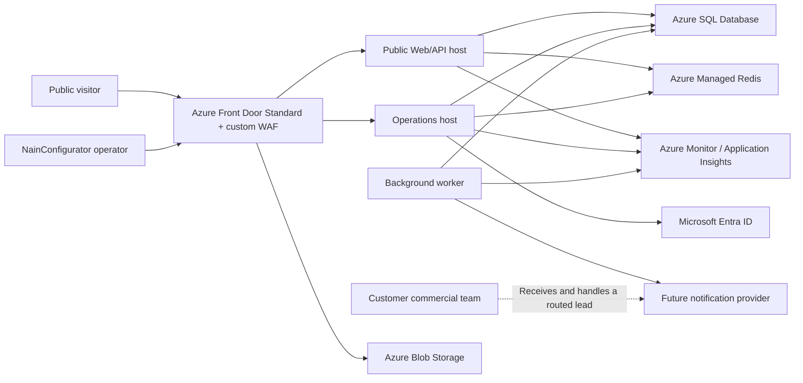

# Architecture

Document version: 1.7  
Status: Approved; SL-000 completed; later slices remain gated  
Decision date: 2026-07-19  
Last updated: 2026-07-28  
Owner: NainConfigurator product and technical owner

## 1. Purpose and authority

This document defines the application and deployment architecture for the NainConfigurator MVP. It selects supported technology families, exact approval-time baselines, trust boundaries, deployables, module responsibilities, transaction ownership, caching, rate limiting, 3D integration, observability and recovery mechanisms.

It implements, and does not redefine:

- `00.2-CommercialStrategy.md` for the shared multi-company SaaS and operating model.
- `02-BusinessRules.md` for business invariants, validation, pricing and lifecycle behavior.
- `03-DataModel.md` for the technology-independent logical model.
- `03.1-UserFlows.md` and `03.2-UXRequirements.md` for user and degraded-rendering behavior.
- `04.1-ApiContracts.md` for the public HTTP and JSON contract.
- `04.2-NonFunctionalRequirements.md` for measurable quality and capacity targets.
- `04.3-SecurityAndPrivacy.md` for isolation, security, privacy, retention and abuse requirements.

Approved `05-DatabaseDesign.md` translates this architecture and the approved logical model into physical Azure SQL design. This document does not authorize application code, create physical tables or select customer-specific legal content.

## 2. Architectural outcome

The MVP is a catalog-driven modular monolith, not a collection of microservices.

The commercial web experience uses an accessible React document interface. Babylon.js is a replaceable, lazy-loaded 3D renderer and never owns commercial truth; Blender is an offline asset-authoring tool, not an application runtime. ASP.NET Core owns public orchestration, authoritative validation and pricing. Azure SQL Database is authoritative persistence. Redis, CDN content and browser state are disposable accelerators.

The production release has three process boundaries built from one versioned codebase:

1. A public web/API host for anonymous catalog, validation, configuration and quote flows.
2. A separately deployed operations host for authenticated catalog, support and privacy operations.
3. A background worker for retention, outbox delivery and operational maintenance.

These processes share one logical application and one physical database, but use different routes, identities and least-privilege permissions. They are not independently evolving services.

## 3. Decision drivers

The architecture prioritizes, in order:

1. Company isolation and correct business behavior.
2. A second fundamentally different product added through catalog and visual assets, without schema or product-specific application branches.
3. A sellable, supportable MVP that one small team can operate profitably.
4. Complete commercial operation without Babylon.js or 3D.
5. Measurable performance at the approved 50-company, 500-product, 500-session and 50-RPS operating point.
6. Simple vertical delivery and low reversible infrastructure cost.
7. Explicit paths to scale only after measurement or contractual demand.

The architecture does not optimize for millions of tenants, independently deployed teams, active-active multi-region writes or unproven AI features.

## 4. Approved technology baseline

Approval-time versions are exact reproducible starting points. Patch updates inside the selected supported line are mandatory before every release; they do not require a new architecture decision unless they break contracts or behavior. Major/minor upgrades require compatibility, regression, performance and security evidence.

| Concern | Approved selection | Approval-time baseline | Runtime role |
|---|---|---|---|
| Backend runtime | Microsoft .NET LTS | .NET SDK/runtime `10.0.10`, supported until 2028-11-14 | Runtime and build |
| Backend language | C# | C# `14` with nullable reference types enabled | Domain, application and hosts |
| HTTP framework | ASP.NET Core | ASP.NET Core `10.0.10`, patched with the .NET runtime | Public and operations hosts |
| Relational mapper | Entity Framework Core | EF Core and `Microsoft.EntityFrameworkCore.SqlServer` `10.0.10` | Persistence adapter and migrations |
| Database service | Azure SQL Database | General Purpose, serverless, standard-series Gen5; compatibility level `170` | Authoritative data |
| Public web UI | React | React/React DOM `19.2.8` | Accessible document interface |
| Web language | TypeScript | TypeScript `6.0.3`, strict mode | Browser application and renderer bridge |
| Web build tool | Vite | Vite `8.1.5` | Build-time only |
| JavaScript build runtime | Node.js LTS | Node.js `24.18.0` LTS | CI/local build-time only; no Node production server |
| 3D web engine | Babylon.js | `@babylonjs/core` and `@babylonjs/loaders` `9.18.0`, ES modules with tree-shaking | Optional browser renderer |
| 3D asset authoring | Blender | Blender `4.5 LTS`; exact stable patch pinned before the first asset export | Offline source-asset creation and optimization only |
| 3D delivery format | Khronos glTF/GLB | glTF `2.0`, validated with Khronos glTF Validator | Immutable browser-ready product packages |
| Edge/CDN | Azure Front Door Standard | Standard tier with custom WAF and rate-limit rules | TLS edge, routing, caching and coarse abuse control |
| Compute | Azure App Service for Linux | Premium v3 `P1v3`, two production workers minimum | Public and operations web apps plus worker capacity |
| Distributed cache | Azure Managed Redis | Balanced `B0`, high availability enabled, TLS, one logical database | Catalog cache, distributed limits and admin session state |
| Object storage | Azure Blob Storage | StorageV2, Standard GZRS for durable assets; separate private account for restricted exports and deletion-recovery evidence | Versioned artifacts and restricted operational evidence |
| Administrative identity | Microsoft Entra ID workforce tenant | OIDC Authorization Code flow, PKCE, MFA and application roles | Individual workforce access only |
| Workload identity | Azure managed identities | Separate system-assigned identity per deployable | Azure service authentication |
| Secrets and key protection | Azure Key Vault Standard | RBAC, soft delete and purge protection | Non-workload credentials and key material |
| Telemetry | OpenTelemetry and Azure Monitor | Azure Monitor OpenTelemetry Distro, workspace-based Application Insights and Log Analytics | Traces, metrics, logs and alerts |
| Infrastructure as code | Azure Bicep | Bicep CLI `0.43.8`, installed explicitly by the delivery workflow | Repeatable environments and recovery |
| Delivery automation | GitHub Actions | OIDC federation to Azure; no long-lived Azure secret | Build, scan, promote and deploy |

The exact Blender `4.5.x` patch cannot be honestly fixed before the owned workstation installation is verified. Selecting a beta, release candidate or daily build is prohibited. Before the first asset export, record the latest stable `4.5 LTS` patch, exporter settings and workstation-independent validation command. Babylon.js packages are pinned exactly in the npm lock file.

### 4.1 Support and patch policy

- Production must run the latest available security patch in its approved runtime line.
- NuGet and npm dependencies are committed through deterministic lock files; the Blender LTS patch and asset-export profile are recorded as release evidence.
- Floating major or minor versions are prohibited in release builds.
- .NET LTS is reviewed six months before end of support; Babylon.js major upgrades and Blender LTS replacement are reviewed only with asset, browser and performance evidence.
- A runtime upgrade may not silently change serialization, price rounding, browser messages, SQL compatibility or public error behavior.
- Preview runtime, database, renderer, asset-pipeline or Azure features are prohibited for authoritative MVP behavior.

## 5. System context

The future notification provider is outside the authoritative quote transaction. Quote creation succeeds when the quote and its delivery intent are committed, not when an email or third-party notification is sent.

## 6. Production deployment topology

### 6.1 Regions and residency

- Primary Azure region: West Europe.
- Declared recovery region: North Europe.
- Quote data, personal-data backups, temporary exports and application telemetry remain in the EU/EEA by default.
- Public renderer and catalog assets may be served from global Front Door points of presence only because they contain no personal data.
- All stateful services must be checked for West Europe SKU capacity before the first real-data launch. If a required SKU is unavailable, the entire primary stateful topology moves together to an approved EU region; Redis alone must not be placed cross-region from the application.
- A region change is an operations and privacy review, not a per-customer fork.

### 6.2 Edge routes

One Front Door Standard profile serves versioned custom domains and routes:

| Route | Origin | Cache behavior |
|---|---|---|
| Public shell and static files | Public App Service | Immutable fingerprinted files cached; HTML short-lived and revalidated |
| `/api/*` | Public App Service | Caching disabled unless an explicit public catalog GET rule is approved and tenant-safe |
| Operations domain | Operations App Service | Caching disabled |
| Babylon.js chunks and glTF/GLB product packages | Public-assets Blob origin | Immutable content-addressed caching |
| Privacy notice content | Public-assets Blob origin | Immutable version URL caching |

Front Door applies TLS, host allowlists, request-size defense, coarse IP-rate rules and custom WAF rules. The App Service public origins accept traffic only from the `AzureFrontDoor.Backend` service tag carrying the expected `X-Azure-FDID` header. Storage write access remains private to managed identities; only intentional immutable public objects are anonymously readable.

Front Door Standard is selected because it provides the required CDN, DDoS edge, routing, certificates, custom WAF and IP-rate controls at a materially lower fixed cost than Premium. Upgrade to Front Door Premium when managed WAF rule sets, bot management or Private Link origins become contractually required or attack evidence justifies the cost.

### 6.3 Compute boundaries

One zone-redundant App Service Linux `P1v3` plan starts with two workers and can scale horizontally to four without application changes or sticky sessions. It hosts separate applications:

- `NainConfigurator.PublicHost`: React static output, public API and health endpoints.
- `NainConfigurator.OperationsHost`: OIDC BFF, protected operations endpoints and future administration UI.
- `NainConfigurator.Worker`: retention, outbox and maintenance loops with SQL-backed leases.

Each application has a separate managed identity, configuration set, hostname, health check and telemetry cloud-role name. Sharing a compute plan controls cost; separate processes and identities preserve trust boundaries. Split an application onto its own plan only when measured resource contention, isolation requirements or an independent availability target justify it.

Production minimum two-worker placement and zone redundancy are mandatory. Autoscale uses measured CPU, memory, HTTP queue and P95 latency with scale-in cooldown; exact thresholds belong in `09-DeploymentAndOperations.md` after load-test evidence.

### 6.4 Environment boundaries

| Environment | Permitted data | Minimum topology | Purpose |
|---|---|---|---|
| Local | Generated synthetic data only | Local processes, SQL Server 2025 Developer and optional disposable Redis-compatible container | Development |
| Optional demo | Synthetic or deliberately non-personal demo data only | Disposable non-production hosts and the Azure SQL free offer with stop-until-next-month behavior; no SLA or customer dependency | Time-bounded product demonstration before a paying pilot |
| Integration | Synthetic data only | Separate Azure resources; low-cost non-HA compute/cache permitted | Automated integration and security tests |
| Staging | Synthetic or explicitly approved masked data | Production-shaped configuration, separate identities, database, storage and Key Vault | Release, migration, recovery and load validation |
| Production | Approved customer and quote data | Full topology in this document | Paying-customer service |

The optional demo is not a production tier and may be unavailable when its free allowance is exhausted. It cannot accept real quote/contact data or support a paid customer. Production data, credentials, keys, caches and telemetry workspaces are never shared with non-production. Production copying to lower environments is prohibited.

## 7. Application architecture

### 7.1 Modular monolith

The backend is organized around business modules, not technical CRUD layers:

| Module | Owns |
|---|---|
| Companies | Company identity, status, locale and branding references |
| Catalogs | Products, option groups, options, compatibility rules, publication and catalog versions |
| Configurations | Authoritative selection validation, price calculation, immutable snapshots and public retrieval |
| Quotes | Privacy acknowledgment validation, quote creation, retention deadline and delivery intent |
| Privacy | Immutable policy versions, active policy designation, rights-assistance orchestration and deletion evidence |
| Operations | Managed publication, audit, support elevation and operational commands |

Modules may call explicit application interfaces in the same process. They do not communicate through a broker, HTTP loopback or eventually consistent copies. One release version changes all modules together.

### 7.2 Clean boundaries

Dependencies point inward:

1. **Domain** contains product-agnostic entities, value objects, invariants, compatibility evaluation and price rules. It has no ASP.NET Core, EF Core, Azure, Babylon.js, Blender or JSON dependency.
2. **Application** contains explicit use cases, input/output models, authorization requirements, transaction intent and ports for persistence, time, code generation, storage and notification. It coordinates domain behavior but does not contain HTTP or Azure code.
3. **Infrastructure** implements EF Core persistence, Azure service adapters, cache, storage, identity and telemetry integration.
4. **Hosts** perform transport binding, authentication, request limits, strict JSON handling, response mapping and dependency composition.

Pragmatic restrictions:

- No generic repository over EF Core.
- No generic service layer whose methods mirror database tables.
- No MediatR/CQRS framework merely to call in-process handlers.
- No AutoMapper dependency for critical contract or snapshot mappings; mappings remain explicit and testable.
- No domain behavior in controllers, React, Babylon.js, Blender assets, EF configurations or SQL triggers.
- EF Core entities may implement the domain model where mapping remains clean; duplicate persistence models require a demonstrated need.

### 7.3 Use-case ownership

The application exposes explicit use cases corresponding to approved behavior:

- Get published product catalog.
- Validate product configuration.
- Create immutable configuration.
- Get saved configuration.
- Create quote request.
- Publish catalog version.
- Publish privacy policy version.
- Expire quote aggregates.
- Process quote delivery intents.
- Assist verified privacy rights requests.

The same application validation and pricing components serve validation and creation. Creation always reloads authoritative current state and revalidates; it never trusts a previous validation response or browser estimate.

## 8. Public web architecture

### 8.1 React document shell

React is selected over Blazor because it shares the existing TypeScript toolchain and browser runtime with the Babylon.js adapter, avoids a second WebAssembly application runtime and supports the 600-KB shell budget. React is used as a client-rendered shell; no Node server or React Server Components are required.

The shell:

- Builds controls from catalog option groups and options.
- Uses semantic HTML and native browser controls before custom widgets.
- Keeps one authoritative browser selection state outside Babylon.js.
- Calculates only a clearly labelled local estimate and replaces it with API authority after validation.
- Uses `Intl.NumberFormat` and BCP 47 resource dictionaries for locale and money display.
- Keeps quote personal values in memory only and clears them after success.
- Stores no access token, quote data or commercial truth in browser persistence.
- Works completely with fallback product imagery when Babylon.js is absent or failed.

React state remains local feature state plus explicit context/reducer boundaries. Redux or another global state framework requires demonstrated state complexity; it is not part of the MVP baseline.

### 8.2 Browser/API boundary

- The public shell and API use the same site origin through Front Door, avoiding permissive CORS.
- `fetch` uses the exact `04.1-ApiContracts.md` JSON shapes.
- JSON deserialization rejects unknown members, excessive depth, invalid media type and bounded-field violations.
- The browser never sends internal database identifiers or authoritative prices.
- API response envelopes and stable error codes remain exactly as documented; generic framework problem responses must not leak around the contract.
- Every response carries or echoes a trace ID that can be used in support without exposing personal values.

### 8.3 Public browser routes and resume behavior

- New configurator entry: `/companies/{companySlug}/products/{productCode}`.
- Saved configuration entry: `/configurations/{configurationCode}`.
- Unknown browser routes return the documented accessible not-found state, not an API payload.
- The Public host returns the React shell for recognized browser routes and never for `/api/*` misses.
- An unsaved configuration lives in memory only. Reloading or closing the page before save starts again from catalog defaults; the MVP does not promise draft recovery.
- A successful save replaces the shareable state with the immutable saved-configuration URL. Quote contact values are never encoded in a URL or history state.

## 9. Babylon.js renderer boundary

### 9.1 Role

Babylon.js is an optional visual projection of shell state. It may render a selected product, camera and presentation state. It may emit user selection intent, but the shell accepts that intent only when the referenced catalog option is currently available.

Babylon.js and Blender-authored assets must not:

- Call the quote or configuration APIs directly.
- Calculate or persist authoritative price.
- Decide option compatibility, required selections or product availability.
- Store personal data, privacy acknowledgment or internal identifiers.
- Block validation, saving or quote submission.
- Contain desk-specific commercial branches.

### 9.2 Versioned bridge

The TypeScript shell owns a small versioned renderer interface. Messages contain bridge version, product code, catalog version, option codes and optional bounded presentation state. Minimum commands and events are:

| Direction | Message purpose |
|---|---|
| Shell to renderer | Initialize product visual package |
| Shell to renderer | Apply complete normalized option selection |
| Shell to renderer | Update locale-independent camera/presentation state |
| Shell to renderer | Dispose and release memory |
| Renderer to shell | Ready |
| Renderer to shell | Selection intent by option code |
| Renderer to shell | Visual update complete |
| Renderer to shell | Recoverable degradation or fatal failure |

The integration uses a dedicated renderer adapter so Three.js or another renderer can implement the same interface later. Adapter messages are schema-tested, size-bounded and ignored when their product/catalog context is stale. The renderer runs in the same application origin and receives no API credential or personal data.

### 9.3 Loading and assets

- The shell reaches commercial readiness before importing the Babylon.js renderer chunk.
- Babylon.js runtime chunks are fingerprinted and cached independently from product packages.
- Product `visualAssetKey` values map to versioned glTF/GLB nodes, materials or packages and never to commercial rules.
- Blender source assets remain offline/restricted; only sanitized, optimized and validated glTF/GLB packages are published.
- Published product packages are content-addressed, hashed and immutable after publication.
- The default renderer uses WebGL 2 with conservative quality tiers, compressed textures and no physics engine. WebGPU is optional progressive enhancement and never required for the MVP.
- The loader detects WebGL 2 and memory capability; unsupported or failing devices use the documented non-3D flow.
- Every glTF/GLB package passes Khronos validation, ownership/license review and browser budget checks before publication.
- Renderer and normal-product payloads must remain within the NFR-3D budgets and be measured on real supported browsers before release.

## 10. Persistence and company isolation

### 10.1 Authoritative store

Azure SQL Database is the sole authority for companies, catalogs, policies, configurations, quotes, idempotency identities, audit and outbox state. Azure Managed Redis, Blob CDN caches, renderer packages and telemetry cannot reconstruct or override commercial truth.

The production database uses:

- Azure SQL General Purpose serverless on standard-series Gen5 hardware.
- Minimum `0.5` and maximum `4` vCores at launch, changed only through measured capacity review.
- Auto-pause disabled in production to avoid cold-start failure of the latency SLO.
- Zone redundancy enabled.
- Database and EF provider compatibility level `170`.
- Microsoft Entra authentication and managed identities; no application SQL password.
- Transparent Data Encryption and GZRS automated backups.
- Point-in-time retention of 35 days for the production database.

The workload profile does not justify Business Critical, Managed Instance, Hyperscale, sharding or database-per-company. Upgrade compute or service tier vertically before introducing partitioning.

### 10.2 Tenant enforcement

Every company-owned operation carries an internal trusted `CompanyId` resolved from persisted relationships, never accepted as authority from a JSON body. Isolation is enforced in layers:

1. Route/resource codes resolve to persisted company ownership.
2. Application queries require an immutable company execution context.
3. EF Core company filters are enabled by default and bypass requires an explicit privileged operation.
4. Physical foreign keys and uniqueness include company ownership where needed to prevent cross-company relationships.
5. SQL Row-Level Security protects company-owned catalog, configuration and quote data through a connection-scoped company context. Privileged cross-company operations use the separately authenticated operations identity and are audited.
6. Cache, asset, outbox, export and job keys include environment and trusted company scope.
7. Negative isolation tests execute every read and write path.

`05-DatabaseDesign.md` must define the exact composite keys, RLS predicates, session-context lifecycle and connection-pool safety. Failure to set or clear SQL company context must fail closed.

## 11. Transactions, concurrency and idempotency

### 11.1 Transaction ownership

Each write use case owns one explicit EF Core/Azure SQL transaction through the application persistence port. EF Core `DbContext` is the native unit of work inside Infrastructure; an additional generic Unit of Work wrapper is prohibited unless it adds a concrete cross-adapter guarantee.

The transaction contains only database work. Blob uploads, email, telemetry and cache invalidation are never enlisted in the SQL transaction.

### 11.2 Canonical request identity

Idempotency fingerprints use SHA-256 over a UTF-8 serialization of an explicit typed canonical projection, not over the raw request body. Configuration projection fields use canonical persisted company/product codes, catalog version, distinct option codes sorted by approved normalized option order, and the fixed visual-state version 1 structure serialized in fixed property order. Quote projection fields use configuration code, the text normalization already defined by business rules, privacy-policy version and acknowledgment in fixed property order. The `clientRequestId` itself is not part of the fingerprint.

The 32-byte fingerprint is an index aid, not proof of equality. Exact replay also compares the persisted normalized fields, so a hash collision can never accept a changed payload. Fingerprint algorithm/version is persisted or otherwise migration-safe; changing it must preserve replay of existing retained resources.

### 11.3 Configuration creation

One transaction:

1. Computes the canonical request identity.
2. Checks the configuration request ID in its company/product scope before mutable-current-state validation.
3. Returns the prior result for an exact replay or the documented conflict for a changed payload.
4. Loads the authoritative current published catalog and verifies the supplied catalog version.
5. Runs shared selection validation and authoritative pricing.
6. Persists the immutable configuration, normalized selections, ordered price components and snapshot.
7. Commits once.

A unique database constraint resolves concurrent first attempts. The losing request reloads the winner and applies exact-replay comparison; application pre-check alone is insufficient.

### 11.4 Quote creation

One transaction:

1. Computes and checks the quote request identity in its separate quote scope.
2. Verifies company ownership, current product availability, saved configuration and active privacy-policy version/hash.
3. Persists quote contact data, immutable acknowledgment evidence and server-derived expiry.
4. Persists one notification outbox intent without provider-specific payload.
5. Commits once.

The HTTP success response means the quote is stored with status `New`; it does not claim that notification delivery succeeded.

### 11.5 Concurrency and retries

- Optimistic concurrency tokens protect mutable catalog, company and policy records.
- Immutable configurations, snapshots and policy versions are never updated in place.
- SQL transient retries apply only when the entire operation is safe to replay.
- No retry surrounds a non-idempotent external call.
- Snapshot/read-committed-snapshot and exact locking choices belong in `05-DatabaseDesign.md` and must preserve one-catalog-version validation.
- No distributed transaction coordinator is used.

## 12. Background work and external integration

The worker polls durable SQL work with bounded batches and a SQL-backed lease. Multiple App Service instances may run it; only the lease owner processes a partition, and work remains idempotent after lease loss.

MVP background responsibilities are:

- Delete expired quote aggregates within the approved 24-hour window.
- Process provider-neutral quote notification intents.
- Delete expired temporary exports.
- Reconcile failed cache invalidation or publication propagation.
- Produce auditable completion/failure evidence without copying personal payloads to logs.

The outbox is not a general event bus. It is a narrow reliability mechanism for external side effects that follow an authoritative transaction. A notification adapter receives a minimum provider-neutral message and owns provider retries, redaction and delivery status. The concrete email/notification vendor remains deliberately unselected until legal, regional, deliverability and commercial workflow review.

Add Azure Service Bus only when there are multiple independent consumers, durable throughput exceeds efficient SQL polling or a measured database hotspot exists. None is true for the MVP.

## 13. Caching and publication

### 13.1 Catalog cache

ASP.NET Core `HybridCache` provides per-process memory cache plus Azure Managed Redis secondary cache. Cache keys include environment, trusted company ID, product code and catalog version.

- Cache-aside only; SQL remains authoritative.
- Immutable versioned catalog payloads may use a long TTL.
- The current-publication pointer uses a TTL of at most 30 seconds.
- Publication writes SQL first, then invalidates version/pointer tags after commit.
- Versioned keys prevent an old payload from becoming a new catalog version.
- A missed invalidation still converges inside the 60-second publication target.
- Redis loss falls back to SQL and local stampede protection; it never blocks catalog truth.
- Quotes, personal data, privacy acknowledgment, saved-configuration writes and idempotency records are not cached.

### 13.2 Distributed rate limits

Exact application limits in `04.3-SecurityAndPrivacy.md` are implemented by atomic Redis scripts using environment, route family, IP pseudonym and trusted company scope. Separate short-burst and sustained buckets enforce the documented windows. Redis keys contain no raw personal value and expire automatically.

Front Door provides a coarser IP shield before the application. It cannot enforce company limits and is not the source of exact contract behavior.

Failure behavior is explicit:

- Public catalog and saved-configuration GET may continue under Front Door protection and SQL/local-cache fallback.
- Anonymous validation, configuration creation and quote creation fail with a retryable `503` when the distributed limiter cannot make a trustworthy decision.
- Operations sign-in/session state fails closed.

Azure Managed Redis Balanced `B0` with high availability is adequate for the approved operating point. Persistence and active geo-replication are disabled because the data is disposable. Scale Redis when P95 command latency, CPU, connections or memory cross tested operational thresholds.

## 14. Object storage and CDN

Storage is separated by sensitivity:

### 14.1 Public durable assets

One StorageV2 Standard GZRS account stores only sanitized, publishable data:

- Fingerprinted Babylon.js renderer chunks.
- Validated, content-addressed glTF/GLB product packages.
- Fallback product images and approved branding.
- Immutable privacy-notice content addressed by policy version and SHA-256 hash.

Blob versioning, soft delete and lifecycle rules protect operations. Published URLs are immutable; replacing bytes under a published key is prohibited. Privacy content receives version-level immutability protection appropriate to its approved retention. Front Door caches content-addressed assets for a long duration and purges only mutable pointers.

### 14.2 Restricted temporary exports

A separate private StorageV2 account holds restricted operational artifacts. Public access is disabled; access is encrypted, audited and mediated by approved Operations/Worker identities. No renderer or public CDN route reaches this account.

The `temporary-exports` container holds rights/support exports only. Access is time-bounded and lifecycle deletion is at most seven days.

### 14.3 Deletion-recovery evidence

The same restricted account contains a separate private `deletion-recovery` container. It stores encrypted, idempotent deletion instructions using HMAC lookup identities and no contact data, message, raw quote code or client request ID. Its lifecycle is at least 42 days so an approved 35-day point-in-time restore cannot silently resurrect a lawfully deleted quote. Only the retention/reconciliation worker and time-bounded recovery procedure can access it.

## 15. Identity, authorization and secrets

### 15.1 Public plane

The public MVP is anonymous. Public configuration codes are high-entropy unlisted locators, not accounts or authorization for quote data. Quote detail has no public route.

### 15.2 Operations plane

- Microsoft Entra ID workforce identities only.
- OIDC Authorization Code flow with PKCE through `Microsoft.Identity.Web` and ASP.NET Core OIDC middleware.
- MFA enforced through tenant policy.
- Browser receives only an encrypted `HttpOnly`, `Secure`, `SameSite=Lax` opaque session cookie.
- OIDC/access/refresh tokens and server-side authentication tickets are stored in the distributed session store, never browser storage.
- Application roles/capabilities enforce least privilege and recent reauthentication for sensitive actions.
- Support elevation is ticket-scoped, expires within four hours and is audited.

The BFF is part of the separately deployed Operations host. Public React code never contains administrative token handling.

### 15.3 Workload identities and secrets

Public, Operations and Worker applications each have a system-assigned managed identity. Azure SQL, Blob, Redis where supported, Key Vault and telemetry access use Entra/RBAC instead of embedded credentials.

Key Vault stores only secrets that cannot be replaced by workload identity, plus key material for protecting ASP.NET Core Data Protection. Data Protection keys are persisted in a shared private Blob container and protected by a Key Vault key so multi-instance cookies remain valid across restarts and deployments.

Key Vault uses RBAC, soft delete, purge protection, audit logs and separate vaults per environment. Secrets never appear in source, browser bundles, Blender assets, glTF/GLB packages, deployment output or telemetry.

## 16. Security boundary implementation

Architecture mechanisms supplement all requirements in `04.3-SecurityAndPrivacy.md`:

- TLS 1.2 minimum and TLS 1.3 preferred at the edge.
- Strict transport security after domain validation.
- CSP with explicit sources; no unsafe third-party script by default.
- `frame-ancestors`, content-type, referrer and permissions policies set deliberately.
- JSON-only public writes, compressed request bodies disabled and approved body/collection/depth limits enforced before application execution.
- Contextual encoding and sanitized catalog content; active formats are rejected unless a proven sanitizer exists.
- No public upload.
- Managed dependency, secret, static and asset scanning; release SBOM and hashes.
- Body-free structured logs and telemetry redaction before export.
- Separate Azure identities and permissions for public read/write, operations and retention worker duties.

WAF is defense in depth, not a substitute for authorization, strict input handling or domain validation.

## 17. Errors, logs and observability

### 17.1 Error handling

One host-level exception boundary maps known application outcomes to the stable `04.1-ApiContracts.md` envelope. Unexpected failures return a generic English stable code plus trace ID and never expose stack traces, SQL, secret values or contact data.

Business rejection, stale catalog, idempotency conflict, abuse rejection, unavailable dependency and programmer failure remain distinct metrics and log events.

### 17.2 Telemetry

The application uses OpenTelemetry APIs and the Azure Monitor OpenTelemetry Distro. This keeps instrumentation portable while using workspace-based Application Insights for the selected hosting platform.

Every request and background batch records:

- W3C trace context and response trace ID.
- Deployable/cloud-role, environment and release version.
- Route template and outcome, never raw URL values containing resource secrets.
- Duration histograms for endpoint P50/P95/P99.
- SQL, Redis, Blob and notification dependency duration/outcome.
- Catalog cache hit/miss, publication age and invalidation lag.
- Rate-limit allowed/rejected/unavailable counts by route family, not raw IP.
- Idempotent replay, conflict and concurrency-race counts.
- Outbox age, attempts and dead-letter-equivalent failure state.
- Quote expiry backlog and oldest overdue record age.
- Renderer load/failure metrics only when collected without personal tracking or non-essential cookies.

Application Insights and Log Analytics are provisioned in the approved EU region with the retention from `04.3-SecurityAndPrivacy.md`. Sampling may reduce successful high-volume traces but never security audit, error, quote-create outcome, outbox failure or retention evidence.

## 18. Availability, recovery and graceful degradation

### 18.1 Failure behavior

| Failure | Required behavior |
|---|---|
| Renderer/asset failure | Accessible commercial shell remains fully usable with fallback imagery |
| Redis cache failure | Reads fall back to SQL/local cache; anonymous writes fail closed when rate limiting is unavailable |
| One App Service worker failure | Front Door/App Service routes to healthy instance; no sticky session dependency |
| Operations identity failure | Public commercial flow continues; operations fail closed |
| Notification provider failure | Quote remains stored; outbox retries and alerts without changing quote status |
| Blob public-asset origin failure | Cached immutable assets may continue; shell fallback remains usable |
| SQL transient failure | Safe bounded retry; otherwise stable retryable error and no partial write |
| Primary-region failure | Execute tested North Europe restore/redeploy runbook within approved recovery target |

### 18.2 Database recovery

The cost-appropriate MVP recovery strategy is zone-resilient primary service plus GZRS automated backups and scripted geo-restore, not a continuously billed hot secondary.

- Azure SQL log backups occur approximately every ten minutes, supporting the approved maximum 15-minute RPO target.
- Restore drills must prove recovery of the documented workload profile inside four support hours.
- Bicep can recreate compute, identities, network restrictions, Key Vault references and empty disposable caches in North Europe.
- Front Door switches to the recovered origin only after database migration/version, tenant isolation, deletion replay and smoke checks pass.
- A restored database reapplies deletions and retention work before public traffic.
- Blob GZRS recovery and immutable asset hashes are verified separately.

If two consecutive drills exceed three hours, or a customer contract requires a shorter RTO, introduce Azure SQL failover groups and a pre-provisioned recovery compute origin. A forced geo-failover may lose asynchronously replicated data, so a zero-RPO promise is prohibited.

## 19. Configuration, release and migration

- Bicep is the only supported way to create shared Azure infrastructure after the initial subscription bootstrap.
- Environment configuration uses validated options; the process refuses to start when required configuration is missing or unsafe.
- Non-secret configuration lives in source-controlled environment parameter files; secrets and key references do not.
- GitHub Actions authenticates to Azure through OIDC federation and least-privilege deployment identities.
- Builds use locked dependencies, tests, security scans, SBOM and artifact hashes before promotion.
- Public host, Operations host, Worker, React shell, Babylon.js renderer and content manifest share one release identifier even when artifacts deploy separately.
- App Service deployment slots provide pre-warm and swap for web hosts.
- Database changes use forward-compatible expand/migrate/contract steps. Destructive contraction occurs only after the old release can no longer run and backup/rollback evidence exists.
- Production migrations run once as an explicit delivery step, never concurrently from application startup.
- Rollback cannot assume an irreversible database migration can be undone; compatible roll-forward is the default recovery.

Exact pipeline jobs, approvals and rollback runbooks belong in `09-DeploymentAndOperations.md`.

## 20. Scaling and commercial cost controls

### 20.1 Scaling order

Scale in this order:

1. Optimize measured queries, payloads, glTF/GLB assets and cache behavior.
2. Increase App Service workers within `P1v3` limits.
3. Increase Azure SQL serverless maximum vCores or move to provisioned General Purpose when sustained use makes it cheaper.
4. Increase Redis Balanced size when measured limits require it.
5. Split Public, Operations or Worker onto separate App Service plans for measured contention or isolation.
6. Add SQL failover group for shorter contractual recovery.
7. Partition data or extract a service only after a proven independent scale, ownership or availability boundary exists.

Company count alone is not a reason to create microservices or databases per company.

### 20.2 Cost profiles

- Local and Integration use synthetic data and may use single-node/auto-paused resources.
- Staging is started for release validation and recovery exercises where practical; it must not silently become an always-on duplicate production environment.
- Production begins with Front Door Standard, one shared App Service plan, one Azure SQL database and Redis `B0` HA.
- Azure budgets and anomaly alerts track total cost and cost per active company.
- Monthly architecture review compares direct recurring infrastructure with subscription revenue and the approved 25-percent guardrail.
- Capacity upgrades require a metric, threshold, forecast and resulting gross-margin check.

### 20.3 Approval-time monthly cost model

This is a planning model in USD, before tax, support plans and exchange-rate effects; it is not an Azure quote. It uses public list prices visible on 2026-07-19 and must be regenerated in the Azure Pricing Calculator for West Europe before infrastructure purchase, each paid proposal and every scale change.

Planning workload: 20 paying companies, 25,000 public sessions/month, at most 2 million API/edge requests/month, at most 750 GB public 3D/static egress if every session downloads a 30-MB cold package, 50 GB object storage, at most 2 GB/month retained telemetry ingestion, and Azure SQL averaging 0.5 to 1.0 billed vCore while online.

| Cost area | Approval-time monthly planning value | Cost control |
|---|---:|---|
| Two Linux App Service `P1v3` workers | About USD 248 PAYG from the published USD list baseline | Move to a savings plan/reservation only after stable production use |
| Front Door Standard base | USD 35 plus requests and egress | One shared profile; immutable CDN caching and asset budgets |
| Azure Managed Redis `B0` HA | About USD 26 PAYG from the published two-node baseline | One shared non-persistent instance; scale on evidence |
| Azure SQL serverless zone-redundant database | Model USD 200-450 depending on actual CPU/memory floor, zone charge, storage and backup | 0.5-4 vCore range, query budgets, cost alert; compare provisioned tier monthly |
| Blob, Key Vault, Log Analytics/Application Insights and DNS | Model USD 40-120 at the planning assumptions | Lifecycle rules, telemetry allowlist/sampling and no duplicate storage |
| Front Door request and public egress usage | Model USD 20-100; the upper edge depends on cache hits, geography and actual renderer downloads | Lazy load Babylon.js, content-addressed cache and compressed product packages |
| **Expected direct baseline** | **USD 570-980/month** | Budget warning at USD 850 and critical review at USD 980 until real data replaces the model |

The wide range is intentional: SQL utilization and 3D egress are not yet measured, and false precision would be commercially dangerous. At 20 customers, the 25-percent infrastructure guardrail requires at least USD 2,280-3,920 in monthly recurring subscription revenue, or approximately USD 114-196 average recurring revenue per company, solely to satisfy infrastructure margin. Commercial pricing must sit above that floor because it must also fund support, sales, asset work, tax and owner time.

At the planning point, a production pricing proposal is invalid if its subscription revenue cannot keep measured infrastructure below the 25-percent target. The solution is not to remove isolation, backup or security controls; pricing, packaging or paid scale must change. After two representative months, replace every modeled range with Azure Cost Management actuals and cost per public session/company.

## 21. Explicitly rejected alternatives

| Alternative | Reason rejected for MVP | Reconsider when |
|---|---|---|
| Node.js, Java or Go backend | No commercial or technical advantage over the owner's strong .NET base; adds delivery risk | A required integration/team has a measured advantage that outweighs a second backend stack |
| Blazor WebAssembly shell | Adds a second browser application runtime and weakens the single TypeScript UI/renderer toolchain | A measured prototype proves lower total complexity and meets all payload/accessibility budgets |
| Unity Web renderer | Client/service eligibility and Industry terms can require a paid plan; WebAssembly payload and asset pipeline add cost before revenue | A funded client requires a Unity-only capability and pays the compliant license/operations cost |
| Godot 4 Web renderer | C# projects cannot currently export to Web, while GDScript adds another language and engine runtime | Official supported C# Web export and a measured product requirement justify the engine |
| Three.js renderer | Commercially safe and viable, but the MVP would assemble more loader, material and lifecycle behavior manually | Babylon.js fails an approved size, compatibility or maintainability benchmark |
| Blazor Server | Adds connection/session dependence and degrades anonymous scale/recovery | A future authenticated internal tool benefits from it and has separate requirements |
| TypeScript 7.0 | The production compiler is fast, but 7.0 has no programmatic API and requires TypeScript 6 side-by-side for API-dependent tooling | TypeScript 7.1+ and the selected lint/test ecosystem work together without a compatibility compiler |
| Razor Pages-only configurator | Lower client complexity but weaker fit for rich catalog-driven interaction and renderer bridge | React complexity proves disproportionate in a prototype |
| Microservices | No independent team, scale or release boundary; increases deployment, data and failure complexity | A module has independently measured scale/availability and clear ownership |
| Kubernetes/AKS | High fixed operational burden for three small processes | App Service cannot meet a proven platform or isolation requirement |
| Azure Container Apps | Viable, but App Service slots, .NET hosting and shared-plan economics are simpler here | Worker/event scaling or container portability becomes a measured advantage |
| Service Bus | SQL outbox volume and consumer count do not justify a broker | Multiple independent consumers or sustained backlog/throughput proves the need |
| Database per company | Expensive onboarding, migrations and pooled reporting for the target segment | A regulated or premium dedicated tier funds and requires it |
| Cosmos DB | Relational invariants, transactions and query patterns fit Azure SQL | A separate bounded workload has non-relational access patterns proven by data |
| SQL Managed Instance | Unneeded compatibility surface and higher fixed cost | A required legacy SQL feature cannot run in Azure SQL Database |
| Business Critical/Hyperscale | Workload and 99.5-percent SLO do not justify cost | Measured IO/latency/size or contract requires it |
| Hot multi-region production | Duplicates fixed cost before revenue and is not required by four-hour RTO | Contractual RTO or restore drills require it |
| Front Door Premium | Managed WAF and Private Link are desirable but the fixed fee is disproportionate to MVP needs | Contract, attacks, bot pressure or revenue justifies managed WAF/private origins |
| Per-customer code, schema or deployment fork | Breaks the approved SaaS economics and upgrade model | Never in shared SaaS; a separately priced product edition requires a new strategy decision |

## 22. Second-product architecture test

Physical database review and every later implementation-readiness review must walk through a product from outside configurable furniture, for example a configurable bicycle or industrial enclosure.

The architecture passes only if that product requires:

- New Company/Product/OptionGroup/ProductOption/CompatibilityRule data.
- New localized content and generic `visualAssetKey` values.
- A new sanitized, validated glTF/GLB product package or fallback images.
- No new public JSON property.
- No new database column/table named for that product category.
- No product-code `if`/`switch` in Domain, Application, React or Babylon.js commercial behavior.
- No customer-specific host, repository or release.

A genuinely new compatibility or pricing rule type is a platform capability change and may require code. Adding a product using already approved rule types must not.

## 23. Architecture acceptance scenarios

| ID | Scenario | Required result |
|---|---|---|
| ARC-AC-001 | Add a fundamentally different product using existing rule types | Data/assets only; no schema, contract or commercial branch change |
| ARC-AC-002 | Run two Public host instances with no affinity | Idempotency, company isolation and responses remain correct |
| ARC-AC-003 | Disable Babylon.js or make its chunk/package fail | Full configuration, validation, save and quote flow remains usable |
| ARC-AC-004 | Lose Redis during catalog reads | Reads converge through SQL/local cache without stale authority |
| ARC-AC-005 | Lose Redis during anonymous create | Request fails safely and retryably; no unmetered write is accepted |
| ARC-AC-006 | Send two concurrent identical configuration requests | One resource is committed and both exact replays resolve to it |
| ARC-AC-007 | Reuse one request ID with changed payload | Stable idempotency conflict; no second resource |
| ARC-AC-008 | Notification provider is unavailable after quote commit | Quote remains `New`, outbox retries and API does not claim delivery |
| ARC-AC-009 | Query a company-owned code through another company route | Not found/forbidden per contract and no cross-company data or timing detail leaks |
| ARC-AC-010 | Publish a new catalog while old cache entries exist | New pointer converges within 60 seconds; old immutable configuration is unchanged |
| ARC-AC-011 | Restore a production-profile backup in recovery region | RPO/RTO, deletion replay, isolation checks and smoke checks pass before traffic |
| ARC-AC-012 | Deploy a new web release with an expand migration | Old and new slots can coexist until swap; no destructive startup migration |
| ARC-AC-013 | Inspect browser storage after quote success | No contact data, admin token or authoritative commercial state remains |
| ARC-AC-014 | Review logs for failed quote and support action | Traceable outcome without body/contact values; privileged access is audited |
| ARC-AC-015 | Load test the approved operating point | All `04.2` latency, error, saturation and cost gates pass with scaling evidence |

## 24. Approved architecture decisions

| ID | Decision |
|---|---|
| ARCH-001 | Use a .NET 10/C# 14/ASP.NET Core 10 modular monolith with one shared release, not microservices. |
| ARCH-002 | Use React 19.2 and TypeScript 6 for the accessible commercial shell; Node is build-time only. |
| ARCH-003 | Superseded by ARCH-019 on 2026-07-28. |
| ARCH-004 | Deploy Public, Operations and Worker as separate least-privilege processes on one zone-redundant App Service plan. |
| ARCH-005 | Use Azure SQL Database General Purpose serverless, compatibility level 170, as the sole commercial authority. |
| ARCH-006 | Use shared-schema multi-tenancy with trusted company context, application filters, relational ownership and SQL RLS defense in depth. |
| ARCH-007 | Use EF Core DbContext as the native unit of work; every write use case owns one explicit SQL transaction. |
| ARCH-008 | Store resource-owned idempotency and use unique constraints to resolve concurrency; Redis is not an idempotency authority. |
| ARCH-009 | Use a narrow SQL outbox and leased worker for notification and retention; do not introduce a broker for MVP. |
| ARCH-010 | Use HybridCache plus Azure Managed Redis B0 HA for disposable catalog caching and exact distributed application limits. |
| ARCH-011 | Fail anonymous write/validate requests closed when distributed rate-limit state is unavailable; allow safe read fallback. |
| ARCH-012 | Use Front Door Standard with custom WAF/rate rules and origin restrictions; upgrade to Premium only on evidence. |
| ARCH-013 | Use GZRS Blob Storage for immutable non-personal public assets and a separate private account for temporary exports plus approved deletion-recovery evidence. |
| ARCH-014 | Use Entra ID workforce OIDC BFF for operations and managed identities/Key Vault for workloads and secrets. |
| ARCH-015 | Use OpenTelemetry with regional Azure Monitor/Application Insights and body-free redacted telemetry. |
| ARCH-016 | Use West Europe primary, North Europe recovery, zone redundancy and tested geo-restore instead of a hot secondary. |
| ARCH-017 | Use GitHub Actions OIDC, Bicep, locked dependencies, release hashes and slot deployment; migrations are explicit delivery steps. |
| ARCH-018 | Scale measured PaaS resources vertically/horizontally before splitting services or tenant databases. |
| ARCH-019 | Use Blender 4.5 LTS for offline asset authoring and Babylon.js 9.18.0 for the replaceable lazy-loaded Web renderer, delivering validated glTF/GLB 2.0 assets. |

## 25. Deferred decisions and next gate

The following are intentionally not invented here:

- Physical tables, SQL data types, keys, indexes, constraints, RLS predicates and migration rules: approved in `05-DatabaseDesign.md`.
- Test suite structure, tools and traceability: `08-TestingStrategy.md`.
- Exact autoscale thresholds, alerts, runbooks, release approvals and regional failover procedure: `09-DeploymentAndOperations.md`.
- Delivery slices and implementation order: `10-ImplementationPlan.md`.
- Notification vendor: commercial/legal integration review before real quote routing.
- Customer-specific privacy text, lawful basis, DPA, subprocessor disclosure and contractual SLA: commercial launch gate.

Physical database design, its deletion-recovery storage clarification, `08-TestingStrategy.md`, `09-DeploymentAndOperations.md` and `10-ImplementationPlan.md` are approved. The final implementation-readiness review passes in `11-ImplementationReadinessReview.md`. SL-000 is completed; no later slice may begin without separate product-owner authorization.

## 26. Official support evidence reviewed

- [.NET support policy](https://dotnet.microsoft.com/en-us/platform/support/policy)
- [EF Core 10 release and support](https://learn.microsoft.com/en-us/ef/core/what-is-new/ef-core-10.0/whatsnew)
- [EF Core SQL Server provider 10.0.10](https://www.nuget.org/packages/Microsoft.EntityFrameworkCore.SqlServer/10.0.10)
- [EF Core SQL Server provider and compatibility level](https://learn.microsoft.com/en-us/ef/core/providers/sql-server/)
- [React versions](https://react.dev/versions)
- [TypeScript 6.0 release](https://devblogs.microsoft.com/typescript/announcing-typescript-6-0/)
- [TypeScript 7.0 transition and programmatic API limitation](https://devblogs.microsoft.com/typescript/announcing-typescript-7-0/)
- [Vite 8.1 release](https://vite.dev/blog/announcing-vite8-1)
- [Vite package releases](https://www.npmjs.com/package/vite?activeTab=versions)
- [Node.js 24.18.0 LTS release](https://nodejs.org/en/blog/release/v24.18.0)
- [Babylon.js releases](https://github.com/BabylonJS/Babylon.js/releases)
- [Babylon.js Apache 2.0 license](https://github.com/BabylonJS/Babylon.js/blob/master/license.md)
- [Babylon.js ES module packages](https://www.npmjs.com/package/@babylonjs/core)
- [Blender 4.5 LTS](https://www.blender.org/download/lts/4-5/)
- [Blender license and ownership of created artwork](https://docs.blender.org/manual/en/latest/getting_started/about/license.html)
- [Khronos glTF 2.0 specification and tools](https://github.com/KhronosGroup/glTF)
- [Khronos glTF Validator](https://github.com/KhronosGroup/glTF-Validator)
- [Azure App Service zone redundancy](https://learn.microsoft.com/en-us/azure/app-service/configure-zone-redundancy)
- [Azure Front Door WAF custom and rate-limit rules](https://learn.microsoft.com/en-us/azure/web-application-firewall/afds/waf-front-door-custom-rules)
- [Azure Front Door tier cost/feature comparison](https://learn.microsoft.com/en-us/azure/frontdoor/understanding-pricing)
- [Azure App Service Linux pricing](https://azure.microsoft.com/en-us/pricing/details/app-service/linux/)
- [Azure SQL serverless](https://learn.microsoft.com/en-us/azure/azure-sql/database/serverless-tier-overview)
- [Azure SQL reliability and zone redundancy](https://learn.microsoft.com/en-us/azure/reliability/reliability-sql-database)
- [Azure SQL automated geo-redundant backups](https://learn.microsoft.com/en-us/azure/azure-sql/database/automated-backups-overview)
- [Azure Managed Redis architecture](https://learn.microsoft.com/en-us/azure/redis/architecture)
- [Azure Managed Redis pricing](https://azure.microsoft.com/en-us/pricing/details/managed-redis/)
- [Azure SQL Database pricing](https://azure.microsoft.com/en-us/pricing/details/azure-sql-database/single/)
- [ASP.NET Core HybridCache](https://learn.microsoft.com/en-us/aspnet/core/performance/caching/hybrid?view=aspnetcore-10.0)
- [App Service managed identities](https://learn.microsoft.com/en-us/azure/app-service/overview-managed-identity)
- [App Service Key Vault references](https://learn.microsoft.com/en-us/azure/app-service/app-service-key-vault-references)
- [Azure Monitor OpenTelemetry for ASP.NET Core](https://learn.microsoft.com/en-us/azure/azure-monitor/app/opentelemetry-enable)
- [Azure Blob immutable storage](https://learn.microsoft.com/en-us/azure/storage/blobs/immutable-storage-overview)
- [Microsoft identity authorization code flow with PKCE](https://learn.microsoft.com/en-us/entra/identity-platform/v2-oauth2-auth-code-flow)
- [Azure Bicep releases](https://github.com/Azure/bicep/releases)
