# Implementation Plan

Document version: 1.0  
Status: Approved; core Technical Demo implemented; SL-009 candidate pending two manual gates
Last updated: 2026-07-31
Applies to: Documentation-to-implementation transition, local technical demo, optional public synthetic demo, customer pilot and commercial launch

## 1. Purpose and authority

This document defines the dependency order, evidence gates and scope boundaries for implementing NainConfigurator as small end-to-end vertical slices.

It schedules, and does not redefine:

- `00-ProjectOverview.md` for product purpose, MVP scope and exclusions.
- `00.1-DocumentationRoadmap.md` for readiness levels and approval authority.
- `00.2-CommercialStrategy.md` for the shared multi-company SaaS and managed-service model.
- `01-ProductDefinition.md` for product scope and actors.
- `02-BusinessRules.md` for commercial truth.
- `03-DataModel.md` for the approved logical model.
- `03.1-UserFlows.md` for user intent, retry and recovery.
- `03.2-UXRequirements.md` for responsive, accessible, localized and renderer-independent behavior.
- `04.1-ApiContracts.md` for public HTTP/JSON behavior.
- `04.2-NonFunctionalRequirements.md` for measurable quality and capacity.
- `04.3-SecurityAndPrivacy.md` for trust, privacy, retention and abuse controls.
- `05-DatabaseDesign.md` for physical SQL Server/Azure SQL persistence.
- `06-Architecture.md` for technology, module, process and infrastructure boundaries.
- `08-TestingStrategy.md` for verification tools, layers and evidence.
- `09-DeploymentAndOperations.md` for environment, delivery, recovery, support and cost gates.
- `07-DecisionLog.md` for approved decisions and their replacement history.

Where a proposed slice conflicts with an approved source, the approved source wins and the slice must stop for a documented decision. Implementation must never resolve a conflict by silently changing product behavior, public contracts, persistence, tenancy or security.

## 2. Direct conclusion

The correct implementation path is:

1. Establish one buildable modular-monolith release and its verification baseline.
2. Deliver the complete accessible commercial journey without depending on 3D.
3. Prove authoritative validation, persistence, idempotency, company isolation and privacy with real SQL Server behavior.
4. Add the Babylon.js renderer behind the approved replaceable boundary only after the commercial shell works.
5. Prove a fundamentally different second product through data and assets only.
6. Package the first complete demo for local, offline-capable, synthetic and zero-recurring-cost operation.
7. Create a public static demo only if commercial evidence justifies it and the exact host terms are approved.
8. Build pilot/production operations only after a funded customer decision and the separate legal, security, recovery, support and budget gates.

The honest risk is scope: implementing every production control before speaking to prospects would delay evidence and spend time on hypothetical scale. The opposite shortcut—building a visual prototype that trusts browser prices, mixes companies or cannot recover data—would create a disposable demo. These slices preserve the approved production boundaries while stopping at the cheapest commercially useful milestone.

## 3. Approval and execution boundary

This document is `Approved for implementation readiness`.

Product-owner approval of IMP-001 through IMP-012 authorized and the recorded final review completed the documentation-readiness gate. Neither action authorizes:

- Application, SQL, migration, infrastructure or pipeline implementation.
- Package installation or framework upgrades.
- Azure, hosting, notification or other external resource creation.
- Paid usage, payment-card registration or consumption billing.
- A public demo or Internet exposure.
- Real personal data, a customer pilot or production.
- Commit, push, pull request or deployment.

Code may start only after:

1. IMP-001 through IMP-012 are explicitly approved and recorded.
2. The final implementation-readiness review finds no unresolved implementation blocker.
3. The product owner gives separate explicit authorization to begin implementation.

Implementation status: SL-000 is complete. The product owner authorized SL-001 through SL-009 on 2026-07-30. SL-001 through SL-006 and SL-008 are implemented with automated evidence, optional SL-007 is deferred under its approved go/no-go rule, and SL-009 is a Technical Demo candidate. The authorized candidate passed its clean-checkout automated gate on 2026-07-31. Manual screen-reader review and a clean controlled-machine offline run still block `G3 Technical demo ready`. Authorization does not extend to SL-010 or later slices, cloud resources, public exposure, real data, paid services, future commits, push or deployment.

## 4. Outcome gates

| Gate | Required outcome | Evidence | Does not authorize |
|---|---|---|---|
| `G0 Documentation complete` | Canonical documents and this plan are approved and coherent | Final readiness report with no blocking conflict | Code or infrastructure |
| `G1 Implementation started` | Product owner authorizes the first approved slice | Scope statement and clean implementation baseline | Public access, real data or customer use |
| `G2 Core commercial journey` | Catalog, selection, validation, save, retrieval and quote intent work with synthetic data | Automated tests and recorded local journey | Technical-demo claim until demo packaging passes |
| `G3 Technical demo ready` | LocalDemo passes approved functional, accessibility, security and operational checks | Immutable local demo manifest and evidence pack | Public demo, pilot, real data or SLA |
| `G4 Optional public demo ready` | Static-only artifact satisfies OPS-003 and current host terms | Separate owner approval, terms record and stop controls | API, writes, contact capture or customer dependency |
| `G5 Customer pilot ready` | Production-shaped system plus legal, security, notification, support, recovery and budget gates pass | Signed scope and pilot readiness evidence | General commercial launch |
| `G6 Commercial launch ready` | Paying-customer operating profile is implemented, tested, costed and contractually supported | Launch approval and customer onboarding evidence | Unbounded customization or unsupported SLA |

Passing one gate never implies the next.

## 5. Delivery principles

1. **Vertical before horizontal:** a slice joins the smallest necessary UI, API, application, domain, persistence and tests to demonstrate one user/business outcome.
2. **Server authority:** browser validation and estimates improve experience but never own price, compatibility, company scope, policy or persistence decisions.
3. **One shared product:** no product/customer branch, schema, endpoint, host, repository, build or deployment fork.
4. **Renderer independence:** the HTML controls and commercial state are complete without Babylon.js. Renderer failure is a visual degradation only.
5. **Real persistence semantics:** persistence evidence uses SQL Server 2025 Developer locally; EF in-memory or SQLite cannot prove the approved SQL behavior.
6. **Secure by slice:** company isolation, authorization, request bounds, redaction and abuse controls are implemented with each relevant path, not postponed to a final hardening phase.
7. **Accessible by slice:** keyboard, focus, semantics, reduced motion, responsive behavior and renderer fallback form part of each UI slice's definition of done.
8. **Observable by slice:** critical outcomes, latency, correlation and failure reasons are measurable without logging bodies or personal values.
9. **One deployable release:** every completed slice leaves the shared release buildable, testable and reversible.
10. **Measure before expansion:** no broker, microservice, database-per-company, Kubernetes, self-service administration, billing engine or speculative rule engine.
11. **Free-first by phase:** Local and LocalDemo use owned hardware, open-source tools, synthetic data and no recurring cloud/software cost.
12. **Commercial evidence controls investment:** public-demo, pilot and production work starts only when its documented trigger and budget gate are satisfied.

## 6. Scope

### 6.1 In scope through the local technical demo

- Approved modular-monolith solution and hosts.
- Shared-schema company-scoped SQL Server persistence and approved migrations.
- Published product catalog read.
- Catalog-driven accessible React shell.
- Draft selection, deterministic estimate presentation and authoritative validation.
- Immutable configuration creation, retrieval and edit-as-new behavior.
- Quote-request persistence with privacy evidence and one provider-neutral outbox intent.
- Recording notification adapter for Local/LocalDemo.
- Optional Blender/Babylon.js visual package behind the renderer adapter.
- English and Spanish locale behavior already approved by UX sources.
- Fundamentally different synthetic second-product proof.
- Automated source-to-test traceability and local demo evidence.
- Local offline-capable packaging and runbook.

### 6.2 Conditional after local-demo evidence

- Static-only public synthetic demo.
- SQL worker for real notification intents, retention and reconciliation.
- Managed Operations host workflows and workforce identity.
- Production-shaped edge, cache, storage, telemetry, recovery and delivery.
- Customer pilot and paying production activation.

### 6.3 Explicitly out of scope

- Customer self-service catalog administration.
- Public product-listing/search endpoint.
- Public quote-detail endpoint.
- Accounts for anonymous configurator users.
- Billing, invoicing, subscription management or payment processing.
- Order placement, stock, manufacturing, logistics, CRM or ERP integration.
- Final binding commercial offers.
- Per-customer code, database, deployment or release forks.
- Dedicated enterprise edition.
- Unlimited branding or custom workflows.
- Microservices, Kubernetes, message broker or distributed transactions.
- Native mobile applications.
- A renderer-specific commercial rule.
- Real customer/personal data before the pilot gate.

Any request in this list requires a new approved product/commercial/architecture decision before implementation.

## 7. Slice entry criteria

A slice may start only when:

- Its predecessors are complete or an approved independent path is documented.
- Every affected canonical rule and contract is Approved.
- No affected decision is `Proposed`, unresolved, missing or contradictory.
- Acceptance criteria and source-to-test mappings are identified.
- Data authority, company scope, transaction owner and failure behavior are explicit.
- New dependency versions/licenses are verified against the approved architecture.
- Test data is synthetic and contains no secret or personal value.
- The rollback/roll-forward boundary is defined for any schema or deployment change.
- The product owner has authorized implementation at the required readiness gate.

Failure of an entry criterion blocks the slice; it is not permission to invent behavior.

## 8. Definition of done for every implemented slice

Where applicable, a slice is complete only when:

- The approved user/business outcome is demonstrable end to end.
- The release builds with locked dependencies and no unrelated changes.
- Relevant unit, integration, contract, end-to-end, accessibility and security tests pass.
- SQL Server-specific persistence, constraints, RLS, transaction and migration behavior is verified against real SQL Server.
- Public request/response and stable error behavior match `04.1-ApiContracts.md`.
- Company ownership is derived from trusted server context and negative isolation tests pass.
- Idempotency/concurrency behavior is proven where the operation creates a resource.
- Logging is structured, correlated, body-free, redacted and diagnostically sufficient.
- Renderer unavailability cannot change commercial state or block the critical journey.
- Keyboard, focus, semantics, responsive and locale requirements pass for changed UI.
- Performance impact is measured at the appropriate evidence level and has no unexplained regression.
- Source-to-test traceability is updated for every affected canonical scenario.
- Any migration has forward compatibility, verification and safe recovery evidence.
- Documentation, decision log and runbook impacts are updated.
- The slice has an immutable evidence manifest containing source revision, dependency lock hashes, migration range, test results and known limitations.
- A short demonstration and failure/recovery path are recorded.
- No code, schema, contract, build or deployment branch was added for a specific company or product.

Items that genuinely do not apply must be marked `Not applicable` with a reason; they cannot be silently omitted.

## 9. Estimation model

Estimates are planning ranges for one focused developer after entry criteria pass:

| Size | Focused implementation range | Intended use |
|---|---:|---|
| `S` | 1-3 developer days | Bounded behavior with established patterns |
| `M` | 4-8 developer days | One end-to-end capability with limited new persistence/UI |
| `L` | 9-15 developer days | Multiple boundaries, migrations or substantial evidence |
| `XL` | 16-25 developer days | Must normally be decomposed before implementation |

These are not delivery promises. Initial uncertainty remains at least ±50 percent because the engineering baseline exists but no domain slice or measured delivery velocity exists yet. Asset creation, customer/legal waiting time, provider approval, penetration testing and recovery drills are excluded. Re-estimate the next three slices using SL-000 setup evidence, and re-estimate again after the first complete database-backed slice.

No slice larger than `L` may start without decomposition or an explicit reason.

## 10. Dependency map

```mermaid
flowchart LR
    S000["SL-000 Engineering baseline"] --> S001["SL-001 Published catalog + shell"]
    S001 --> S002["SL-002 Draft selection + estimate"]
    S002 --> S003["SL-003 Authoritative validation"]
    S003 --> S004["SL-004 Save immutable configuration"]
    S004 --> S005["SL-005 Retrieve + edit as new"]
    S005 --> S006["SL-006 Quote request + recording outbox"]
    S003 --> S007["SL-007 Optional renderer"]
    S006 --> S008["SL-008 Quality + second-product proof"]
    S007 -. "optional enhancement" .-> S008
    S008 --> S009["SL-009 LocalDemo release"]
    S009 --> S010["SL-010 Optional static public demo"]
    S009 --> S011["SL-011 Worker reliability"]
    S011 --> S012["SL-012 Managed operations"]
    S012 --> S013["SL-013 Production-shaped hardening"]
    S013 --> S014["SL-014 Customer pilot"]
    S014 --> S015["SL-015 Commercial launch"]
```

SL-007 may finish after SL-009 if 3D asset work would delay customer conversations. SL-010 is optional and never a prerequisite for a pilot. SL-011 through SL-015 require separate commercial/funding gates; they are not automatically authorized by completing the local demo.

## 11. SL-000 - Engineering and verification baseline

**Outcome:** One buildable, testable and version-identifiable release boundary exists before domain behavior is added.

**Size:** `M`.

**Includes:**

- Approved .NET/React/TypeScript solution and host boundaries from `06-Architecture.md`.
- Dependency locking, supported analyzers, formatting and secret/license/vulnerability checks defined by `08-TestingStrategy.md`.
- Test projects and source-to-test inventory structure without fabricated passing cases.
- Configuration validation and synthetic Local/Integration profiles.
- Real SQL Server 2025 Developer connectivity/test harness boundary.
- Local build/test evidence manifest and sanitized structured telemetry baseline.

**Acceptance:**

- A clean checkout can build and execute the empty quality pipeline using documented prerequisites.
- No application secret, personal value or customer data exists in source or fixtures.
- Public, Operations and Worker boundaries remain separate compositions in one shared release.
- SQL Server integration evidence is distinguishable from unit-test evidence.
- The baseline contains no speculative business abstraction or customer/product branch.

**Excludes:** Catalog behavior, database domain tables, API behavior, cloud workflows and deployment.

**Go/no-go:** Re-estimate the next three slices from actual setup effort. Stop if approved versions are unavailable, licenses conflict or architecture cannot be represented without changing an approved decision.

## 12. SL-001 - Published catalog read and accessible product shell

**Outcome:** A visitor can open one known product route and receive a complete, company-scoped, published, data-driven product definition in an accessible shell.

**Size:** `L`.

**Depends on:** SL-000.

**Includes:**

- The minimum approved physical tables, constraints, RLS and migration path required by Companies, Branding, Catalogs and active Privacy policy read data.
- Deterministic synthetic catalog provisioning for Local/Integration evidence; not a production administration shortcut.
- `GET /api/v1/companies/{companySlug}/products/{productCode}` exactly as approved.
- Strict JSON, request bounds, company scope, not-found behavior, caching boundary and redacted telemetry.
- React route/document shell, loading/error/empty states, branding and localized content.
- Generic option-group/option/rule rendering from response data with no `DESK-001` branch.

**Acceptance:**

- Valid company/product data renders from SQL Server through the public contract.
- Unknown, inactive and cross-company routes expose no unauthorized catalog data.
- Published response remains one coherent catalog version.
- Keyboard and screen-reader structure works before any renderer is loaded.
- A catalog response containing approved generic rule types requires no UI code tied to a furniture property.
- Relevant BR, UX, API, SEC, DB and ARC cases are mapped and pass.

**Excludes:** Selection mutation, authoritative validation, save, quote, public product listing and Operations UI.

**Go/no-go:** Stop if the first view requires a desk-specific JSON property, table/column or conditional branch.

## 13. SL-002 - Catalog-driven draft selection and estimate

**Outcome:** A visitor can choose options and see a responsive, localized, non-authoritative estimate while all commercial state remains independent of 3D.

**Size:** `L`.

**Depends on:** SL-001.

**Includes:**

- Draft state derived only from the published catalog and approved defaults.
- Generic single/multiple selection behavior, compatibility guidance and deterministic local estimate presentation.
- Money/locale display, responsive layout, keyboard/focus behavior and history/resume rules.
- Full visual fallback region and versioned renderer-adapter placeholder.
- Browser state minimization and no contact values.

**Acceptance:**

- Every selection can be completed with HTML controls when the renderer is disabled.
- The browser labels the estimate as non-binding and cannot make it authoritative.
- Catalog version and normalized option identities remain attached to the draft.
- Conflicts never silently migrate a user's selection.
- Reload/back/forward behavior follows `03.1-UserFlows.md` without exposing personal data.
- No option or price rule is duplicated as a product-code branch in React.

**Excludes:** API validation, persistent save and quote creation.

**Go/no-go:** Stop if UI state, renderer state and commercial state cannot be separated through the approved adapter boundary.

## 14. SL-003 - Authoritative validation and pricing

**Outcome:** A visitor can ask the server whether a draft is valid and receive the authoritative normalized selection and price outcome.

**Size:** `M`.

**Depends on:** SL-002.

**Includes:**

- Product-agnostic domain compatibility and price evaluation for every approved rule type.
- Shared application validation component intended for validation and later creation.
- `POST /api/v1/configurations/validate` with exact errors, limits, catalog-version conflict and server-derived company scope.
- UI integration that preserves user intent, displays field/global errors accessibly and never treats a prior result as a save guarantee.
- Deterministic rules, API contract, negative isolation, abuse and performance tests.

**Acceptance:**

- Server output is independent of client-submitted price or derived authority.
- All BR pricing/compatibility scenarios and approved API errors are traceable.
- A changed/inactive catalog produces the approved conflict/recovery behavior.
- Repeated identical validation is deterministic for one authoritative catalog version.
- Creation can later call the same validation/pricing components without duplicating rules.

**Excludes:** Database persistence of validation results and configuration creation.

**Go/no-go:** Stop if validation logic must be copied between controller, application, SQL, React or renderer.

## 15. SL-004 - Immutable configuration creation

**Outcome:** A valid draft can be revalidated and saved once as an immutable, shareable configuration snapshot.

**Size:** `L`.

**Depends on:** SL-003.

**Includes:**

- Configuration, selection, price-component, snapshot and idempotency persistence from `05-DatabaseDesign.md`.
- `POST /api/v1/configurations`.
- One explicit EF Core/SQL transaction owned by the use case.
- Authoritative reload, revalidation and repricing regardless of prior validation.
- Cryptographically strong public code, canonical request identity, exact replay comparison and unique-constraint concurrency resolution.
- UI save/retry behavior with one request ID per exact intent.

**Acceptance:**

- A forced failure at any child insert leaves no partial aggregate.
- Twenty concurrent exact creates converge on one resource.
- Same request ID plus changed payload returns the stable conflict and creates nothing new.
- Manipulated client price cannot affect persisted total or components.
- Snapshot content remains retrievable after catalog mutation/deactivation.
- Cross-company ownership and public-code entropy requirements pass.

**Excludes:** Retrieval UI, editing saved configurations and quote requests.

**Go/no-go:** Stop if idempotency relies only on Redis, pre-checks or raw-body hashing, or if creation trusts a validation token/response.

## 16. SL-005 - Saved configuration retrieval and edit-as-new

**Outcome:** A visitor can open an immutable saved configuration and deliberately continue from it as a new draft without changing history.

**Size:** `M`.

**Depends on:** SL-004.

**Includes:**

- `GET /api/v1/configurations/{configurationCode}` from immutable snapshots.
- Branded/localized historical presentation and renderer-independent fallback.
- Product-unavailable view-only behavior.
- Edit-as-new transition that preserves the old code and creates a new request identity on later save.
- Not-found/company-isolation behavior and browser-storage minimization.

**Acceptance:**

- Historical content does not depend on the current catalog for display.
- An unavailable product can be viewed but cannot create a new quote.
- Editing cannot update the saved aggregate; saving produces a new immutable configuration.
- Another company's route/context cannot disclose a saved resource.
- Visual failure does not change retrieval or edit state.

**Excludes:** Quote submission and administrative history search.

**Go/no-go:** Stop if a saved configuration needs mutable current catalog rows to reconstruct its commercial truth.

## 17. SL-006 - Quote request persistence and recording outbox

**Outcome:** A visitor can submit fictional LocalDemo contact details against an eligible saved configuration and receive confirmation that the request was stored—not that it was delivered.

**Size:** `L`.

**Depends on:** SL-005.

**Includes:**

- Quote, privacy-acknowledgment, outbox and resource-owned idempotency persistence.
- `POST /api/v1/quote-requests`.
- Active policy/hash/version verification, company/configuration/product eligibility and server-derived retention deadline.
- One atomic transaction that stores one quote and one provider-neutral delivery intent.
- Exact retry/concurrency behavior and accessible privacy/error/success UX.
- Recording adapter for Local/Integration/LocalDemo; it captures only sanitized technical delivery evidence.

**Acceptance:**

- One transaction commits the quote plus exactly one outbox intent or neither.
- Exact concurrent retries converge; changed payload with the same request ID conflicts.
- A new privacy policy requires new acknowledgment.
- Inactive product/view-only configurations cannot create a quote.
- API/UI never claim email, notification, acceptance or final offer.
- Contact values never appear in URL, logs, renderer, telemetry or test artifacts.
- Only synthetic `.invalid`-style contact data is permitted in demo evidence.

**Excludes:** Real email/CRM provider, public quote detail, customer sales workflow and real contact data.

**Go/no-go:** Stop if success depends on an external call or if the outbox contains provider-specific/personal logging payloads beyond the approved minimum.

## 18. SL-007 - Optional Blender/Babylon.js renderer

**Outcome:** The first product receives an optional performant 3D view without gaining any commercial authority.

**Size:** `L`, with asset-production effort tracked separately.

**Depends on:** SL-003; may proceed independently of SL-004 through SL-006.

**Includes:**

- Approved Blender 4.5 LTS authoring/validation workflow.
- Sanitized, licensed, hashed and content-addressed glTF/GLB package.
- Lazy-loaded Babylon.js 9.18.0 adapter using the approved versioned bridge.
- Whole normalized-selection updates, stale-message rejection, bounded message size and disposal.
- Progressive quality, reduced motion, fallback image and failure/time-budget behavior.

**Acceptance:**

- Renderer disabled, failed, slow or unsupported leaves every critical commercial action usable.
- Renderer cannot calculate or change compatibility, price, save or quote state.
- Asset ownership/license, type, malware and Khronos validation evidence exists.
- Product/catalog stale events are ignored.
- Performance and memory budgets pass at the approved evidence level.
- No personal data or API credential reaches the renderer.

**Excludes:** Physics, mandatory WebGPU, Unity, product-specific commercial logic and 3D as a launch prerequisite.

**Go/no-go:** Defer the slice if asset/renderer work delays prospect validation; ship the accessible no-renderer LocalDemo first.

## 19. SL-008 - Cross-cutting quality and second-product proof

**Outcome:** The complete synthetic core journey is verified across approved browsers/locales and a fundamentally different product is added through data/assets only.

**Size:** `L`.

**Depends on:** SL-006; SL-007 is optional.

**Includes:**

- Close remaining keyboard, focus, WCAG, responsive, reduced-motion, localization and monetary presentation cases across completed flows.
- Browser matrix and real-device evidence available at the technical-demo level.
- Controlled synthetic bicycle or industrial-enclosure catalog using only approved generic rule types.
- Traceability closure for every affected business, flow, API, UX, NFR, security, database, architecture and test scenario.
- Threat-oriented negative tests, payload boundaries, renderer-off journey and deterministic fixtures.

**Acceptance:**

- First and second products use the same schema, DTOs, endpoints, validation/pricing engine, React components, release and host.
- Adding the second product creates no product-named table/column/property or product-code conditional.
- All critical journeys pass without Babylon.js.
- Accessibility automation plus required manual keyboard/screen-reader review pass.
- Unsupported or unverified platform claims remain explicitly limited.

**Excludes:** Multi-product public discovery. The second product is portability evidence, not additional MVP navigation scope.

**Go/no-go:** A product-specific change fails the scalability criterion and blocks the technical-demo gate until the generic capability is approved or the product is removed.

## 20. SL-009 - Zero-cost local technical-demo release

**Outcome:** The owner can demonstrate the approved core journey reliably on owned hardware with no recurring cloud/software cost or network dependency.

**Size:** `M`.

**Depends on:** SL-008 and all required core slices; SL-007 remains optional.

**Includes:**

- Immutable LocalDemo artifact and exact runbook from `09-DeploymentAndOperations.md`.
- Synthetic first-product catalog and second-product portability fixture.
- Recording notification adapter, deterministic reset and known-safe demo script.
- Dependency/license/asset manifest, test summary, limitations and recovery instructions.
- Offline launch, renderer-on when available and renderer-off fallback.

**Acceptance:**

- A clean controlled machine can execute the documented demo without Azure, payment card or Internet.
- Configure, validate, save, retrieve/edit-as-new and fictional quote intent are demonstrable.
- No real personal/customer data, provider credential or external notification is present.
- Demo evidence does not claim pilot, production, SLA or legal readiness.
- The technical-demo checklist in `08-TestingStrategy.md` and LocalDemo runbook in `09-DeploymentAndOperations.md` pass.

**Excludes:** Unattended public access, lead capture, customer dependency and production operations.

**Commercial checkpoint:** Use the demo to collect the approved commercial evidence before funding public or pilot capabilities. Record contacts, responses, meetings, pilot interest, requested workflows, onboarding effort assumptions and willingness-to-pay evidence without treating projections as sales.

## 21. SL-010 - Optional static public synthetic demo

**Outcome:** Qualified prospects can explore a bounded static sample without creating backend, privacy or availability obligations.

**Size:** `M`.

**Depends on:** SL-009 plus a separately approved public-demo activation.

**Includes:**

- Pre-generated, immutable synthetic catalog/view assets only.
- No API, database, write, contact form, admin, login, cookie-dependent tracking or SLA.
- Current commercial-use terms, limits, data location, suspension, export and exit evidence for the exact host.
- Zero-spend/stop controls, public security headers and removal runbook.

**Acceptance:**

- Network inspection proves no write endpoint or contact capture exists.
- Reaching 80 percent of a free limit stops/removes publication before billable dependency.
- Provider term/limit change triggers shutdown or approved migration.
- Static artifact cannot be confused with the authoritative customer service.

**Excludes:** Saved configurations, quote requests, customer branding commitments and customer/personal data.

**Go/no-go:** Skip this slice when attended local demonstrations are producing sufficient qualified conversations. A static demo is a sales experiment, not required architecture.

## 22. SL-011 - Worker reliability, retention and delivery boundary

**Outcome:** Committed external intents and retention duties are processed reliably without expanding the SQL transaction or introducing a broker.

**Size:** `L`.

**Depends on:** SL-006 and a funded pilot direction.

**Includes:**

- SQL lease/batch worker, reclaim after lease loss and provider-neutral idempotency.
- Quote delivery intent processing through an approved adapter boundary.
- Quote expiry, legal-hold behavior, temporary export expiry, cache/publication reconciliation and auditable outcomes.
- Deletion tombstone/journal write and restored-data reconciliation behavior.
- Backlog/age/attempt metrics and actionable alert states.

**Acceptance:**

- Worker loss/restart cannot duplicate authoritative intent or lose committed work.
- Notification failure cannot change stored quote success semantics.
- Expired unheld personal aggregate is removed within the approved window without deleting the configuration.
- Legal hold blocks deletion with auditable non-personal evidence.
- Restored pre-erasure data is reconciled before readiness.

**Excludes:** A concrete commercial notification provider until legal, regional, deliverability and recipient decisions are approved.

**Go/no-go:** Stop provider integration when owner, DPA/subprocessor, recipient, failure escalation or cost is unresolved.

## 23. SL-012 - Managed operations and publication

**Outcome:** Authorized workforce users can manage company/catalog/privacy publication and support actions through audited generic workflows.

**Size:** `L`.

**Depends on:** SL-011 and approved workforce identity/customer onboarding prerequisites.

**Includes:**

- Entra workforce OIDC BFF and approved roles.
- Company, branding, catalog and privacy publication commands.
- Validation, optimistic concurrency, immutable version publication and cache invalidation.
- Support elevation, audited scope changes and safe offboarding actions.
- Generic catalog/asset validation pipeline; no direct production table editing.

**Acceptance:**

- Deny-by-default role and company scope tests pass.
- Publication exposes one complete version and rolls back through an approved pointer/version process.
- Every privileged action is correlated and audited without secret/personal payload.
- A second product/company follows the same onboarding/publication path with no fork.
- Customer self-service remains absent.

**Excludes:** Billing, membership administration, unlimited customization and ordinary customer administrator accounts.

**Go/no-go:** Stop if a customer requires direct database access or a unique publication workflow; resolve as shared capability or professional-service scope first.

## 24. SL-013 - Production-shaped security, delivery and recovery

**Outcome:** The approved architecture is proven in a production-shaped non-customer environment before a pilot.

**Size:** `XL`; must be decomposed into reviewable delivery, security, observability, performance and recovery sub-slices before implementation.

**Depends on:** SL-012, explicit cloud/budget authorization and current provider/version/price verification.

**Includes:**

- Approved Bicep/OIDC identities, immutable artifacts, migration flow and slot promotion.
- Edge/origin restrictions, distributed rate limiting, cache failure behavior, secrets and least privilege.
- Azure SQL/Storage/Redis/App Service topology only at the approved pilot profile.
- Health/readiness, OpenTelemetry/Azure Monitor, dashboards, alerts and error-budget operation.
- Load/capacity evidence, restore, deletion reconciliation and regional recovery drills.
- SBOM, hashes, provenance, dependency/license/vulnerability and security test evidence.

**Acceptance:**

- NFR operating point, isolation, idempotency, failure and cost guardrails pass with production-shaped evidence.
- Application/schema coexistence and rollback/roll-forward path are demonstrated.
- Restore and regional recovery meet measured targets before traffic.
- No high unresolved automated security finding exists; automated scanning is not called a penetration test.
- The environment contains synthetic data only until the pilot gate passes.

**Excludes:** Real customer data, production DNS/traffic, contractual SLA and public launch.

**Go/no-go:** Do not activate resources until an explicit cost ceiling is approved. Stop if the private infrastructure/revenue guardrail cannot be supported by the pilot terms.

## 25. SL-014 - Customer pilot readiness and activation

**Outcome:** One time-bounded paying or explicitly approved customer pilot can operate safely under written scope.

**Size:** `L` plus external legal/security/customer lead time.

**Depends on:** SL-013 and every pilot prerequisite in `04.3-SecurityAndPrivacy.md` and `09-DeploymentAndOperations.md`.

**Includes:**

- Customer-approved catalog, branding, asset rights, privacy content and commercial accuracy.
- Executed commercial/DPA terms, controller/processor responsibilities, subprocessor/region disclosure and lawful-basis decision.
- Approved notification provider/recipients, response ownership and failure escalation.
- Named technical, security and customer operational contacts.
- Restore evidence, penetration-test evidence, support channel, budget and pilot exit criteria.
- Controlled onboarding and least-privilege activation.

**Acceptance:**

- All launch blockers are evidenced, not merely documented as future work.
- Real data appears only in the approved Pilot profile and never in demo/test evidence.
- Customer understands estimate-versus-offer, lead response and support boundaries.
- Pilot has success, stop, offboarding and data-return/deletion criteria.
- No customer fork or unpriced customization enters the shared subscription.

**Excludes:** General availability and promises beyond the signed pilot.

**Go/no-go:** Do not activate the pilot if any legal, notification, penetration, recovery, support, budget or customer-owner prerequisite is missing.

## 26. SL-015 - Paying-customer commercial launch

**Outcome:** The service can onboard and support paying customers within the approved shared-SaaS offer.

**Size:** Determined from pilot evidence; not estimable responsibly before SL-014.

**Depends on:** Successful pilot evidence and explicit commercial-launch approval.

**Includes:**

- Proven conversion, onboarding effort, infrastructure/support cost and operational capacity.
- Measured availability/recovery/support behavior suitable for offered terms.
- Final rate card, service boundaries, onboarding/offboarding and escalation process.
- Production budget, trained backup contact and release/recovery evidence.
- Shared improvements justified by pilot findings.

**Acceptance:**

- Commercial claims match implemented, measured and funded capability.
- Unit economics and the private infrastructure/revenue guardrail are reviewed with visible assumptions.
- Support and recovery ownership is sustainable beyond one unplanned absence.
- New companies/products remain data-driven under one release.
- Any dedicated/premium option is separately priced and approved.

**Excludes:** Automatic expansion to new sectors, enterprise requirements or features without evidence.

**Go/no-go:** Simplify, reprice or stop investment if pilot demand, willingness to pay, onboarding effort or support cost does not support a profitable shared product.

## 27. Continuous workstreams

These are responsibilities inside slices, not independent horizontal projects:

| Workstream | Continuous responsibility | Closure milestone |
|---|---|---|
| Product/rules | Preserve approved behavior and trace every changed case | Each slice |
| Security/privacy | Threat review, scope, bounds, redaction and negative tests | Each slice; system proof in SL-013 |
| Accessibility/UX | Keyboard, focus, semantics, responsive, locale and fallback | Each UI slice; matrix closure in SL-008 |
| Persistence | Approved migrations, constraints, RLS, transaction and recovery | Each persistence slice |
| Testing | Lowest useful layer plus real-boundary evidence | Each slice; demo pack in SL-009 |
| Observability | Correlated outcomes and actionable failure evidence | Each slice; operational closure in SL-013 |
| Cost/licensing | Verify structural dependencies and prevent unapproved spend | Each slice; activation checks at SL-010/SL-013 |
| Commercial evidence | Record real conversations, objections and willingness to pay | From SL-009 onward |

No team may defer these responsibilities by naming a later “hardening phase.”

## 28. Traceability and change control

Before implementation starts, create one maintained traceability inventory that maps:

- All 111 currently named business, UX, NFR, security, database and architecture scenarios.
- API contract behavior and stable error cases.
- User-flow happy, recovery, retry and view-only paths.
- TST-AC-001 through TST-AC-018.
- OPS-AC-001 through OPS-AC-024.
- IMP-AC-001 through IMP-AC-021.

Each mapping identifies source version, slice, planned test layer, test/evidence identifier and current result. Coverage percentage cannot replace this mapping.

During implementation:

- An approved behavior change first updates its authoritative source and decision log.
- A breaking API/data/security/tenancy/architecture change stops the slice for approval.
- A product-specific request is either represented by approved shared data/rules or remains out of scope.
- Technical debt that does not block current acceptance is recorded with impact and trigger; it does not silently expand a slice.
- A failed test is fixed only when caused by the slice or separately authorized.

## 29. Risk register

| ID | Risk | Early evidence | Mitigation/decision | Owner checkpoint |
|---|---|---|---|---|
| IMP-RSK-001 | Visual work delays customer evidence | SL-007 exceeds `L` or blocks core UI | Defer renderer; demonstrate accessible fallback | Before/within SL-007 |
| IMP-RSK-002 | Generic model hides a desk-specific assumption | Second product needs schema/DTO/branch change | Stop, classify missing shared capability and seek approval | SL-001 through SL-008 |
| IMP-RSK-003 | Documentation/code divergence | Contract test or traceability entry has no source | Source wins; no silent implementation reinterpretation | Every slice |
| IMP-RSK-004 | SQL behavior is falsely proven | Acceptance uses SQLite/EF in-memory | Reject evidence; use SQL Server 2025 Developer | Every persistence slice |
| IMP-RSK-005 | One-developer scope is too large | Slice becomes `XL`, WIP accumulates | Decompose, cap WIP at one primary slice and preserve deployability | Weekly |
| IMP-RSK-006 | Free service creates cost or license exposure | Offer/terms/limits cannot be verified | Do not activate; stay local or select an approved alternative | SL-010/SL-013 |
| IMP-RSK-007 | Demo is mistaken for customer readiness | Real contacts/SLA/customer dependency requested | Enforce gate labels and refuse promotion | SL-009 onward |
| IMP-RSK-008 | Customer customization destroys margin | Unique field/workflow/deployment requested | Price discovery/professional service or shared approved capability; no fork | Pilot onboarding |
| IMP-RSK-009 | Personal data leaks into evidence | Fixture/log/report contains contact value | Fail gate, remove safely and review source | Every slice |
| IMP-RSK-010 | Notification integration is selected too early | Provider chosen without legal/recipient/cost evidence | Keep recording/provider-neutral adapter | SL-006/SL-011 |
| IMP-RSK-011 | Recovery exists only on paper | No isolated restore/deletion replay evidence | Block pilot until drill passes | SL-013 |
| IMP-RSK-012 | Architecture is scaled for hypothetical demand | Broker/service/database split proposed without metrics | Apply ARCH-018/OPS-016 and measure first | Architecture review |
| IMP-RSK-013 | Commercial demand is weaker than assumed | Low response/meeting/pilot evidence | Simplify or stop before pilot infrastructure | After SL-009 |
| IMP-RSK-014 | Support depends on one person | No trained backup/incident handoff | Limit offer; require backup before launch | SL-014/SL-015 |

## 30. Commercial learning loop

The technical demo is a sales instrument, not proof of demand. After SL-009:

1. Contact prospects in the approved initial segment with a specific problem/outcome hypothesis.
2. Demonstrate the first product and the data-driven second-product proof.
3. Record whether the buyer values fewer sales clarifications, faster qualification, better visualization or another measurable outcome.
4. Test willingness to pay for setup plus recurring service separately from professional asset/catalog work.
5. Record onboarding effort, requested customization, security/legal objections and expected lead workflow.
6. Continue, change or stop investment using evidence rather than feature enthusiasm.

Projected revenue, response rates and dates remain hypotheses until observed. Do not build billing, self-service, CRM integration or a dedicated edition as a substitute for securing a pilot conversation.

The approved commercial strategy does not yet contain numeric outreach, response, meeting or pilot thresholds. This plan does not invent them. Before funding SL-010 or SL-013, the product owner must approve a bounded commercial experiment brief with a target segment/list, outreach count, response and meeting thresholds, required pilot signal, time box and maximum spend. Missing thresholds do not block SL-000 through SL-009, but they do block additional public/cloud investment.

## 31. Release and migration sequencing

Within an authorized implementation slice:

1. Add a backward-compatible expand migration when persistence changes.
2. Implement and verify the application behavior against old/new compatible states where required.
3. Produce one immutable shared artifact set and manifest.
4. Run the evidence gate for the target environment.
5. Promote the exact artifacts; do not rebuild per environment/customer.
6. Observe the approved window and preserve rollback/roll-forward capability.
7. Migrate data in bounded resumable work when required.
8. Contract/remove obsolete schema only after no supported release depends on it and recovery is proven.

Application startup never owns production migration. Down migration is not assumed safe.

## 32. Approved implementation decisions

The product owner explicitly approved IMP-001 through IMP-012 on 2026-07-28. Approval closes the implementation-plan decision gate but does not authorize application code, SQL, migrations, package installation, infrastructure or deployment.

| ID | Approved decision | Benefit now | Cost/risk | Reconsider when |
|---|---|---|---|---|
| IMP-001 | Implement dependency-ordered end-to-end vertical slices rather than horizontal layers or a big-bang MVP | Delivers demonstrable value and exposes integration risk early | Requires narrow scope discipline | Team/release structure changes with evidence |
| IMP-002 | Require every slice to leave one shared release buildable, testable, evidenced and safely evolvable | Prevents long unstable branches and hidden debt | More Definition-of-Done work per slice | Never remove equivalent evidence |
| IMP-003 | Complete the accessible commercial shell and server authority before allowing 3D to become a schedule dependency | Protects sellable core value and renderer fallback | 3D may appear later in demonstrations | Validated buyers prove 3D is the primary purchase condition |
| IMP-004 | Treat security, privacy, accessibility, observability and cost as per-slice work, with later system-level closure only | Avoids unsafe end-loaded hardening | Each slice takes longer | Never defer applicable controls |
| IMP-005 | Verify persistence slices with SQL Server 2025 Developer and approved migrations; reject SQLite/EF in-memory as database acceptance evidence | Proves real RLS, constraints, concurrency and migration behavior at zero license cost | Local SQL setup/runtime cost | Approved database platform changes |
| IMP-006 | Make a fundamentally different second synthetic product pass through data/assets only before technical-demo scalability is claimed | Demonstrates flexibility rather than assuming it | Adds fixture/test/asset effort | Never remove an equivalent portability proof |
| IMP-007 | Make the first complete technical demo local, offline-capable, synthetic and zero-recurring-cost | Fastest safe route to customer conversations | Attended demo only | Commercial evidence justifies a later gate |
| IMP-008 | Keep public demo, pilot and production as optional separately approved slices; never auto-promote LocalDemo | Prevents premature cost/privacy/SLA obligations | More explicit approvals | Readiness model is replaced with equivalent controls |
| IMP-009 | Prohibit per-customer/product forks and speculative microservices, brokers, billing, self-service or enterprise features | Protects margin and maintainability | Some requests remain manual/out of scope | Shared measured demand and approved business case exist |
| IMP-010 | Use relative effort bands with at least ±50% initial uncertainty and re-estimate from measured delivery evidence | Honest planning without false dates | Less calendar certainty initially | Stable velocity and decomposed backlog exist |
| IMP-011 | Stop implementation for conflicts affecting business rules, public contracts, persistence, tenancy, security or architecture; resolve them through source/decision approval | Prevents silent irreversible drift | May pause delivery | Never remove approval control |
| IMP-012 | Require plan approval, a passing final implementation-readiness review and separate explicit product-owner authorization before code starts | Keeps documentation approval distinct from implementation authority | One final gate | Product owner explicitly replaces the readiness process |

## 33. Implementation-plan acceptance scenarios

| ID | Scenario | Required result |
|---|---|---|
| IMP-AC-001 | A developer starts with the React UI for all features before server/persistence boundaries | Plan review rejects horizontal/big-bang sequencing |
| IMP-AC-002 | SL-001 needs a `DeskWidth` property or column | Slice stops; no product-specific contract/schema is added |
| IMP-AC-003 | A client estimate differs from server calculation | Server result wins and UI presents the authoritative outcome |
| IMP-AC-004 | Babylon.js is late or fails | Core slices and LocalDemo proceed with full accessible controls/fallback |
| IMP-AC-005 | Configuration create is tested only with EF in-memory | Slice cannot satisfy database Definition of Done |
| IMP-AC-006 | Exact concurrent configuration retries occur | One resource exists and all exact retries converge |
| IMP-AC-007 | Same request ID carries a changed payload | Stable conflict; no additional resource or partial write |
| IMP-AC-008 | A second non-furniture product uses approved rule types | Data/assets only; same schema/contracts/UI/release |
| IMP-AC-009 | Public-demo host terms do not clearly permit intended use | SL-010 remains unactivated or selects another approved host |
| IMP-AC-010 | CI included allowance is exhausted | Workflows stop/wait or verification runs locally; no paid overage |
| IMP-AC-011 | Prospect asks for a unique customer field/deployment | No fork; request is rejected or routed to shared-capability approval/pricing |
| IMP-AC-012 | A quote is stored while recording/provider notification fails | API reports stored state only; durable intent remains retryable |
| IMP-AC-013 | A real contact appears in LocalDemo/test evidence | Gate fails, data is removed safely and source is investigated |
| IMP-AC-014 | A slice passes tests but lacks source-to-test mapping | Slice remains incomplete |
| IMP-AC-015 | A canonical contract conflicts with proposed implementation | Implementation stops for explicit source/decision resolution |
| IMP-AC-016 | A migration cannot coexist with the previous release | Promotion stops until expand/migrate/contract compatibility is designed |
| IMP-AC-017 | Technical demo passes locally | It is labeled Technical demo ready, not pilot/production ready |
| IMP-AC-018 | Pilot requested before legal/recovery/security/support gates | Activation is refused until all evidence exists |
| IMP-AC-019 | Infrastructure cost exceeds approved revenue guardrail | Scale/customization stops; pricing/capacity/scope is reviewed |
| IMP-AC-020 | IMP decisions are approved but no explicit start authorization exists | Documentation closes; no code is written |
| IMP-AC-021 | Public/cloud investment is requested without numeric commercial experiment thresholds | SL-010/SL-013 remains blocked until a bounded experiment brief is approved |

## 34. Rejected sequencing alternatives

| Alternative | Reason rejected | Revisit trigger |
|---|---|---|
| Build all database tables, then all APIs, then all UI | Delays usable evidence and hides cross-boundary mistakes | Never for the initial product; migrations may still establish shared prerequisites |
| Build the 3D scene first | Visual progress can hide missing commercial authority, accessibility and persistence | A funded buyer proves 3D is the only validation question |
| Build production Azure before the local demo | Adds cost/operations/privacy work before customer evidence | Funded pilot passes prerequisites |
| Use a static fake form to simulate quote capture | Misleads prospects and creates ambiguous personal-data handling | Use the real authoritative flow only at an approved data gate |
| Implement all production operations before prospect outreach | Consumes months on unvalidated demand | Security/recovery obligations are funded by a pilot |
| Add generic plugin/rule/workflow engines | Variability is not proven beyond approved rule types | Multiple real customers require the same new extension point |
| Create microservices by module | No independent team, release, scale or availability need | ARCH-018/OPS-016 trigger is measured and funded |
| One branch/deployment/database per customer | Destroys shared SaaS margin and upgradeability | Separately approved dedicated product edition |
| Calendar deadline before measured domain velocity | Would be false precision | Use SL-000 evidence now; re-estimate again after the first database-backed slice |

## 35. Approval checklist

- [x] Every implementation-blocking canonical source is identified.
- [x] The plan preserves approved business, API, data, security, architecture, test and operation authority.
- [x] The core journey is ordered as end-to-end slices.
- [x] Server validation and pricing remain authoritative.
- [x] Persistence uses real SQL Server behavior and approved migrations.
- [x] 3D is optional, lazy, replaceable and commercially non-authoritative.
- [x] A fundamentally different second-product proof blocks scalability claims.
- [x] LocalDemo is synthetic, offline-capable and zero-recurring-cost.
- [x] Public demo, pilot and production are separate conditional gates.
- [x] Security, privacy, accessibility, observability, recovery and cost are not end-loaded.
- [x] Scope exclusions prevent customer forks and speculative platform work.
- [x] Relative estimates expose uncertainty and require evidence-based replanning.
- [x] Risks, stop conditions, migration and commercial checkpoints are explicit.
- [x] Product owner approved IMP-001 through IMP-012 on 2026-07-28.
- [x] Final implementation-readiness review passed with no blocker for SL-000 through SL-009 eligibility; see `11-ImplementationReadinessReview.md`.
- [x] Product owner separately authorized SL-000 implementation on 2026-07-28.
- [x] Product owner separately authorized SL-001 through SL-009 implementation on 2026-07-30.
- [x] Automated functional, security, real-SQL, cross-browser, package-integrity and LocalDemo smoke evidence passes for the required core.
- [ ] Manual screen-reader review passes.
- [x] The exact authorized candidate passes the automated gate from a clean checkout.
- [ ] The exact candidate passes offline from a clean controlled machine.

## 36. Next documentation gate

IMP-001 through IMP-012 are approved and recorded in `07-DecisionLog.md`. The final cross-document review is recorded in `11-ImplementationReadinessReview.md` and passes NainConfigurator for local implementation eligibility.

SL-000 is completed. SL-001 through SL-006 and SL-008 are implemented with automated evidence. SL-007 is intentionally deferred because the approved accessible fallback preserves every commercial action. SL-009 is a candidate: its clean-checkout automated gate, real SQL migration/tests, two-product proof, SBOM, 150-file integrity manifest and packaged smoke pass; the two manual checks above remain open. SL-010 and later slices retain their own public-demo, pilot, real-data, cloud-spend and commercial-launch gates.

Approval of this plan does not authorize application code, SQL, migrations, package installation, infrastructure, public exposure, real data, paid services, commit, push or deployment.
